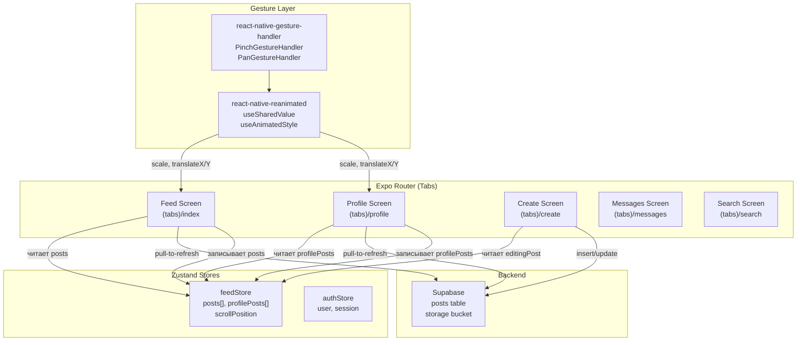
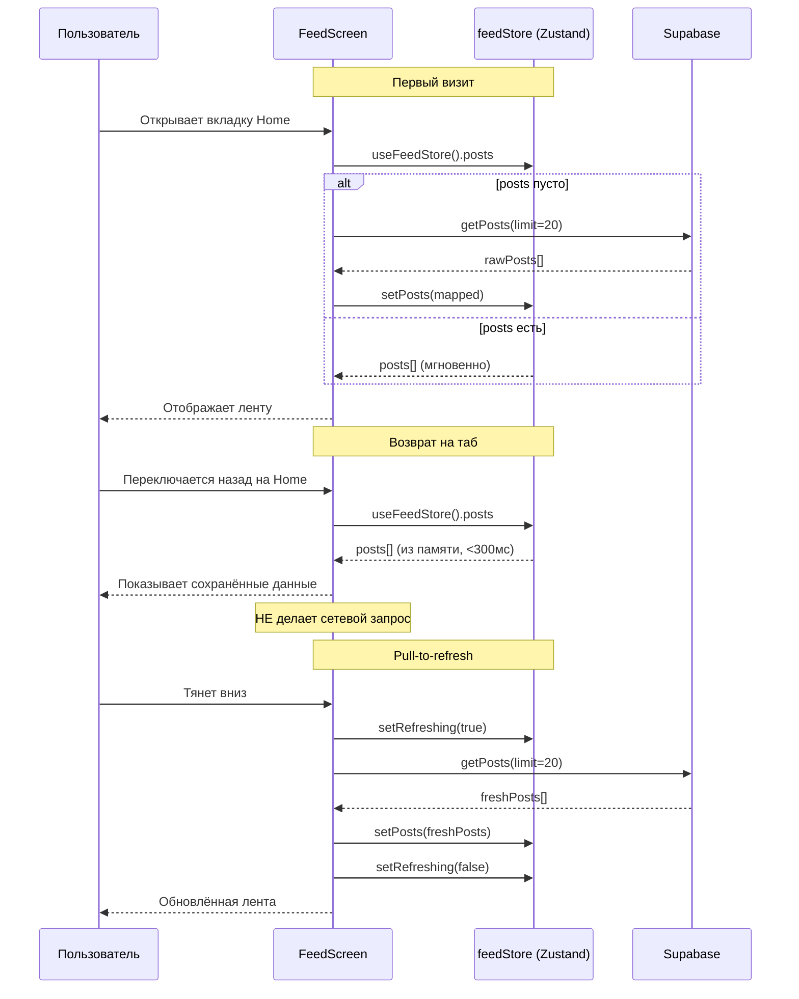
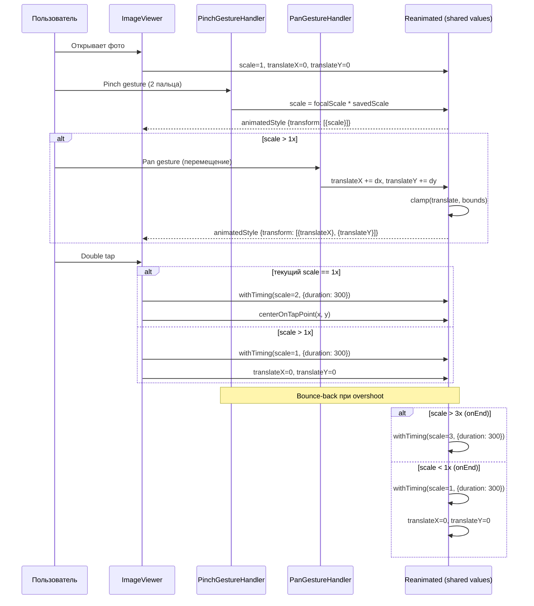

# Дизайн-документ: App UX Improvements

## Overview

Набор из шести UX-улучшений для приложения San (Expo/React Native + Supabase). Основные изменения затрагивают управление состоянием (переход от локального state к Zustand store для сохранения данных между табами), добавление pinch-to-zoom через react-native-gesture-handler + react-native-reanimated, исправление логики редактирования постов (update вместо insert), перенос кнопки «Опубликовать» в headerRight, повышение качества фото (quality: 1.0), и OTA-деплой через существующий workflow.

Ключевой архитектурный принцип: табы в Expo Router не размонтируются при переключении, поэтому проблема «потери данных» решается не через сохранение монтирования, а через вынос данных из локального useState в глобальный Zustand store. Экраны при фокусе читают из store мгновенно, а сетевые запросы выполняются только при первом монтировании или pull-to-refresh.

## Architecture



## Диаграммы потоков данных

### Поток 1: Переключение табов с сохранением данных



### Поток 2: Pinch-to-zoom в Image Viewer



### Поток 3: Редактирование поста (update vs insert)

```mermaid
sequenceDiagram
    participant U as Пользователь
    participant Profile as ProfileScreen
    participant Store as feedStore
    participant Create as CreateScreen
    participant SB as Supabase
    participant Cache as AsyncStorage

    U->>Profile: Нажимает "Редактировать" на посте
    Profile->>Store: setEditingPost({id, content, imageUrl})
    Profile->>Create: router.push('/(tabs)/create')

    Create->>Store: editingPost?
    Store-->>Create: {id: "abc", content: "...", imageUrl: "..."}
    Create->>Create: setContent(editingPost.content)
    Create->>Create: setImageUris(editingPost.imageUrls)
    Create->>Create: setEditingPostId("abc")

    U->>Create: Изменяет текст/фото
    U->>Create: Нажимает "Опубликовать" (headerRight)

    alt editingPostId != null
        Note over Create,SB: РЕЖИМ РЕДАКТИРОВАНИЯ
        Create->>Create: uploadNewImages(localUris)
        Create->>SB: supabase.from('posts').update({content, image_url}).eq('id', editingPostId)
        SB-->>Create: updatedPost
        Create->>Cache: обновляет @san:feed_posts и @san:my_posts
        Create->>Store: updatePost(editingPostId, newData)
        Create->>Create: reset state
        Create-->>U: router.back()
    else editingPostId == null
        Note over Create,SB: РЕЖИМ СОЗДАНИЯ
        Create->>SB: createPost(userId, content, imageUrl)
        SB-->>Create: newPost
        Create->>Store: addPost(newPost)
        Create-->>U: router.replace('/(tabs)')
    end
```

### Поток 4: Кнопка «Опубликовать» в header

```mermaid
sequenceDiagram
    participant Layout as TabLayout
    participant Create as CreateScreen
    participant Router as Expo Router

    Layout->>Router: screenOptions для "create" tab
    Router->>Create: headerShown: true, headerRight: PublishButton

    Note over Create: PublishButton считывает состояние
    Create->>Create: canPost = content || images || repost
    alt canPost && !isPosting
        Create-->>Create: Кнопка активна (accent.primary)
    else
        Create-->>Create: Кнопка disabled (opacity: 0.4)
    end
```

## Components and Interfaces

### Компонент 1: feedStore (расширение)

**Назначение**: Глобальное хранилище данных ленты и профиля, единый источник правды для всех табов.

**Интерфейс**:
```typescript
interface FeedStoreState {
  // Существующие поля
  posts: Post[];
  isLoading: boolean;
  isRefreshing: boolean;
  hasMore: boolean;
  pendingRepostId: string | null;
  editingPost: EditingPost | null;

  // НОВЫЕ поля
  profilePosts: Post[];
  feedScrollOffset: number;
  profileScrollOffset: number;
  lastFeedFetch: number | null;
  lastProfileFetch: number | null;

  // Существующие методы
  setPosts: (posts: Post[]) => void;
  addPost: (post: Post) => void;
  removePost: (postId: string) => void;
  toggleLike: (postId: string) => void;
  setLoading: (loading: boolean) => void;
  setRefreshing: (refreshing: boolean) => void;
  setPendingRepost: (postId: string | null) => void;
  setEditingPost: (post: EditingPost | null) => void;

  // НОВЫЕ методы
  setProfilePosts: (posts: Post[]) => void;
  updatePost: (postId: string, data: Partial<Post>) => void;
  setFeedScrollOffset: (offset: number) => void;
  setProfileScrollOffset: (offset: number) => void;
}
```

**Обязанности**:
- Хранить посты ленты и профиля в памяти между переключениями табов
- Предоставлять мгновенный доступ к данным без сетевых запросов
- Поддерживать обновление отдельного поста (для режима редактирования)
- Сохранять позицию прокрутки

### Компонент 2: ZoomableImage

**Назначение**: Компонент полноэкранного просмотра изображения с поддержкой pinch-to-zoom и pan.

**Интерфейс**:
```typescript
interface ZoomableImageProps {
  uri: string;
  width: number;
  height: number;
  minScale?: number;   // default: 1
  maxScale?: number;   // default: 3
  onClose?: () => void;
}

// Внутреннее состояние (shared values)
interface ZoomState {
  scale: SharedValue<number>;
  savedScale: SharedValue<number>;
  translateX: SharedValue<number>;
  translateY: SharedValue<number>;
  savedTranslateX: SharedValue<number>;
  savedTranslateY: SharedValue<number>;
}
```

**Обязанности**:
- Обработка pinch gesture для масштабирования (1x–3x)
- Обработка pan gesture для перемещения при zoom > 1x
- Double tap для переключения 1x ↔ 2x
- Bounce-back анимация при выходе за пределы min/max scale
- Ограничение панорамирования границами viewport
- Сброс позиции при возврате к scale=1

### Компонент 3: CreateScreen (рефакторинг)

**Назначение**: Экран создания и редактирования постов с кнопкой публикации в header.

**Интерфейс**:
```typescript
// Header button (выносится в screenOptions)
interface PublishButtonProps {
  onPress: () => void;
  disabled: boolean;
  isLoading: boolean;
}

// Логика handlePost (ключевое изменение)
type PostMode = 'create' | 'edit' | 'repost';

interface HandlePostParams {
  mode: PostMode;
  editingPostId: string | null;
  content: string;
  imageUris: string[];
  userId: string;
}
```

**Обязанности**:
- Определять режим работы: create / edit / repost
- В режиме edit: вызывать `supabase.from('posts').update()` вместо `createPost()`
- Загружать только новые локальные изображения, сохранять существующие URL
- Обновлять кэш AsyncStorage и Zustand store после успешного update
- Отображать кнопку «Опубликовать» в headerRight через Expo Router screenOptions

### Компонент 4: ImagePicker (настройка качества)

**Назначение**: Конфигурация expo-image-picker с максимальным качеством.

**Интерфейс**:
```typescript
// Конфигурация для launchImageLibraryAsync
const PICKER_OPTIONS: ImagePicker.ImagePickerOptions = {
  mediaTypes: ['images'],
  allowsEditing: false,
  allowsMultipleSelection: true,
  selectionLimit: MAX_IMAGES,
  quality: 1.0,  // Было 0.8 → стало 1.0
};

// Конфигурация для launchCameraAsync
const CAMERA_OPTIONS: ImagePicker.CameraPickerOptions = {
  allowsEditing: false,
  quality: 1.0,  // Было 0.8 → стало 1.0
};

// Валидация размера (новое)
const MAX_IMAGE_SIZE_BYTES = 20 * 1024 * 1024; // 20 MB
```

## Data Models

### Post (существующий тип, без изменений)

```typescript
interface Post {
  id: string;
  authorId: string;
  authorName: string;
  authorUsername: string;
  authorEmoji: string;
  content: string;
  imageUrl?: string;
  imageUrls?: string[];
  likesCount: number;
  commentsCount: number;
  sharesCount: number;
  isLiked: boolean;
  isBookmarked: boolean;
  createdAt: string;
  isRepost: boolean;
  originalPost?: OriginalPost;
}
```

### EditingPost (существующий, расширить)

```typescript
interface EditingPost {
  id: string;
  content: string;
  imageUrl?: string;
  imageUrls?: string[];
}
```

**Правила валидации**:
- `id` — обязательное, должен быть UUID существующего поста
- `content` — строка до 500 символов
- `imageUrls` — массив URL (remote) или URI (local), до 6 элементов
- Локальные URI начинаются с `file://`, remote — с `https://`

## Correctness Properties

### Property 1: Инвариант store — сохранение данных между табами

После вызова `setPosts(posts)`, последующий вызов `useFeedStore.getState().posts` возвращает тот же массив без сетевого запроса.

**Validates: Requirements 1.1, 1.2, 1.3**

**Formal**: `∀ posts: Post[] → setPosts(posts); getState().posts === posts`

### Property 2: Идемпотентность updatePost

Вызов `updatePost(id, data)` дважды с одинаковыми данными не дублирует пост в массиве и результат идентичен одному вызову.

**Validates: Requirements 3.2**

**Formal**: `updatePost(id, d); updatePost(id, d) ≡ updatePost(id, d)` и `posts.filter(p => p.id === id).length === 1`

### Property 3: Ограничение zoom scale

Для любого значения scale после завершения gesture: `1.0 ≤ scale ≤ 3.0`. Bounce-back анимация гарантирует возврат в допустимый диапазон.

**Validates: Requirements 2.1, 2.5, 2.6**

**Formal**: `onGestureEnd → 1.0 ≤ scale.value ≤ 3.0`

### Property 4: Ограничение pan при scale=1

При scale=1, translateX и translateY всегда равны 0. Pan gesture активируется только при zoom > 1x.

**Validates: Requirements 2.2, 2.4**

**Formal**: `scale.value === 1 → translateX.value === 0 ∧ translateY.value === 0`

### Property 5: Корректный режим create vs edit

Если `editingPostId !== null`, то `handlePost` вызывает `supabase.from('posts').update()`. Если `editingPostId === null`, вызывается `createPost()`.

**Validates: Requirements 3.1**

**Formal**: `editingPostId ≠ null → update(); editingPostId === null → insert()`

### Property 6: Качество фото

Параметр `quality` в ImagePicker всегда равен 1.0 для gallery и camera picker.

**Validates: Requirements 5.1, 5.2**

**Formal**: `launchImageLibraryAsync({quality: 1.0}) ∧ launchCameraAsync({quality: 1.0})`

### Property 7: Кэш-консистентность после update

После успешного update поста, данные в AsyncStorage и в Zustand store содержат одинаковую версию поста.

**Validates: Requirements 3.2, 3.5**

**Formal**: `update(id, data).success → store.posts.find(id).content === asyncStorage.find(id).content`

## Error Handling

### Сценарий 1: Ошибка при update поста

**Условие**: Supabase возвращает ошибку при `update()` (нет прав, пост удалён, сеть)
**Ответ**: Показать Alert с `error.message`, не очищать форму
**Восстановление**: Пользователь может повторить попытку или отменить

### Сценарий 2: Ошибка загрузки изображения

**Условие**: `uploadPostImage()` возвращает ошибку (timeout, размер > 20MB)
**Ответ**: Показать Alert с описанием проблемы
**Восстановление**: Сохранить текст и остальные изображения, позволить повторить

### Сценарий 3: Ошибка при pull-to-refresh

**Условие**: Сетевой запрос `getPosts()` завершается ошибкой
**Ответ**: Прекратить индикатор обновления, показать toast/alert
**Восстановление**: Сохранить данные из store, пользователь видит предыдущую версию

### Сценарий 4: Потеря фокуса во время gesture

**Условие**: Приложение уходит в background во время pinch/pan
**Ответ**: Сбросить gesture state при возврате
**Восстановление**: Автоматический сброс scale и translate к начальным значениям

## Testing Strategy

### Модульное тестирование

- `feedStore`: проверка setPosts, updatePost, toggle, что данные сохраняются между вызовами
- `handlePost`: mock supabase, проверка что при editingPostId вызывается update(), а без — createPost()
- Валидация размера изображения (> 20MB → отклонить)

### Интеграционное тестирование

- Переключение табов: перейти Home → Profile → Home, проверить что посты на месте без API-вызова
- Редактирование: открыть пост → edit → publish → проверить что пост обновлён в кэше
- Pinch-to-zoom: E2E через Detox (если настроен)

### Ручное тестирование

- Проверить плавность pinch-to-zoom на реальном устройстве
- Проверить качество фото (сравнить оригинал с загруженным)
- Проверить OTA-обновление на TestFlight билде

## Dependencies

| Зависимость | Версия | Назначение | Статус |
|---|---|---|---|
| react-native-gesture-handler | ~2.28.0 | Pinch/Pan gestures | Уже установлен |
| react-native-reanimated | — | Анимации zoom | **Нужно добавить** |
| zustand | ^5.0.3 | State management | Уже установлен |
| expo-image-picker | ~17.0.11 | Выбор фото | Уже установлен |
| expo-updates | ~29.0.17 | OTA updates | Уже установлен |
| expo-router | ~6.0.23 | Навигация, screenOptions | Уже установлен |

**Примечание**: `react-native-reanimated` необходимо установить и настроить babel plugin (`react-native-reanimated/plugin` в `babel.config.js`). Проект уже использует gesture-handler, но reanimated отсутствует в package.json.

## Performance Considerations

- **Zustand store** не вызывает ре-рендер компонентов, которые не подписаны на изменённые поля (selector pattern)
- **FlatList** в FeedScreen уже оптимизирован: `removeClippedSubviews`, `maxToRenderPerBatch=5`, `windowSize=7`
- **Reanimated** выполняет анимации на UI thread (worklet), не блокируя JS thread
- **Pinch/Pan** используют `useAnimatedGestureHandler` → все вычисления на UI thread
- **Позиция прокрутки** сохраняется через `onScroll` → store (throttled), восстанавливается через `scrollToOffset` при фокусе

## Security Considerations

- `update()` вызывается с `.eq('id', postId)` — RLS политика Supabase должна проверять `auth.uid() = author_id`
- Загрузка изображений проходит через `uploadPostImage`, который использует authenticated client
- Размер файла проверяется на клиенте (20MB лимит) перед upload
- OTA-обновление подписано Expo — невозможно подменить бандл
