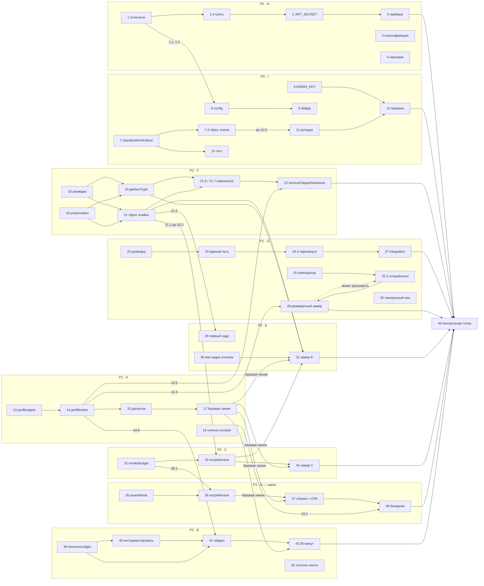

# Implementation Plan

**План реализации: устранение сквозной деградации производительности (`app-wide-degradation-fixes`).**

## Overview

Порядок задач следует приоритетам дизайна: **P0 (блоки H, I) → P1 (блок A) → P2 (блоки F, G) → P3 (блоки E, C, D, B)**. Внутри P3 порядок из дизайна: E → C → D → B.

Обоснование порядка. P0 — это не производительность, а сломанная функциональность: изображения не публикуются (блок H), а состояние конфигурации нельзя ни увидеть, ни отличить от неверного пароля (блок I). Оба блока живут в каналах `[server]` и `[ota]`, то есть доезжают без новой нативной сборки и не ждут ничего из перф-части — поэтому идут первыми и параллельно всему остальному. P1 стоит перед всей перф-работой по одной причине: без базовой линии «до» ни одно улучшение из P2 и P3 недоказуемо, а требование 2.2 прямо запрещает считать dev-замер доказательством.

Далее P2 — два дефекта с самым прямым видимым эффектом: чужой контент в переиспользованной ячейке (блок F) и цикл «пусто → неправильно → правильно» при возврате на экран (блок G). P3 опирается на механизмы, введённые в F и G: `imageDimsCache` из 21.5 закрывает E.1, `activeIndex` из 21.2 нужен ленивым слайдам карусели в 33.3, `renderBudget` из 32 принимает `powerMode` в 36.1. Блок D целиком `[native]`, поэтому доезжает позже всех и **не блокирует OTA-часть**. Блок B замыкает список, потому что его ядро — не ускорение, а инструмент, отвечающий на вопрос «какая из трёх причин», и этот инструмент проверяется 30-минутным замером после всех прочих правок.

Каждая задача оставляет репозиторий в собирающемся состоянии: `npm run ts:check` и `npm test` должны проходить после каждой отмеченной задачи.

### Обозначения

**Канал доставки:**

| Метка | Что означает |
|---|---|
| `[server]` | Вне бинарника: env-переменные Vercel и Worker, код в `api/` и `workers/`, ротация кредов. Доезжает деплоем, не требует ни сборки приложения, ни OTA. |
| `[ota]` | JS и ассеты через `eas update`. Доезжает только до сборок с `version = 1.2.0` (`runtimeVersion.policy: appVersion`). Не имеет права вводить нативных permission'ов (3.13). |
| `[native]` | Требует новой нативной сборки. Блок D целиком в этом канале. |

**Исполнитель:**

| Метка | Что означает |
|---|---|
| `[оператор]` | Выполняет человек. Требует доступа к консоли Vercel, Cloudflare dashboard, `wrangler`, `vercel env`, либо физических устройств для замеров. **Агент к ним доступа не имеет** — такие задачи не автоматизируются и не могут быть отмечены агентом как выполненные. |
| (без метки) | Выполняет агент: код, тесты, проверки типов. |

**Разведочные тесты** (задачи 18 и 23) пишутся и запускаются **до** исправления и **обязаны упасть** на текущем коде. Падение — не сбой, а контрпример, подтверждающий корневую причину. Не «исправляйте» такой тест и не правьте код, чтобы он прошёл, — задача считается выполненной, когда тест написан, запущен и падение задокументировано.

---

## Task Dependency Graph

Зависимости собраны из формулировок самих задач — ниже нет ни одного нового требования, только явная запись того, что уже сказано по тексту.

### Что не блокируется ничем

**P0 (блоки H и I) не блокируется ничем** и выполняется параллельно с P1: это `[server]` и `[ota]`, они не ждут ни базовой линии замеров, ни нативной сборки. Единственная связь P0 с перф-частью направлена внутрь P0 — задача 8 берёт `jwtFingerprintMatch` из отпечатков задач 1.1 и 1.2.

**Критический путь перф-части — 13 → 14 → 17.** Пока нет `PerfRunReport` с `build: 'release'` из задачи 17, замеры 31, 34, 37 и 43 не с чем сравнивать: они превращаются в утверждения без доказательства, что требование 2.2 прямо запрещает. Всё остальное в P2 и P3 можно писать параллельно этому пути — сравнивать придётся потом.

### Внутри блоков

**Блок H.** 1 (эндпоинты отпечатка) → 1.4 (снять отпечатки; требует деплоя Vercel и Worker) → 2 (привести `JWT_SECRET` к секрету Worker'а) → 5 (ручная проверка публикации). Задачи 3 (клиентская классификация) и 4 (сохранение черновика) **независимы от 1–2** и идут параллельно: они не знают о состоянии серверной конфигурации и не должны знать.

**Блок I.** 6 (согласовать `ADMIN_KEY`) → 12 (ручная проверка панели); 11 (ротация кредов) → 12. 8 (`config` в ответе `status.ts`) зависит от 1.1 и 1.2 — `jwtFingerprintMatch` считается через отпечатки. 7.4 (сброс сохранённого admin-ключа при `wrong_password`) обязательна **до** 11.5 (ротация админ-пароля): иначе оператор попадёт в открытую панель с мёртвым ключом — пустой список пользователей и 401 в статусе. 9 (бейдж «не измерено») читает `config.r2Debug`, то есть идёт после 8; 10 (integration-тест трёх сообщений) — после подключения классификатора в 7.3.

**Блок A.** 13 (`perfBudgets`) → 14 (дополнения `perfMonitor`) → 15 (экран «до/после») → 17 (первый замер, базовая линия). 16 (`babel-plugin-transform-remove-console`) независима от этой цепочки. **17 — предпосылка для всех замеров P2 и P3: 31, 34, 37, 43.**

**Блок F.** 18 (разведочный тест, обязан упасть) и 19 (preservation-тест, обязан пройти) → 20 (`getItemType`) и 21 (сброс состояния ячейки) → 21.6 и 21.7 (перезапуск обоих тестов) → 22 (проверка `removeClippedSubviews`). 14.5 (`markCellAnomaly`) нужна до 22 — иначе на флике нечего наблюдать.

**Блок G.** 23 (разведочный тест) → 24 (единый путь записи кэша) → 24.4 (перезапуск теста) → 27 (integration-тест «создать пост → вернуться на ленту»). Параллельная ветка: 25 (компаратор) → 25.3 (подключение к потребителям) → 28 (разведочный замер), причём **результат 28 может расширить 25.3** — если замер найдёт экран вне списка, расширяется 25.3, а не изобретается новое исправление. 14.4 (`cache_first_content`) нужна до 28.

**Блок E.** 21.5 (подключение `imageDimsCache`) — это и есть механизм E.1, то есть **E.1 выполнена внутри блока F** и дублировать её не нужно. 29 (тест первого кадра) — после 21.5. 30 (тяжёлая работа вне кадра отклика) независима. 31 (замер) — после 20, 21, 30 и после 33 (блок C), плюс базовая линия 17.

**Блок C.** 32 (`renderBudget`) → 33 (развести бюджет по потребителям) → 34 (замер на `Weak` и `Mid`). **33.3 (ленивые слайды карусели) строго после 21.2**, потому что требует `activeIndex` из блока F.

**Блок D.** Целиком `[native]`, поэтому доезжает позже всех и **не блокирует OTA-часть**. 35 (`powerMode`) → 36 (подключить к потребителям) → 37 (нативная сборка и замер при включённом LPM) → 38 (проверка состава permission'ов на собранном бинарнике). 36.1 зависит от 32: `renderBudget` принимает `powerMode`. 38 также проверяет результат 16 — правку `babel.config.js`.

**Блок B.** 39 (`resourceLedger`) → 40 (инструментировать долгоживущие места) → 41 (гейджи) → 43 (30-минутный замер). 41.3 зависит от 39 и от 14.6 (`setGauge`). 42 (потолок ленты) независима; 24.3 лишь упоминает, что явный потолок вводится в 42.

**44 (контрольная точка) — после всех.**

### Волны

Внутри волны задачи независимы и могут идти параллельно. Задачи, разорванные между волнами, перечислены с точностью до подзадач.

| Волна | Задачи | Чем ограничена |
|---|---|---|
| 0 | 1.1–1.3, 3, 4, 6, 7, 11.1–11.4, 13, 16.1, 18, 19, 23, 25.1, 25.2, 26, 30, 32, 35, 39, 42 | ничем — можно начинать немедленно |
| 1 | 1.4, 8, 11.5–11.8, 14, 20, 21.1–21.5, 24.1–24.3, 25.3, 33.1, 33.2, 33.4–33.6, 36, 40 | волна 0 |
| 2 | 2, 9, 10, 15, 21.6, 21.7, 24.4, 27, 29, 33.3, 41 | волна 1 |
| 3 | 5, 12, 16.2, 17 | волна 2; 16.2 и 17 требуют release-сборки |
| 4 | 22, 28, 31, 34, 37 → 38, 43 | базовая линия из 17; 38 — на том же бинарнике, что 37 |
| 5 | 44 | всё выше |

### Граф



```json
{
  "waves": [
    { "id": 0, "tasks": ["1.1", "1.2", "1.3", "3", "4", "6", "7", "11.1", "11.2", "11.3", "11.4", "13", "16.1", "18", "19", "23", "25.1", "25.2", "26", "30", "32", "35", "39", "42"] },
    { "id": 1, "tasks": ["1.4", "8", "11.5", "11.6", "11.7", "11.8", "14", "20", "21.1", "21.2", "21.3", "21.4", "21.5", "24.1", "24.2", "24.3", "25.3", "33.1", "33.2", "33.4", "33.5", "33.6", "36", "40"] },
    { "id": 2, "tasks": ["2", "9", "10", "15", "21.6", "21.7", "24.4", "27", "29", "33.3", "41"] },
    { "id": 3, "tasks": ["5", "12", "16.2", "17"] },
    { "id": 4, "tasks": ["22", "28", "31", "34", "37", "38", "43"] },
    { "id": 5, "tasks": ["44"] }
  ]
}
```

---

## Tasks

### P0 · Блок H — 401 при загрузке изображений

_Дизайн: «P0 · Блок H», H.1–H.4. Закрывает 1.24–1.26 → 2.24–2.26._

- [ ] 1. Эндпоинты отпечатка секрета: сравнение `JWT_SECRET` без раскрытия значения `[server]`

  - [ ] 1.1 Создать `api/admin/auth-fingerprint.ts`
    - `secretFingerprint(secret)` = `HMAC-SHA256(key: secret, message: "san-mes-jwt-fingerprint-v1")`, усечённый до 8 hex-символов, через Node `crypto.createHmac` — тот же API, что в `api/_lib/verifyToken.ts`
    - Возвращает `{ configured, fingerprint, alg: "HS256", iss: "san-mes-api" }`; при пустом или отсутствующем секрете — `{ configured: false, fingerprint: null, … }`
    - Эндпоинт закрыт проверкой `x-admin-key` тем же способом, что `api/admin/status.ts`; `configured` отдаётся **только после** успешной проверки ключа
    - Значение секрета не попадает в ответ ни в каком виде
    - _Дизайн: H.2_
    - _Требования: 2.25, 2.28, 3.12_

  - [ ] 1.2 Добавить `GET /v1/admin/auth-fingerprint` в `workers/api/src/routes/admin.ts`
    - Тот же алгоритм на Web Crypto (`crypto.subtle.sign('HMAC', …)`), та же домен-разделённая константа, то же усечение до 8 hex
    - Ключ — `env.JWT_SECRET`; гейт по `X-Admin-Key` через существующее `timingSafeEqual`-сравнение
    - _Дизайн: H.2_
    - _Требования: 2.25_

  - [ ] 1.3 Unit-тесты `secretFingerprint`
    - Детерминизм; разные секреты дают разные отпечатки; `configured: false` при пустом и при `undefined`; длина 8 hex
    - В возвращаемом объекте нет ни одной подстроки самого секрета
    - Эквивалентность реализаций: Node `createHmac` и Web Crypto `subtle.sign` на одном входе дают один отпечаток — без этого сравнение отпечатков бессмысленно
    - _Дизайн: Testing Strategy → Unit Tests_
    - _Требования: 2.25_

  - [ ] 1.4 `[оператор]` Задеплоить Vercel и Worker, снять и сравнить отпечатки `[server]`
    - `GET /v1/admin/auth-fingerprint` (Worker) и `GET /api/admin/auth-fingerprint` (Vercel) с admin-ключом
    - Зафиксировать исход: `configured: false` → секрет не задан; отпечатки различаются → секреты не совпадают; отпечатки равны → причина в токене или в отсутствии редеплоя
    - _Дизайн: H.1, шаги 1–3_
    - _Требования: 2.25_

- [ ] 2. `[оператор]` Привести `JWT_SECRET` на Vercel к существующему секрету Worker'а `[server]`

  - Приводить Vercel к секрету Worker'а, **не ротировать оба**: смена `JWT_SECRET` инвалидирует все выданные токены (TTL 30 дней) и заставит каждого пользователя перелогиниться
  - `vercel env add JWT_SECRET production` (и `preview`, если превью-деплои используются) — **интерактивным вводом, не через `echo |`**: завершающий перевод строки попадёт в значение и HMAC не совпадёт. Тот же риск у `wrangler secret put`
  - **Сделать новый деплой Vercel.** Env-переменная не применяется к уже задеплоенным функциям — это самая частая причина «я всё поставил, но не работает»
  - Повторно снять оба отпечатка и убедиться в равенстве. Подтверждением считается только равенство отпечатков, а не факт вставки значения
  - `api/_lib/verifyToken.ts` не редактируется ни одной строкой: fail-closed сохраняется (3.12)
  - _Дизайн: H.1, шаги 4–7_
  - _Требования: 2.24, 2.25, 3.12_

- [ ] 3. Классификация причины отказа загрузки на клиенте `[ota]`

  - [ ] 3.1 Создать `src/lib/uploadFailure.ts` с `classifyUploadFailure(input)`
    - Ветви по дизайну: `abort → timeout`, `network → offline`, `token = null → not_signed_in`, `401` с истёкшим `exp` → `session_expired`, `401` с живым `exp` → `auth_rejected`, `503 → storage_not_configured`, `413 → too_large`, `400 → bad_image`, прочее → `server_error`
    - `readExpClaimWithoutVerifying` — локальный base64url-декод **своего** токена без проверки подписи; не бросает на повреждённом токене; учитывает `CLOCK_SKEW_SEC`
    - Различение выполняется на клиенте, а не объявляется сервером: `api/r2-upload.ts` продолжает отдавать `401 {error:'unauthorised'}` без дополнительных полей
    - _Дизайн: H.3_
    - _Требования: 2.26, 2.28_

  - [ ] 3.2 Unit-тесты `classifyUploadFailure` по всем ветвям
    - Отдельным тестом: три подпричины `auth_rejected` (секрет не задан, секрет расходится, токен отозван) дают **одно** сообщение. Слияние намеренно — различение раскрыло бы состояние серверной конфигурации. Тест утверждает слияние, а не считает его недоработкой
    - _Дизайн: Testing Strategy → Unit Tests_
    - _Требования: 2.26_

  - [ ] 3.3 `src/lib/r2.ts` — вернуть `{ url: null, reason: UploadFailureReason }` вместо строки
    - Строка `upload failed (${res.status}) ${detail}` убирается; `detail` из тела ответа наружу не идёт вовсе (сейчас в UI попадает `{"error":"unauthorised"}`)
    - `perfMonitor.recordError('upload:auth_rejected')` — машинный код для локальной диагностики, без токена, без секрета, без URL с параметрами
    - Клиентский таймаут `UPLOAD_TIMEOUT_MS = 45000` не меняется (3.11)
    - _Дизайн: H.3_
    - _Требования: 2.26, 3.11_

  - [ ] 3.4 Сообщения пользователю через существующий i18n (ключи `create.alert.*`)
    - Таблица сообщений и действий — из дизайна H.3. Сообщение для `auth_rejected` **не утверждает**, что сервер не настроен
    - Ни одно сообщение не содержит значений секретов и токенов
    - _Дизайн: H.3_
    - _Требования: 2.26_

- [ ] 4. Сохранение черновика и выбранного изображения при отказе загрузки `[ota]`

  - [ ] 4.1 `app/(tabs)/create.tsx`, ветка CREATE MODE / online — заменить мягкий пропуск на прерывание
    - `createPost` **не вызывается**, если хотя бы одна выбранная локальная картинка не загрузилась и причина не сетевая. Пост без выбранного пользователем изображения не публикуется никогда
    - `setContent('')`, `setImageUris([])` и `router.replace` выполняются только на ветках `ok` и `queued`
    - `setImageUploading(false)` / `setIsPosting(false)` — на всех ветках в `finally`, иначе кнопка останется заблокированной
    - Ветка `offline` / `timeout` сохраняет текущее поведение целиком: `queueMutation` с локальными uri, `offlineQueue` и `uploadImageWithRetry` не трогаются (3.2)
    - _Дизайн: H.4_
    - _Требования: 2.26, 3.2_

  - [ ] 4.2 То же для ветвей REPOST и EDIT в `app/(tabs)/create.tsx`
    - Обе имеют ту же форму дефекта; `createRepost` и `apiPatch` подпадают под тот же инвариант
    - _Дизайн: H.4_
    - _Требования: 2.26_

  - [ ] 4.3 Integration-тест экрана создания поста в `src/__tests__/integration/`
    - При отказе загрузки по не-сетевой причине одновременно: `createPost` не вызван, `content` не изменился, `imageUris` не изменились, `router.replace` не вызывался
    - Четыре утверждения в одном тесте: дефект состоит именно в их совместном нарушении
    - Отдельные кейсы: `offline` и `timeout` → постановка в офлайн-очередь с локальными uri
    - Существующие `src/__tests__/createPostMode.property.test.ts` и `postMutations.test.ts` остаются зелёными
    - _Дизайн: Testing Strategy → Integration Tests_
    - _Требования: 2.26, 3.2_

- [ ] 5. `[оператор]` Ручная проверка публикации изображения в release-сборке `[server]`
  - Критерий бинарный, измерение не нужно: изображение публикуется или нет
  - Проверить все четыре пути: пост, комментарий, сообщение, аватар/баннер
  - _Дизайн: H.1, шаг 8; Testing Strategy → Ручная приёмка_
  - _Требования: 2.24_

---

### P0 · Блок I — админ-панель и диагностируемость конфигурации

_Дизайн: «P0 · Блок I», I.1–I.4. Закрывает 1.27–1.29 → 2.27–2.29._

- [ ] 6. `[оператор]` Согласовать `ADMIN_KEY` на трёх сторонах `[server]`
  - Совпадать должны три значения: пароль оператора, `ADMIN_KEY` на Vercel, `ADMIN_KEY` в Worker. Причина — `api/admin/status.ts` пересылает **свой** ключ в Worker как `X-Admin-Key` (`const ADMIN_KEY = ADMIN_PASSWORD`)
  - `vercel env add ADMIN_KEY production` + `wrangler secret put ADMIN_KEY` (оба интерактивно) + **новый деплой Vercel**
  - Проверка: `GET /api/admin/status` с этим значением в `x-admin-key` → 200, `services[1].status === 'online'` (D1), счётчики непустые. Непустые счётчики и подтверждают, что ключ Worker'а согласован
  - Literal-фоллбэки не возвращаются: `process.env.ADMIN_KEY || ''` остаётся, 503 при отсутствии остаётся (3.12)
  - _Дизайн: I.1_
  - _Требования: 2.27, 3.12_

- [ ] 7. Различение 503 / 401 / сетевой ошибки в UI админ-панели `[ota]`

  - [ ] 7.1 Добавить чистый `classifyAdminFailure(input)` в `app/settings/admin.tsx`
    - Ветви: `abort → timeout`, `network → unreachable`, `503` + тело `admin_not_configured` → `not_configured`, `503` без тела → `service_unavailable`, `401`/`403 → wrong_password`, прочее → `server_error`
    - _Дизайн: I.2_
    - _Требования: 2.28_

  - [ ] 7.2 Unit-тесты `classifyAdminFailure` по всем ветвям
    - Отдельно: `503` **с** телом и `503` **без** тела дают разные причины
    - _Дизайн: Testing Strategy → Unit Tests_
    - _Требования: 2.28_

  - [ ] 7.3 Подключить классификатор в `handleUnlock` и `loadStatus`
    - Сообщения и действия — по таблице дизайна I.2; `not_configured` получает подсказку «задайте переменную окружения на Vercel и сделайте новый деплой»
    - `AbortError` перестаёт попадать в общий `catch` как `e?.message`
    - Ни одно сообщение не раскрывает значений ключей
    - _Дизайн: I.2_
    - _Требования: 2.28_

  - [ ] 7.4 Автоматический сброс сохранённого admin-ключа при `wrong_password`
    - При `wrong_password` в `loadStatus` или `loadUsers`: `kvDeleteRaw(ADMIN_KEY_STORAGE_KEY)`, сброс `adminKeyRef`, возврат на экран ввода через существующий `handleAdminLogout`
    - Иначе после ротации (задача 11) оператор попадёт в открытую панель с мёртвым ключом: пустой список пользователей и 401 в статусе
    - _Дизайн: I.4, побочное следствие ротации_
    - _Требования: 2.28, 2.29_

- [ ] 8. Поле `config` в ответе `api/admin/status.ts` `[server]`
  - `config: { r2Measured, r2Debug, workerAdminKeyOk, jwtFingerprintMatch }` — только **внутри ответа 200**, то есть доступно лишь после успешной проверки ключа
  - `jwtFingerprintMatch` — boolean от сравнения отпечатка Vercel с отпечатком Worker'а; ни одного отпечатка в ответ не попадает. Это же поле закрывает диагностику блока H прямо из панели
  - Тело 503 остаётся ровно `{error:'admin_not_configured'}`: без перечня отсутствующих переменных, без имён, без регионов (2.28)
  - `Access-Control-Allow-Origin: '*'` на этом эндпоинте остаётся как есть и не сужается — сужение сломает существующие вызовы
  - Серверная отдача `measured` не меняется
  - _Дизайн: I.2_
  - _Требования: 2.28, 2.29_

- [ ] 9. Бейдж «не измерено» вместо одиночной тильды `[ota]`

  - [ ] 9.1 `UsageBar` в `app/settings/admin.tsx`
    - Явная пилюля «не измерено» рядом с названием, значение приглушённым цветом, подстрочник с методом оценки («оценка: постов с изображениями × 180 КБ»)
    - Для полосы R2 — причина из `config.r2Debug`; для `db_size` — подстрочник «оценка по числу строк»
    - Одиночная тильда `item.label + ' ~'` убирается: она воспринимается как шум и не читается как «не измерено»
    - _Дизайн: I.3_
    - _Требования: 2.29_

  - [ ] 9.2 Снапшот-тест `UsageBar` с `measured: false`
    - _Дизайн: Testing Strategy → Integration Tests_
    - _Требования: 2.29_

- [ ] 10. Integration-тест админ-экрана: три ответа → три различных сообщения `[ota]`
  - Подставить `503 {error:'admin_not_configured'}`, `401 {error:'Unauthorized'}`, `AbortError`
  - Утверждается **различность** сообщений, а не конкретные строки (строки идут через i18n)
  - _Дизайн: Testing Strategy → Integration Tests_
  - _Требования: 2.28_

- [ ] 11. `[оператор]` Чек-лист ротации закоммиченных в git-историю кредов `[server]`

  Обязательно до подачи в App Store. Ротация должна быть **подтверждена явно**, а не предположена. Все пункты 11.1–11.8 относятся к одному требованию.

  _Дизайн: I.4_
  _Требования: 2.29, 3.12_

  - [ ] 11.1 Перечислить исторические значения по git-истории
    - `git log -S 'R2_SECRET_ACCESS_KEY' -p -- api/admin/status.ts`, то же для админ-пароля и `R2_ACCESS_KEY_ID`
    - Цель — точный список подлежащего отзыву, а не приблизительный
  - [ ] 11.2 Проверить по git-истории, был ли когда-либо закоммичен `R2_API_TOKEN`
    - Используется `api/r2-upload.ts`; комментарий в `api/admin/status.ts` его не упоминает, но проверка обязательна — токен даёт право записи в бакет
    - Если закоммичен — ротировать и отозвать вместе с остальными
  - [ ] 11.3 Создать новый R2 S3 keypair и задать его на Vercel
    - Cloudflare → R2 → Manage R2 API Tokens, права Object Read & Write на бакет `san`
    - `R2_ACCESS_KEY_ID` / `R2_SECRET_ACCESS_KEY` на Vercel + новый деплой
  - [ ] 11.4 **Удалить старый R2 S3 keypair в Cloudflare**
    - Отзыв, а не только замена: без удаления старая пара продолжает работать
  - [ ] 11.5 Ротировать админ-пароль
    - Новое значение в `ADMIN_KEY` на Vercel и `wrangler secret put ADMIN_KEY`, затем новый деплой Vercel
  - [ ] 11.6 **Подтвердить отзыв опытом: попытка `ListObjectsV2` со старым keypair возвращает ошибку доступа**
    - Создание нового keypair подтверждением **не является**
    - Без этого пункта задача 11 не считается выполненной
  - [ ] 11.7 Задать `R2_ACCOUNT_ID` / `R2_ACCESS_KEY_ID` / `R2_SECRET_ACCESS_KEY` на Vercel, чтобы метрики хранилища измерялись, а не оценивались
  - [ ] 11.8 Зафиксировать факт ротации комментарием в `api/admin/status.ts`
    - Дата и что именно ротировано — чтобы следующий читатель не выяснял статус заново
    - Переписывание git-истории **не требуется и в объём не входит**: значения останутся читаемыми в любом существующем клоне, поэтому единственная действующая мера — отзыв. Это осознанное решение, а не упущение
    - _Требования: 2.29_

- [ ] 12. `[оператор]` Ручная проверка открытия панели после задач 6 и 11 `[server]`
  - Панель открывается, `services[1].status === 'online'`, счётчики непустые
  - Метрика хранилища показана как измеренная (`measured: true`) после 11.7
  - _Дизайн: I.1; Testing Strategy → Ручная приёмка_
  - _Требования: 2.27, 2.29_

---

### P1 · Блок A — измеримость

_Дизайн: «P1 · Блок A», A.1–A.4. Закрывает 1.1–1.3 → 2.1–2.3._

> **Пункт для владельца продукта — не задача на исполнение.**
>
> Удалённая телеметрия в приложении **уже работает**: `app/_layout.tsx` вызывает `Sentry.init` с `tracesSampleRate: 0.1`, `enableAutoSessionTracking: true`, `sendDefaultPii: false`, `enabled: !__DEV__`, закоммиченным DSN, `reactNavigationIntegration` с `enableTimeToInitialDisplay: true` (навигационные breadcrumbs), `Sentry.wrap` корневого компонента и `Sentry.captureException` в `componentDidCatch`.
>
> `enableAutoSessionTracking` и навигационные breadcrumbs — это сбор данных, и на него распространяются требования **2.3** (данные локальны; удалённая отправка требует явного consent, обновления privacy policy и App Store privacy questionnaire) и **3.16** (никакого fingerprinting, только opaque per-install идентификаторы).
>
> Приведение этой интеграции в соответствие **не входит в объём данного багфикса** — ни одно из 29 требований этого не описывает, и задачи на это здесь нет. Решение принимает владелец продукта: либо аудит с consent-гейтом, либо обоснование, что текущий объём сбора допустим и отражён в privacy questionnaire.
>
> Что дизайн решает без владельца продукта: измерение производительности через Sentry **не делается** — трассы, профили и метрики через Sentry не включаются, `perfMonitor` остаётся локальным (2.3).
>
> _Дизайн: A.4_

- [ ] 13. Создать `src/services/perfBudgets.ts` — таблица 2.1 как данные `[ota]`

  - [ ] 13.1 Модуль `perfBudgets` с `BUDGETS` и `evaluate(report)`
    - Чистый, без побочных эффектов и без импортов из React
    - `BUDGETS.Mid` и `BUDGETS.Weak` — буквально таблица 2.1
    - `Verdict = "within_budget" | "out_of_budget" | "inadmissible_dev_build"`
    - `report.build <> "release"` ⇒ `inadmissible_dev_build` **до** любых других проверок — механически проверяемая форма требования 2.2
    - Отдельная ветвь `IF report.lowPower`: бюджет **относительный**, `≥ ceiling × 0.90` вместо абсолютных значений таблицы, плюс `jsDrivenAnimationCount = 0` (это же закрывает D.4)
    - `osRefreshCeilingHz` возвращает `30` при `lowPower = true`, иначе наблюдаемый максимум UI-потока. Известное ограничение зафиксировать комментарием: `perfMonitor` ограничивает отображаемый FPS 60, поэтому на 120 Гц ProMotion потолок недосчитывается вдвое; для LPM это безразлично, для обычного режима бюджеты не выше 58
    - _Дизайн: A.1, D.4_
    - _Требования: 2.1, 2.2, 2.3, 2.12_

  - [ ] 13.2 Property-тесты `evaluate` через `fast-check`
    - Тотальность: вердикт определён для любого сгенерированного `PerfRunReport`, функция не бросает
    - Монотонность: ухудшение любой метрики не может превратить `out_of_budget` в `within_budget`
    - `build: 'dev'` ⇒ всегда `inadmissible_dev_build`, независимо от всех остальных полей
    - _Дизайн: Testing Strategy → Property-Based Tests_
    - _Требования: 2.1, 2.2_

  - [ ] 13.3 Unit-тест границ: значение ровно на границе бюджета проходит
    - _Дизайн: Testing Strategy → Property-Based Tests_
    - _Требования: 2.1_

- [ ] 14. Дополнения к `src/services/perfMonitor.ts` `[ota]`

  Новый инструмент не вводится: `perfMonitor` уже собирает JS/UI fps, длинные задачи, per-route hotspots и `pendingDecodes`. Не хватает порогов, контекста, признака сборки и артефакта прогона. Стоимость в выключенном состоянии — одна проверка boolean, по схеме существующих `mark*`.

  - [ ] 14.1 `setContextTags({ deviceClass, lowPower })`
    - Вызывается из `app/_layout.tsx` со значением `isWeakDevice() ? 'Weak' : 'Mid'`; `lowPower` обновляется из хука блока D
    - Теги попадают в `PerfSnapshot` и `PerfRunReport`, хранятся в памяти, никуда не передаются. Один boolean и одно трёхзначное перечисление — это не fingerprinting (3.16)
    - Порог длинной задачи (120 мс) **не меняется**: это диагностический порог, вердикт считается по 250 / 400 мс из таблицы. «Зафиксировано» и «вне бюджета» — разные вещи, обе видны
    - _Дизайн: A.2, пункты 1–2_
    - _Требования: 2.3, 3.16_

  - [ ] 14.2 Серии пропущенных кадров: `_jankRunLength` и `worstJankRun` в `RouteStat`
    - Существующий `jankCount` считает отдельные сэмплы ниже 30 fps; требование 2.14 говорит про **серии** (`droppedFrameRuns = 0`). Один провал и серия из пяти подряд — разные явления
    - _Дизайн: A.2, пункт 3_
    - _Требования: 2.3, 2.14_

  - [ ] 14.3 TTI через существующие `markInteractionStart` / `markInteractionEnd`
    - `markInteractionStart('tti')` в module scope `app/_layout.tsx`, `markInteractionEnd('tti')` в ленте после первого коммита с непустым `posts`
    - _Дизайн: A.2, пункт 4_
    - _Требования: 2.1, 2.3_

  - [ ] 14.4 Время до первого контента из кэша
    - `markInteractionStart('cache_first_content')` перед синхронным пиком в инициализаторе `useState` ленты, `markInteractionEnd` в `useEffect` после первого коммита. Тот же приём для профиля и чата
    - _Дизайн: A.2, пункт 5_
    - _Требования: 2.1, 2.21_

  - [ ] 14.5 `markCellAnomaly(list, kind)`, где `kind ∈ {'stale_state', 'blank_with_known_dims', 'type_mismatch'}`
    - Попадает в `badCellFrames` отчёта; инкрементируется из инструментированной сборки блока F
    - _Дизайн: A.2, пункт 6_
    - _Требования: 2.1, 2.18_

  - [ ] 14.6 `setGauge(name, value)` с `Map<string, number>` в снимке
    - Носитель трёх счётчиков блока B (задачи 39–41)
    - _Дизайн: A.2, пункт 7_
    - _Требования: 2.3, 2.7_

  - [ ] 14.7 Тип `PerfRunReport` и локальное хранение прогонов
    - Поля по дизайну, включая `build` из `__DEV__` (подделать нельзя), `gauges`, `hotspots`, `verdict`, `breaches`
    - Хранение под `accountKey('@san:perf_runs')` через `kvSetJSON`, потолок 20 записей с вытеснением самых старых. Новый ключ проходит через `accountKey()` — изоляция по аккаунтам сохраняется (3.4)
    - Данные не покидают устройство (2.3, 3.16)
    - _Дизайн: A.2, `PerfRunReport`_
    - _Требования: 2.1, 2.3, 3.4, 3.16_

- [ ] 15. Экран «до/после» в `src/components/dev/PerfMonitorPanel.tsx` `[ota]`
  - Выбрать два отчёта с одинаковым `scenarioId` и увидеть построчную разницу с вердиктом каждого
  - Это и есть протокол сравнения, которого не было. Отчёт с `inadmissible_dev_build` показывается как недопустимый, а не как «плохой»
  - _Дизайн: A.2_
  - _Требования: 2.1, 2.2, 2.10_

- [ ] 16. `babel-plugin-transform-remove-console` `[ota]`

  - [ ] 16.1 Добавить devDependency точной (запинованной) версией и правку `babel.config.js`
    - Плагин в `env.production.plugins` с `{ exclude: ['error', 'warn'] }` — dev-логи сохраняются
    - `react-native-reanimated/plugin` остаётся **последним** в основном списке; `env.production.plugins` применяются до основного списка, поэтому порядок не нарушается
    - `exclude` обязателен: удаление `console.error` / `console.warn` молча выключило бы существующую диагностику, включая `'[Sentry.init] failed'`
    - Сейчас в `src/` и `app/` вне тестов — 26 вызовов `console.*`, все попадают в release-бандл
    - _Дизайн: A.3_
    - _Требования: 2.1_

  - [ ] 16.2 `[оператор]` Проверить release-сборку после правки `babel.config.js` `[native]`
    - Бандл собирается, приложение стартует, `console.log` в бандле отсутствует, `console.error` и `console.warn` сохранены
    - Единственная часть блока A, которую нужно проверить на собранном бинарнике
    - _Дизайн: A.3; Testing Strategy → Проверка на собранном бинарнике_
    - _Требования: 2.1, 2.2_

- [ ] 17. `[оператор]` Первый замер на `Weak` и `Mid` в release: уточнить базовые значения таблицы 2.1 `[ota]`
  - Формулировка 2.1 прямо предусматривает уточнение первым замером на реальных эталонных устройствах
  - Протокол — из `bugfix.md` § «Протокол измерения»: только release, термостабилизация, отключение от зарядки, фиксированные сценарии, раздельные JS и UI fps, оба класса устройств
  - Каждый сценарий прогоняется дважды: LPM выключен и LPM включён
  - Артефакт — `PerfRunReport` с `build: 'release'` для каждого класса. Это базовая линия «до» для всех блоков P2 и P3
  - _Дизайн: Testing Strategy → Ручная приёмка_
  - _Требования: 2.1, 2.2, 2.10_

---

### P2 · Блок F — рециклинг списков

_Дизайн: «P2 · Блок F», F.1–F.5. Закрывает 1.17–1.20 → 2.17–2.20._

- [ ] 18. Разведочный тест блока F — кадр с пропорцией предыдущего поста `[ota]`
  - **Property 6: Bug Condition** - Состояние ячейки не протекает между элементами
  - **КРИТИЧНО: этот тест ОБЯЗАН УПАСТЬ на текущем коде** — падение и есть контрпример, подтверждающий корневую причину
  - **НЕ правьте тест и НЕ правьте код, чтобы он прошёл.** Задача выполнена, когда тест написан, запущен и падение задокументировано
  - Пишется и запускается **до** задач 20 и 21
  - Тест монтирует `PostCard` с постом A (изображение 3:4), дожидается `onLoad`, затем подменяет проп `post` на пост B (изображение 16:9) — ровно то, что делает FlashList при переиспользовании ячейки, — и записывает **последовательность кадров**, а не только конечное состояние
  - Утверждение: ни на одном кадре `aspectRatio` hero-изображения не равен пропорции поста A
  - **Ожидаемое падение:** первый кадр после подмены содержит `aspectRatio` поста A, потому что `useEffect(() => setHeroAspect(null), [heroUri])` (`src/components/feed/PostCard.tsx:158`) выполняется **после** коммита. Это ровно то, что 2.17 называет нарушением («в том же кадре»), и ровно то, что пользователь описывает как «появился неправильный контент»
  - Второй кейс того же теста: подмена одиночного изображения на карусель из четырёх — `activeIndex` (`PostCard.tsx:396`) и `firstAspect` (`PostCard.tsx:409`) не сбрасываются вообще, падение ожидается и без записи кадров
  - Задокументировать контрпримеры: какой кадр, какое значение `aspectRatio`, какой `activeIndex`
  - `react-test-renderer` + `TestRenderer.act`, по образцу `src/__tests__/integration/`
  - _Дизайн: Testing Strategy → Exploratory Bug Condition Checking; Hypothesized Root Cause → Блок F_
  - _Требования: 1.17, 1.18_

- [ ] 19. Preservation property-тест блока F — тот же элемент не сбрасывает состояние `[ota]`
  - **Property 2: Preservation** - Поведение вне условия дефекта неизменно
  - **Методология «сначала наблюдение»:** запустить на **неисправленном** коде, зафиксировать наблюдаемое поведение, написать тест по наблюдению
  - **Ожидаемый исход: тест ПРОХОДИТ на неисправленном коде** — это базовая линия, которую нельзя сломать
  - Ячейка, перерисовываемая под **тот же** элемент (`prevItem.id === nextItem.id`, например при флипе лайка): `heroAspect` и `activeIndex` сохраняются, повторного измерения пропорций не происходит
  - Property через `fast-check`: для любого поста и любого числа перерисовок с тем же `id` состояние ячейки не меняется
  - После задач 20 и 21 тест обязан остаться зелёным: иначе лайк вызывал бы повторное измерение пропорций — регрессия, введённая исправлением
  - _Дизайн: Testing Strategy → Preservation Checking, п. 3; Expected Behavior → Scope_
  - _Требования: 3.1, 3.7_

- [ ] 20. `getItemType` для ленты `[ota]`

  - [ ] 20.1 Добавить `feedGetItemType(item)` в `app/(tabs)/index.tsx`
    - Пять типов по дизайну: `repost`, `spoiler`, `text`, `image`, `carousel` — соответствуют пяти ветвям `PostCard`
    - Функция модульного уровня и чистая; `useCallback` с пустым массивом deps, чтобы FlashList не видел новый проп при перерисовках ленты
    - Образцы в репозитории: `chatGetItemType` (`app/chat/[id].tsx:3481`), `getItemType` (`app/comments/[id].tsx:1251`)
    - _Дизайн: F.1_
    - _Требования: 2.19_

  - [ ] 20.2 Property-тест соответствия дискриминатора ветвлению `PostCard`
    - На сгенерированных `Post`: тип от `feedGetItemType` соответствует ветви, которую фактически выберет `PostCard`
    - Расхождение вернуло бы проблему рециклинга в замаскированном виде — пул переиспользования не совпал бы с формой поддерева
    - Плюс тотальность и детерминизм
    - _Дизайн: Testing Strategy → Property-Based Tests_
    - _Требования: 2.19_

  - [ ] 20.3 Подключить `getItemType={feedGetItemType}` к `AnimatedFlashList`
    - Рядом с существующими `keyExtractor`, `renderItem`, `drawDistance`, `onEndReached`, `refreshControl`
    - _Дизайн: F.1_
    - _Требования: 2.19_

- [ ] 21. Сброс состояния ячейки в том же кадре `[ota]`

  - [ ] 21.1 `heroAspect` → `useRecyclingState(initialHeroAspect, [post.id, heroUri])`
    - Существующий `useEffect(() => setHeroAspect(null), [heroUri])` **удаляется** — он опаздывает ровно на один кадр
    - Ключ `[post.id, heroUri]`, а не только `heroUri`: `post.id` — идентичность элемента (то же, что возвращает `keyExtractor`), `heroUri` покрывает смену изображения при сохранённом id (редактирование). Оба dep нужны
    - `useRecyclingState` сбрасывает состояние **на этапе рендера**, а не в эффекте после коммита — это и есть «в том же кадре» из 2.17
    - _Дизайн: F.2_
    - _Требования: 2.17, 2.18_

  - [ ] 21.2 `firstAspect` и `activeIndex` в `ImageCarousel` + проп `postId: string`
    - `firstAspect` → `useRecyclingState(initialFirstAspect, [postId, firstUri])`, `activeIndex` → `useRecyclingState(0, [postId])`
    - _Дизайн: F.2_
    - _Требования: 2.17, 2.18_

  - [ ] 21.3 Сброс горизонтального offset внутреннего `ScrollView` карусели
    - ref + `scrollTo({ x: 0, animated: false })` в `useLayoutEffect`, зависящем от `postId` (layout-эффект выполняется до отрисовки)
    - Без этого новая карусель может открыться на второй странице предыдущей
    - Резервный вариант — `key={postId}` на `ScrollView`: проще и очевидно корректен, но перемонтирует поддерево при каждом переиспользовании и частично отменяет смысл рециклинга. Применять только если ref-подход окажется недостаточным на измерении
    - _Дизайн: F.2_
    - _Требования: 2.17_

  - [ ] 21.4 `primed` остаётся как есть — зафиксировать комментарием в `PostCard.tsx`
    - Сброс `primed` через `useRecyclingState(false, [post.id])` **нарушил бы 2.18**: он вводил бы намеренный пустой кадр при каждом переиспользовании — то самое «пусто», на которое жалуется пользователь
    - `primed` обслуживает только первое монтирование, для чего и был написан. Для переиспользуемых ячеек его роль берут `getItemType` (форма поддерева совпадает, релэйаута нет) и известные заранее размеры (высота не меняется)
    - Комментарий обязателен, чтобы следующий читатель не «починил» это обратно
    - _Дизайн: F.4_
    - _Требования: 2.17, 2.18_

  - [ ] 21.5 Подключить `imageDimsCache` к ленте
    - `initialHeroAspect` / `initialFirstAspect` из `getImageDims(uri)`; в `handleHeroLoad` / `handleFirstLoad` добавить `setImageDims(uri, w, h)` рядом с существующим `setXAspect(w / h)`
    - `PLACEHOLDER_ASPECT_RATIO = 4/5` остаётся для никогда не виденных изображений — это и есть «нейтральный плейсхолдер» из 2.18
    - `src/services/imageDimsCache.ts` не изменяется, только новые вызовы. Это же закрывает 2.15 (блок E, E.1)
    - _Дизайн: F.3, E.1_
    - _Требования: 2.15, 2.18_

  - [ ] 21.6 Перезапустить разведочный тест из задачи 18
    - **Property 6: Expected Behavior** - Состояние ячейки не протекает между элементами
    - **Тот же тест, новых не писать.** Он кодирует ожидаемое поведение и валидирует исправление тем, что теперь проходит
    - **Ожидаемый исход: тест ПРОХОДИТ** (подтверждает, что дефект устранён)
    - _Требования: 2.17, 2.18_

  - [ ] 21.7 Перезапустить preservation-тест из задачи 19
    - **Property 2: Preservation** - Поведение вне условия дефекта неизменно
    - **Тот же тест, новых не писать**
    - **Ожидаемый исход: тест ПРОХОДИТ** (подтверждает отсутствие регрессии)
    - _Требования: 3.1, 3.7_

- [ ] 22. `[оператор]` Проверить `removeClippedSubviews` на iOS в release-сборке `[native]`
  - Уже отрисованный контент не должен пропадать. Проверяется на четырёх экранах, где стоит флаг: `app/(tabs)/messages.tsx`, `app/(tabs)/profile.tsx`, `app/profile/[id].tsx`, `app/chat/music.tsx`
  - **Связка, о которую легко споткнуться:** `src/__tests__/integration/performanceStructural.integration.test.tsx` **утверждает** `removeClippedSubviews === true` для этих четырёх экранов. Если контент пропадает и флаг придётся снять — **тот же коммит обязан обновить этот тест**, заменив требование флага на компенсирующие параметры (`getItemLayout` там уже есть, плюс `windowSize` / `maxToRenderPerBatch`). Иначе набор тестов упадёт и корректную правку откатят как «поломавшую тесты»
  - `app/(tabs)/messages.tsx` остаётся на `FlatList`: миграция на FlashList в рамках этого багфикса **не** выполняется — прецедент «rows missing until a tab switch» зафиксирован в том же тесте
  - Плюс: быстрый флик ленты на `Weak` в release с включённым `markCellAnomaly` — ноль аномалий ячеек
  - _Дизайн: F.5; Testing Strategy → Регрессионная защита_
  - _Требования: 2.18, 2.20_

---

### P2 · Блок G — кэш «как в Telegram»

_Дизайн: «P2 · Блок G», G.1–G.3. Закрывает 1.21–1.23 → 2.21–2.23._

- [ ] 23. Разведочный тест блока G — пост в AsyncStorage не виден ленте, читающей MMKV `[ota]`
  - **Property 7: Bug Condition** - Кэш отрисовывается синхронно и не перерисовывается зря
  - **КРИТИЧНО: этот тест ОБЯЗАН УПАСТЬ на текущем коде** — падение подтверждает корневую причину
  - **НЕ правьте тест и НЕ правьте код, чтобы он прошёл.** Задача выполнена, когда тест написан, запущен и падение задокументировано
  - Пишется и запускается **до** задачи 24
  - Тест воспроизводит путь записи `app/(tabs)/create.tsx` (`AsyncStorage.setItem(accountKey('@san:feed_posts'), …)`) и путь чтения `app/(tabs)/index.tsx` (`kvGetJSONSync(FEED_CACHE_KEY, [])`) на замоканном MMKV, доступном как в нативной сборке
  - Утверждение: список, прочитанный лентой, содержит только что записанный пост
  - **Ожидаемое падение:** прочитанный список пуст либо содержит прежнее содержимое. `kvSetString` при доступном MMKV пишет только MMKV и делает `return`, `kvGetStringSync` читает только MMKV, а `create.tsx` пишет в AsyncStorage — два несвязанных хранилища. Это тот самый цикл «пусто → неправильно → правильно» из 1.21
  - Тест **обязан явно утверждать, что MMKV доступен**: иначе `kvStore` уйдёт в AsyncStorage-fallback, оба пути сойдутся в одно хранилище, тест пройдёт и дефект будет замаскирован. Ложное прохождение здесь опаснее падения
  - _Дизайн: Testing Strategy → Exploratory Bug Condition Checking; Hypothesized Root Cause → Блок G, причина 1_
  - _Требования: 1.21, 1.22_

- [ ] 24. Единый путь записи кэша `[ota]`

  - [ ] 24.1 Перевести 4 места в `app/(tabs)/create.tsx` на `kvGetJSONSync` / `kvSetJSON`
    - Ветки CREATE, REPOST, EDIT × ключи `@san:feed_posts` и `@san:my_posts`
    - **Убрать вызовы `accountKey(...)` из этих мест:** `kvSetJSON` применяет `accountKey()` сам, и `accountKey(accountKey(k))` дал бы неверный ключ. Изоляция по аккаунтам сохраняется без изменений (3.4)
    - Правило: никакой экран не обращается к `AsyncStorage` для кэша, который читается через `kvStore`
    - _Дизайн: G.1_
    - _Требования: 2.21, 2.22, 3.4_

  - [ ] 24.2 Перевести 2 места в `app/settings/admin.tsx` (после удаления поста) на `kvStore`
    - Те же ключи, то же правило про двойной `accountKey`
    - _Дизайн: G.1_
    - _Требования: 2.21, 3.4, 3.10_

  - [ ] 24.3 Задокументировать дублирование ключей ленты в `src/services/cacheService.ts`
    - `KEYS.feed = '@san:feed'` с `MAX_FEED_POSTS = 200` и `FEED_CACHE_KEY = '@san:feed_posts'` в ленте — это **два разных кэша**, и потолок 200 к рендерящемуся списку не относится
    - Объединять их в этом багфиксе **не** нужно (риск задеть офлайн-путь): только комментарий, какой ключ чей. Явный потолок для ленты вводится в задаче 42
    - `app/(tabs)/search.tsx` тоже пишет через AsyncStorage, но его ключ читается тем же путём и никем больше — не источник дефекта, в объём не входит
    - _Дизайн: G.1_
    - _Требования: 2.6, 3.3_

  - [ ] 24.4 Перезапустить разведочный тест из задачи 23
    - **Property 7: Expected Behavior** - Кэш отрисовывается синхронно и не перерисовывается зря
    - **Тот же тест, новых не писать. Ожидаемый исход: тест ПРОХОДИТ**
    - _Требования: 2.21, 2.22_

- [ ] 25. Общий компаратор списков `src/utils/listEquality.ts` `[ota]`

  - [ ] 25.1 Модуль-компаратор — обобщение существующего `postsShallowEqual`
    - Сравнение по id и по полям, влияющим на отрисовку
    - Поля оптимистичного состояния `isLiked` / `isBookmarked` **исключаются** по той же причине, что и сейчас: сервер всегда возвращает их как `false`, и их учёт делал бы каждое обновление «изменившимся»
    - _Дизайн: G.3_
    - _Требования: 2.23_

  - [ ] 25.2 Property-тесты компаратора через `fast-check`
    - Рефлексивность: `equal(xs, xs) = true`
    - Симметричность: `equal(xs, ys) = equal(ys, xs)`
    - Чувствительность: изменение любого учитываемого поля даёт `false`
    - `isLiked`-исключение: изменение только `isLiked` / `isBookmarked` даёт `true`
    - _Дизайн: Testing Strategy → Property-Based Tests, Preservation Checking п. 4_
    - _Требования: 2.23, 3.1_

  - [ ] 25.3 Подключить компаратор к профилю, «моим постам», списку диалогов и сообщениям
    - `setProfilePosts` сейчас вызывается безусловно из трёх мест `create.tsx` и из загрузчиков профиля
    - Инвариант: `setState` вызывается только при `!equal(prev, next)`; при равенстве возвращается `prev`, ссылка сохраняется и `React.memo` дочерних элементов не сбрасывается
    - _Дизайн: G.3_
    - _Требования: 2.23_

- [ ] 26. Синхронная отрисовка кэша без спиннера на остальных экранах `[ota]`
  - Форма — из G.2, повторяется, а не заменяется: (1) инициализатор `useState` читает кэш синхронно через `kvGetJSONSync`, берёт первые N; (2) `isLoading := (пик пуст)`; (3) полная гидратация в `InteractionManager.runAfterInteractions`; (4) сетевое обновление применяется только при фактическом изменении данных
  - Пункт 3 существен: синхронный разбор полного кэша на кадре навигационного перехода сам создаёт длинную задачу — именно поэтому лента разделена на пик и полную гидратацию
  - Лента уже соответствует требованию и служит эталоном; изменяются профиль, чат, список диалогов, комментарии
  - Экраны, полагающиеся на синхронный пик, обязаны вызывать `kvWarm` для своих ключей на старте (в окружениях без MMKV синхронное чтение возможно только из `memMirror`). `app/chat/[id].tsx` это уже делает
  - Скелетоны и спиннеры при действительно пустом кэше остаются — это корректное поведение (3.3)
  - _Дизайн: G.2_
  - _Требования: 2.21, 2.22, 3.3_

- [ ] 27. Integration-тест «создать пост → вернуться на ленту → пост в первом же кадре без спиннера» `[ota]`
  - Пост, созданный через `create.tsx`, присутствует в списке ленты **на первом кадре** после возврата; `SkeletonCard` не смонтирован ни на одном кадре
  - Отдельный кейс: два одинаковых ответа подряд → ноль перерисовок (2.23)
  - _Дизайн: Testing Strategy → Integration Tests_
  - _Требования: 2.21, 2.22, 2.23_

- [ ] 28. `[оператор]` Разведочный замер: какие экраны перерисовываются при идентичных данных `[ota]`
  - Единственная часть блока G со статусом «требует подтверждения». Устанавливается счётчиком перерисовок и `markScreenMount`, а не предположением
  - Плюс ручной прогон переключения табов на `Weak` в release с замером `cacheFirstContentMs` против бюджета (300 мс на `Mid`, 500 мс на `Weak`)
  - Если замер покажет экран вне списка задачи 25.3 — расширить 25.3, а не изобретать новое исправление
  - _Дизайн: Hypothesized Root Cause → Блок G, причина 2; Testing Strategy → Exploratory_
  - _Требования: 2.21, 2.23_

---

### P3 · Блок E — jank и «нудж» вьюпорта

_Дизайн: «P3 · Блок E», E.1–E.3. Закрывает 1.14–1.16 → 2.14–2.16._

Механизм устранения «нуджа» (E.1) — это `imageDimsCache`, уже подключённый в задаче 21.5. Здесь остаются проверка первого кадра, вынос тяжёлой работы из кадра отклика и замер.

- [ ] 29. Тест первого кадра при предзаполненном `imageDimsCache` `[ota]`
  - `PostCard` с уже известными размерами изображения: высота карточки на **первом** кадре равна финальной, изменения размера не происходит — сдвигать вьюпорт нечему
  - `maintainVisibleContentPosition` остаётся включённым и не трогается: он решает свою задачу (вставка и удаление элементов) и относится к уже работающим оптимизациям (3.7)
  - Зафиксировать комментарием остаточный случай: первый в истории показ никогда не виденной фотографии — изменение высоты неустранимо без серверных полей `width`/`height` у поста, что является изменением схемы D1 и в объём не входит
  - _Дизайн: E.1; Testing Strategy → Unit Tests_
  - _Требования: 2.15, 3.7_

- [ ] 30. Тяжёлая работа вне кадра отклика `[ota]`

  - [ ] 30.1 `PostCard`, кнопка «поделиться»: поднять `require('../../utils/sharePost')` на уровень модуля
    - Сейчас `require` выполняется **внутри** обработчика нажатия — синхронная загрузка модуля на кадре реакции
    - Разрешить один раз при простое через `InteractionManager.runAfterInteractions`; обработчик получает уже готовую функцию
    - _Дизайн: E.2_
    - _Требования: 2.16_

  - [ ] 30.2 `handleShare` в `app/(tabs)/index.tsx`: `setPendingRepost` + `router.push` в `requestAnimationFrame` после хаптика
    - Схема: сначала визуальный отклик (`triggerHaptic('light')`), затем работа в `requestAnimationFrame`
    - _Дизайн: E.2_
    - _Требования: 2.16_

  - [ ] 30.3 `handleMenu` в ленте: `setMenuPost(post)` в `requestAnimationFrame`
    - Меняется только момент монтирования `PostMenuModal` на один кадр; состав действий не меняется — **флоу жалобы на контент и блокировки пользователей сохраняется полностью** (3.17)
    - _Дизайн: E.2_
    - _Требования: 2.16, 3.17_

  - [ ] 30.4 `handleComment` и `handleFollow` — трогать **только** если замер покажет выход за бюджет
    - Если `touchResponseMs ≤ 150`, не менять. Выбор между `requestAnimationFrame` (сдвиг на один кадр) и `InteractionManager` (дождаться завершения анимации перехода) — по дизайну; оба механизма уже используются в ленте, новых не вводится
    - _Дизайн: E.2_
    - _Требования: 2.16_

- [ ] 31. `[оператор]` Замер блока E в release на `Weak` и `Mid` `[ota]`
  - `visibleAnchorShiftPx` на записанном сценарии скролла с **наполовину прогретым** кэшем размеров — должен быть 0 для уже виденных изображений
  - `touchResponseMs` на нажатии «поделиться» через `markInteractionStart` / `markInteractionEnd` — ≤ 150 мс
  - `worstJankRun` до и после — сравнение против базовой линии из задачи 17
  - **1.14 (ровный ритм кадров) намеренно не имеет отдельного исправления.** Гипотеза: неровность — производная от F, E.1 и C. Порядок: сделать F, E.1, C, затем замерить. Если серии пропущенных кадров исчезли, требование закрыто без дополнительной работы; если нет — на руках отчёт с `hotspots`, указывающий конкретный маршрут, и следующая гипотеза строится на данных. Это и есть практическая ценность блока A
  - _Дизайн: E.3; Testing Strategy → Ручная приёмка_
  - _Требования: 2.14, 2.15, 2.16, 2.10_

---

### P3 · Блок C — слабые устройства

_Дизайн: «P3 · Блок C», C.1–C.3. Закрывает 1.8–1.10 → 2.8–2.10._

`isWeakDevice()` (`src/utils/deviceCapability.ts`) **не меняется**: он корректен, берёт только коарсные device-class-входы и уже соблюдает запрет fingerprinting. Задача блока — развести существующий boolean по потребителям, не расширяя набор входов.

- [ ] 32. Создать `src/utils/renderBudget.ts` `[ota]`

  - [ ] 32.1 Чистая тотальная функция `renderBudget({ isWeak, powerMode })`
    - `degraded <- isWeak OR powerMode = "low_power"`
    - `degraded = false` ⇒ ровно текущие значения: `drawDistance: 250`, `heroWarmCount: 4`, `warmCachePolicy: 'memory-disk'`, `carouselEagerSlides: ALL`, `glassAllowed: true`, `fadingBlurAllowed: true`, `ambientParticles: true`
    - `degraded = true` ⇒ `drawDistance: 120`, `heroWarmCount: 2`, `warmCachePolicy: 'disk'`, `carouselEagerSlides: 2`, `glassAllowed: false`, `fadingBlurAllowed: false`, `ambientParticles: false`
    - Никаких значений врассыпную по экранам — одна таблица в одном месте
    - _Дизайн: C.1_
    - _Требования: 2.8, 3.8_

  - [ ] 32.2 Property-тесты `renderBudget` через `fast-check`
    - **При `degraded = false` результат тождественен текущим значениям** — это машинная проверка требования **3.8**: `∀ isWeak = false, powerMode ∈ {'unknown','normal'} → renderBudget(...) = BASELINE`
    - При `degraded = true` каждое поле не «тяжелее» соответствующего: `drawDistance` не больше, `heroWarmCount` не больше, `carouselEagerSlides` не больше, ни один boolean не становится `true` из `false`
    - Тотальность на всём произведении `boolean × PowerMode`
    - _Дизайн: C.1; Testing Strategy → Property-Based Tests, Preservation Checking п. 1_
    - _Требования: 3.8, 2.8_

- [ ] 33. Развести бюджет рендеринга по трём требуемым осям `[ota]`

  - [ ] 33.1 `drawDistance` в `app/(tabs)/index.tsx` — из `renderBudget(...).drawDistance` вместо литерала `250`
    - На слабом 120 — примерно один экран вперёд вместо двух: вдвое меньше карточек в предварительном рендере и вдвое меньше параллельных декодирований в момент флика
    - Дополнительный эффект: сужает окно риска «нуджа» из блока E — C и E работают согласованно
    - _Дизайн: C.2, ось «объём предварительного рендеринга»_
    - _Требования: 2.8_

  - [ ] 33.2 Прогрев hero-изображений ленты: `heroWarmCount` и `warmCachePolicy`
    - Сейчас `heroes` по `Math.min(posts.length, 4)` и `prefetchImages(heroes, HERO_IMG_WIDTH)` с политикой по умолчанию `'memory-disk'` (скачивание **и** декодирование)
    - На слабом — два изображения и политика `'disk'`: только скачивание, декодирование лениво при реальной надобности. Механизм уже реализован и задокументирован в `CachedImage.tsx`, его используют пути прогрева чата и таба сообщений — новый код не пишется, меняется выбор аргумента
    - `heroPriority: 'low'` остаётся: iOS выстраивает низкоприоритетные декодирования последовательно, это уже работающая оптимизация (3.7)
    - _Дизайн: C.2, ось «число одновременно декодируемых изображений»_
    - _Требования: 2.8, 3.7_

  - [ ] 33.3 Ленивое монтирование слайдов карусели (`carouselEagerSlides`)
    - Сейчас `imageUrls.map(...)` монтирует `CachedImage` для **всех** слайдов сразу; на слабом — только активный и следующий, остальные — плейсхолдеры того же размера с тем же фоном
    - **Выполняется после задачи 21.2**: требует `activeIndex` из блока F
    - _Дизайн: C.2_
    - _Требования: 2.8_

  - [ ] 33.4 Сложность декоративных поверхностей: `glassAllowed` и `fadingBlurAllowed`
    - `useLiquidGlassActive()` в `LiquidGlass.tsx` получает дополнительный сомножитель: `NATIVE_GLASS_CAPABLE && enabled && !reduced && glassAllowed`
    - `isFadingBlurAvailable()` на слабом возвращает `false`, лента уходит на ветку `LinearGradient`, которая **уже написана** в обоих местах экрана — новый визуальный язык не вводится, используется существующий фоллбэк
    - Про 3.1 («не редизайн»): отключение glass на слабом устройстве — изменение внешнего вида, и это проговорено прямо. Оправдано тем, что 2.8 требует именно этого, а 3.8 ограничивает область применения устройствами `Weak` и режимом LPM
    - _Дизайн: C.2, ось «сложность декоративных поверхностей»_
    - _Требования: 2.8, 3.1, 3.8_

  - [ ] 33.5 `useAmbientAnimationGate` получает `isWeak` и `lowPower` как равноправные суппрессоры
    - Дисъюнкция, не тернарный выбор — см. задачу 36.5
    - _Дизайн: C.2, D.3_
    - _Требования: 2.8, 3.9_

  - [ ] 33.6 Зафиксировать комментарием инвариант: `isWeakDevice()` не становится идентификатором
    - `isWeakDevice()` остаётся одним boolean, мемоизированным на сессию; входы **не расширяются**: `Device.deviceYearClass`, `Device.totalMemory`, `Device.platformApiLevel` читаются только внутри `computeIsWeakDevice()` и наружу не выходят
    - Новые потребители получают **только** boolean через `renderBudget`, не сырые значения — комбинировать их негде, они недоступны
    - Запрещено: сохранять или передавать `deviceYearClass` / `totalMemory` / `platformApiLevel`; объединять класс устройства с чем-либо ещё; включать класс устройства в любой сетевой запрос
    - _Дизайн: C.3_
    - _Требования: 3.16_

- [ ] 34. `[оператор]` Замер блока C в release на `Weak` **и** `Mid` `[ota]`
  - Вся колонка `Weak` таблицы 2.1 плюс `touchResponseMs ≤ 150`
  - Сравнение `pendingDecodes` на пике флика до и после — это машинно наблюдаемое «объём работы сокращён, а не тот же»
  - **Регрессионный замер на `Mid` обязателен** (2.10): улучшение на `Mid` при регрессии на `Weak` и наоборот считается неуспешным исправлением
  - _Дизайн: C.2; Testing Strategy → Ручная приёмка_
  - _Требования: 2.8, 2.9, 2.10_

---

### P3 · Блок D — режим энергосбережения

_Дизайн: «P3 · Блок D», D.1–D.5. Закрывает 1.11–1.13 → 2.11–2.13._

**Блок целиком `[native]`.** `expo-battery@~10.0.8` — нативный модуль, отсутствующий в текущем бинарнике; признак Low Power Mode активируется **только новой нативной сборкой, никогда через OTA** (2.11, 3.13). Именно поэтому проектируется деградация к `"unknown"`.

- [ ] 35. Создать `src/services/powerMode.ts` и `src/hooks/usePowerMode.ts` `[native]`

  - [ ] 35.1 Модульный синглтон `powerMode` с `installPowerMode()`
    - `PowerMode = "unknown" | "normal" | "low_power"` — трёхзначное состояние, не boolean: «выключено» и «неизвестно» — разные вещи, и 2.11 задаёт для «неизвестно» конкретное поведение
    - `require("expo-battery")` **внутри `try/catch`** — обязательно, а не защитный стиль: OTA-бандл может исполняться на бинарнике без нативного модуля, и `import` на верхнем уровне уронил бы бандл целиком
    - `isLowPowerModeEnabledAsync()` → `"low_power"` / `"normal"`, при отказе → `"unknown"`; `addLowPowerModeListener` для изменений в течение сессии
    - Идемпотентность, диспозер снимает подписку
    - Форма — `Set` слушателей, та же, что уже применена для Reduce Transparency в `LiquidGlass.tsx`. Новая конвенция не вводится
    - _Дизайн: D.1_
    - _Требования: 2.11_

  - [ ] 35.2 `usePowerMode()` на `useSyncExternalStore`
    - Изменение режима во время сессии подхватывается подпиской **без перезапуска экрана** (2.11)
    - _Дизайн: D.1_
    - _Требования: 2.11_

  - [ ] 35.3 Unit-тесты `powerMode`
    - **Отсутствие нативного модуля → `"unknown"`** — первый по важности случай: это состояние всего текущего парка бинарников
    - Отказ `isLowPowerModeEnabledAsync()` → `"unknown"`
    - Событие подписки меняет режим
    - `"unknown"` ⇒ поведение **точно как сейчас**, байт в байт, а не «почти» (preservation, 2.11)
    - _Дизайн: D.1; Testing Strategy → Unit Tests, Preservation Checking п. 2_
    - _Требования: 2.11_

  - [ ] 35.4 `installPowerMode()` в `app/_layout.tsx` + прокидывание `lowPower` в `perfMonitor.setContextTags`
    - _Дизайн: D.1, A.2_
    - _Требования: 2.11, 2.3_

- [ ] 36. Подключить режим питания к потребителям — allowlist декоративной и опросной работы `[native]`

  Политика — **allowlist, не blocklist**. Всё, что не перечислено, не затрагивается.

  - [ ] 36.1 `renderBudget({ isWeak, powerMode })` — тот же путь, что в блоке C
    - `drawDistance`, прогрев hero, политика прогрева, слайды карусели, glass/blur
    - _Дизайн: D.2_
    - _Требования: 2.12_

  - [ ] 36.2 Ambient-частицы профиля: `enabled: false`, `particleCap: 0` при `low_power`
    - _Дизайн: D.2_
    - _Требования: 2.12, 2.13_

  - [ ] 36.3 `src/services/connectivityMonitor.ts` — увеличить интервалы опроса при `low_power`
    - `POLL_INTERVAL` 30 с → 60 с, потолок откатов 120 с → 240 с
    - Реакция на **реальное** изменение состояния остаётся мгновенной: `stableCount` сбрасывается на любом изменении
    - _Дизайн: D.2_
    - _Требования: 2.13_

  - [ ] 36.4 `src/hooks/useThemeFontState.ts` — увеличить интервал опроса загрузки шрифта при `low_power`
    - _Дизайн: D.2_
    - _Требования: 2.13_

  - [ ] 36.5 Дисъюнкция суппрессоров: режим питания может только **добавлять** подавление
    - `ambientEnabled <- hasAnimation AND NOT isWeak AND NOT reducedMotion AND NOT (powerMode = "low_power")`
    - `glassActive <- NATIVE_GLASS_CAPABLE AND userEnabled AND NOT reduceTransparency AND glassAllowed`
    - Формулировка через `AND NOT` вместо тернарного выбора структурно исключает возможность, при которой `powerMode = "normal"` включил бы что-то обратно вопреки настройке доступности
    - Ни `useReducedMotion`, ни `isReduceTransparencyEnabled` не читают режим питания и не зависят от него
    - _Дизайн: D.3_
    - _Требования: 3.9_

  - [ ] 36.6 Property-тест дисъюнкции суппрессоров через `fast-check`
    - **`reducedMotion = true` ⇒ ambient выключен при любом `PowerMode`**, включая `'normal'`
    - `reduceTransparency = true` ⇒ glass выключен при любом режиме питания (жёсткое вето)
    - Монотонность подавления: переход `'normal' → 'low_power'` может только выключать, никогда не включать
    - _Дизайн: Testing Strategy → Property-Based Tests_
    - _Требования: 3.9_

  - [ ] 36.7 Зафиксировать комментарием, что не деградирует **ни при каком** режиме
    - Воспроизведение музыки, `MusicMiniBar`, `UIBackgroundModes: ["audio"]` (3.5 — прямой запрет)
    - Доставка push (`expo-notifications`, регистрация токена) (3.6 — прямой запрет)
    - `offlineQueue`: `RETRY_BACKOFF_BASE_MS`, `RETRY_BACKOFF_CAP_MS`, `processQueue` (3.2)
    - `imageMemoryManager`: `SUSTAINED_TRIM_INTERVAL_MS`, обработчики `memoryWarning` и background (3.7 — отключать нельзя)
    - Reduce Motion и Reduce Transparency (3.9)
    - _Дизайн: D.2, таблица «Не деградирует»_
    - _Требования: 2.13, 3.2, 3.5, 3.6, 3.7, 3.9_

- [ ] 37. `[оператор]` Новая нативная сборка и замер при включённом Low Power Mode `[native]`
  - `app.json` → `ios.infoPlist` **не изменяется**: `expo-battery` на iOS читает `ProcessInfo.isLowPowerModeEnabled` / `UIDevice.batteryState` и не требует ни одной строки `NS*UsageDescription` (3.14)
  - Замер по **относительному** бюджету: `jsFpsAvg` и `uiFpsAvg` ≥ 90 % от навязанного ОС потолка (≈ 27 fps при 30 Гц). Абсолютные значения таблицы 2.1 при потолке 30 Гц недостижимы физически, и требовать их означало бы гарантированный ложный отказ
  - `jsDrivenAnimationCount = 0`: существующие анимации ленты (`spinValue`, `appearValue`, `scrollY`) уже нативные, так что это регрессионная защита (3.7)
  - **Low Power Mode — полноправный сценарий приёмки**, не краевой случай: каждый сценарий прогоняется дважды, LPM выключен и включён
  - Проверить при включённом LPM: музыка играет, push приходит, офлайн-очередь работает (3.5, 3.6, 3.2)
  - _Дизайн: D.4, D.5; Testing Strategy → Ручная приёмка_
  - _Требования: 2.11, 2.12, 2.13, 3.2, 3.5, 3.6_

- [ ] 38. `[оператор]` Проверить состав permission'ов и entitlements на **собранном бинарнике** `[native]`
  - По факту, а не по допущению. Ни Jest, ни замер производительности этого не покрывают
  - `NS*UsageDescription` в фактическом `Info.plist` — ровно текущий набор: `NSPhotoLibraryUsageDescription`, `NSPhotoLibraryAddUsageDescription`, `NSCameraUsageDescription`, плюс `UIBackgroundModes: ["audio"]`. Утверждение дизайна «`expo-battery` не требует usage description» **подлежит проверке**; если появилась новая строка — `expo-battery` не проходит и блок D требует пересмотра
  - `NSMotionUsageDescription` отсутствует, `expo-sensors` не вернулся (сборка 82 уже получила нежелательный prompt «Motion & Fitness»)
  - Неиспользуемых entitlements нет; `aps-environment` от APNs — ожидаемый и используемый
  - `NSAllowsArbitraryLoads` отсутствует, все эндпоинты HTTPS
  - IDFA, `NSUserTrackingUsageDescription`, трекинг-SDK отсутствуют
  - _Дизайн: D.5; Testing Strategy → Проверка на собранном бинарнике_
  - _Требования: 3.13, 3.14, 3.15_

---

### P3 · Блок B — деградация при длительной сессии

_Дизайн: «P3 · Блок B», B.1–B.3. Закрывает 1.4–1.7 → 2.4–2.7._

Ядро блока — не «ускорить», а **сделать причину различимой** (2.7). Дизайн намеренно останавливается на инструменте: какие именно ресурсы накапливаются, устанавливается замером. Проектировать исправление утечки до её обнаружения — ровно тот способ работы, который требования называют причиной провала предыдущих раундов.

- [ ] 39. Создать `src/services/resourceLedger.ts` `[ota]`

  - [ ] 39.1 Модуль с тремя целочисленными счётчиками и парными `track*` / `untrack*`
    - Счётчики: слушатели, таймеры, подписки. `snapshot()` возвращает все три
    - Стоимость в выключенном состоянии — одна проверка boolean, по схеме `perfMonitorEnabled` в существующих `mark*`
    - _Дизайн: B.1, счётчик 2_
    - _Требования: 2.5, 2.7_

  - [ ] 39.2 Unit-тесты: парность `track` / `untrack`, счётчик возвращается к исходному значению, не уходит в отрицательные значения при лишнем `untrack`
    - _Дизайн: Testing Strategy → Property-Based Tests_
    - _Требования: 2.5_

  - [ ] 39.3 Property-тест «N циклов монтирования дают тот же счётчик, что и один»
    - Для каждого инструментированного хука: `∀ N ≥ 1: snapshot(после N циклов mount/unmount) = snapshot(после 1 цикла)`
    - Это форма требования 2.5 в коде
    - _Дизайн: Testing Strategy → Property-Based Tests_
    - _Требования: 2.5_

- [ ] 40. Инструментировать долгоживущие места `[ota]`
  - Оборачиваются только долгоживущие места, а не всё подряд: `connectivityMonitor` (самоперепланирующийся `setTimeout`, у него уже есть защита `runGen`), `imageMemoryManager` (2 подписки `AppState` + `backgroundTimer` + `sustainedTrimTimer`), `useReducedMotion` (подписка `AccessibilityInfo` на каждого консьюмера), `useThemeFontState` (интервал опроса), `updateStore` (интервал прогресса), `imageDimsCache` (отложенный flush-таймер), Ably / realtime (подписки на каналы)
  - Два счётчика доступны **бесплатно уже сейчас** и годятся как первый инструмент: `reduceTransparencyListeners.size` в `LiquidGlass.tsx` и `_listeners.size` в `perfMonitor` — оба `Set`, оба растут при забытой отписке. Их достаточно, чтобы проверить 2.5 на цикле «10 раз войти и выйти» до того, как остальной учёт подключён
  - _Дизайн: B.1, счётчик 2; B.3_
  - _Требования: 2.5, 2.7_

- [ ] 41. Гейджи трёх причин деградации `[ota]`

  - [ ] 41.1 Гейдж `feedItems` = `posts.length` из ленты, аналогично для сообщений чата и комментариев
    - Причина 1 — рост числа объектов в памяти
    - _Дизайн: B.1, счётчик 1_
    - _Требования: 2.7_

  - [ ] 41.2 Отчётность `imageMemoryManager` — **только отчётность, поведение не меняется** (3.7 запрещает отключать)
    - `clearImageMemory(reason)`: вместо `void reason` вызывать `perfMonitor.mark('img_mem_clear:' + reason)` — станет видно, сколько раз и по какой причине (`memoryWarning` / `background` / `sustained`) сбрасывался кэш декодированных изображений
    - `capApplied` из `tryApplyMemoryCacheLimit()` публиковать как гейдж `imgMemCapApplied` (0 или 1). Одна строка с непропорционально большой диагностической ценностью: «потолок 96 МБ с LRU-вытеснением» и «потолка нет, периодический сброс раз в 120 с» — принципиально разные профили памяти, и сейчас нельзя сказать, какой измеряется
    - Накопительный гейдж `imgMemClears` — число сбросов за сессию
    - Причина 3 — рост нативной памяти изображений
    - _Дизайн: B.1, счётчик 3_
    - _Требования: 2.7, 3.7_

  - [ ] 41.3 Гейджи `listeners` / `timers` / `subscriptions` из `resourceLedger` в `PerfRunReport.gauges`
    - Причина 2 — накопление слушателей и таймеров
    - Как это отвечает на 2.7: при деградации fps на 30-й минуте смотрим в `gauges` — растёт `feedItems` → причина 1; растут `listeners` / `timers` → причина 2; растёт `imgMemClears` при стабильных 1 и 2 → причина 3. Исправление адресует установленную причину, а не предполагаемую
    - _Дизайн: B.1_
    - _Требования: 2.7_

- [ ] 42. Явный числовой потолок для данных ленты `[ota]`
  - `FEED_MAX_IN_MEMORY = 200` — одно явное число в одном месте. Сейчас `loadMore` дописывает страницы без потолка, а `MAX_FEED_POSTS = 200` из `cacheService.ts` относится к другому ключу и на массив в памяти не влияет
  - Реализация — **остановка подгрузки**, не вытеснение: `IF postsRef.current.length >= FEED_MAX_IN_MEMORY THEN hasMoreRef.current <- false; RETURN`
  - Почему не вытеснение с головы массива: удаление старых прокрученных постов сломало бы `maintainVisibleContentPosition` и сдвинуло видимую позицию — то есть создало бы дефект блока E, исправляя дефект блока B
  - `pull-to-refresh` сбрасывает пагинацию к странице 0 (`hasMoreRef.current = true` там уже делается)
  - Следствие, названное честно: пользователь, прокрутивший 200 постов, для продолжения должен обновить ленту. Приемлемая цена за предсказуемое потребление памяти
  - Соразмерность зафиксировать комментарием: 200 постов в JS — порядка сотен килобайт, доминирующий член — декодированные изображения, уже ограниченные 96 МБ в `imageMemoryManager`. Потолок нужен ради предсказуемости и выполнения 2.6, а не потому, что массив постов — главный потребитель памяти
  - _Дизайн: B.2_
  - _Требования: 2.6_

- [ ] 43. `[оператор]` 30-минутный замер в release на `Weak` и `Mid` `[ota]`
  - Сценарий `session_30min`: лента → чат → профиль → назад, 20 циклов. Термостабилизация, отключение от зарядки
  - Критерии 2.4: на 30-й минуте оба потока fps ≥ 90 % от значения на 5-й минуте, память ≤ +15 %
  - Критерий 2.5: `resourceLedger.snapshot()` после цикла «10 раз войти и выйти» совпадает со значением после первого входа. Первые подозреваемые: подписка `useReducedMotion`, `reduceTransparencyListeners`, `perfMonitor._listeners`, интервал `useThemeFontState`, подписки realtime
  - **Память измеряется внешним профайлером** (Xcode Instruments / Android Studio Profiler): RSS процесса из JS в React Native надёжно не читается. Три гейджа отвечают на другой вопрос — 2.7, «какая из трёх причин», — и внешний замер не заменяют
  - Регрессионная защита 3.7: `imageMemoryManager` продолжает работать — сброс по `memoryWarning` наблюдается в логе `img_mem_clear:memoryWarning`
  - Если замер обнаружит накопление — исправлять **установленную** причину, а не предполагаемую; это отдельная работа за пределами данного плана
  - _Дизайн: B.3; Testing Strategy → Ручная приёмка_
  - _Требования: 2.4, 2.5, 2.7, 3.7_

---

### Контрольная точка

- [ ] 44. Итоговая проверка перед подачей
  - `npm test` — зелёный; `npm run ts:check` — без ошибок; `npm run lint` — без новых замечаний
  - Существующие тесты остаются зелёными: `createPostMode.property.test.ts`, `postMutations.test.ts`, `searchHistoryMutations.test.ts`, `contextMenuBurst.integration.test.tsx`, `musicEndToEnd.integration.test.ts`, `performanceStructural.integration.test.tsx`
  - Разведочные тесты задач 18 и 23 теперь **проходят**; preservation-тесты проходят
  - Все задачи с меткой `[оператор]` закрыты человеком-оператором, включая замеры на физических устройствах и полный чек-лист ротации (задача 11) с подтверждённым отзывом старого R2 keypair через `ListObjectsV2`
  - Пункт про Sentry в блоке A вынесен владельцу продукта и получил решение (аудит с consent-гейтом либо обоснование текущего объёма сбора)
  - Комплаенс-инварианты, которые ни одна задача не затрагивала и которые обязаны остаться нетронутыми: флоу жалобы на контент и блокировки пользователей работают (3.17), новых прямых SoundCloud stream-вызовов не появилось (3.18), ATS остался HTTPS-only без `NSAllowsArbitraryLoads` (3.15), fingerprinting не выполняется (3.16)
  - При вопросах или расхождении замера с гипотезой — остановиться и спросить, а не подгонять
  - _Требования: 3.15, 3.16, 3.17, 3.18_

---

## Notes

Здесь собрано то, что не является задачей и не должно выглядеть как задача.

- **Разведочные тесты обязаны упасть, и их нельзя «починить».** Полная формулировка — в разделе «Обозначения»; она относится к задачам 18 и 23. Падение на текущем коде — контрпример, подтверждающий корневую причину из дизайна, а не сбой набора тестов. Правка теста или кода «чтобы прошло» уничтожает единственное доказательство того, что дефект воспроизведён. Проходить эти тесты обязаны только после исправления — в задачах 21.6 и 24.4.

- **Задачи `[оператор]` агент отметить не может.** Метка стоит на 1.4, 2, 5, 6, 11 (вместе со всем чек-листом 11.1–11.8), 12, 16.2, 17, 22, 28, 31, 34, 37, 38, 43 — все они требуют доступа к консоли Vercel, Cloudflare dashboard, `wrangler`, `vercel env` либо к физическим устройствам для замеров. Агент такого доступа не имеет, поэтому эти задачи не автоматизируются и закрываются человеком.

- **Переписывание git-истории в объём не входит.** Закоммиченные значения останутся читаемыми в любом существующем клоне, поэтому единственная действующая мера — отзыв: удаление старого R2 keypair в Cloudflare и ротация админ-пароля. Это осознанное решение, а не упущение; подробности и критерий подтверждения — в задачах 11.4, 11.6 и 11.8.

- **Dev-замер доказательством не является.** `perfBudgets.evaluate` возвращает `inadmissible_dev_build` до любых других проверок, если `report.build <> "release"` (задача 13.1). Это машинная форма требования 2.2: цифры из dev-сборки не сравниваются с бюджетами и не закрывают ни одно требование. Все замеры — 17, 22, 28, 31, 34, 37, 43 — снимаются только на release.

- **Пункт про Sentry в блоке P1 — вопрос владельцу продукта, а не задача на исполнение.** Он оставлен блок-цитатой без чекбокса намеренно: приведение уже работающей удалённой телеметрии в соответствие с 2.3 и 3.16 не описано ни одним из 29 требований и в объём этого багфикса не входит. Задача 44 требует, чтобы решение было принято, а не реализовано.
