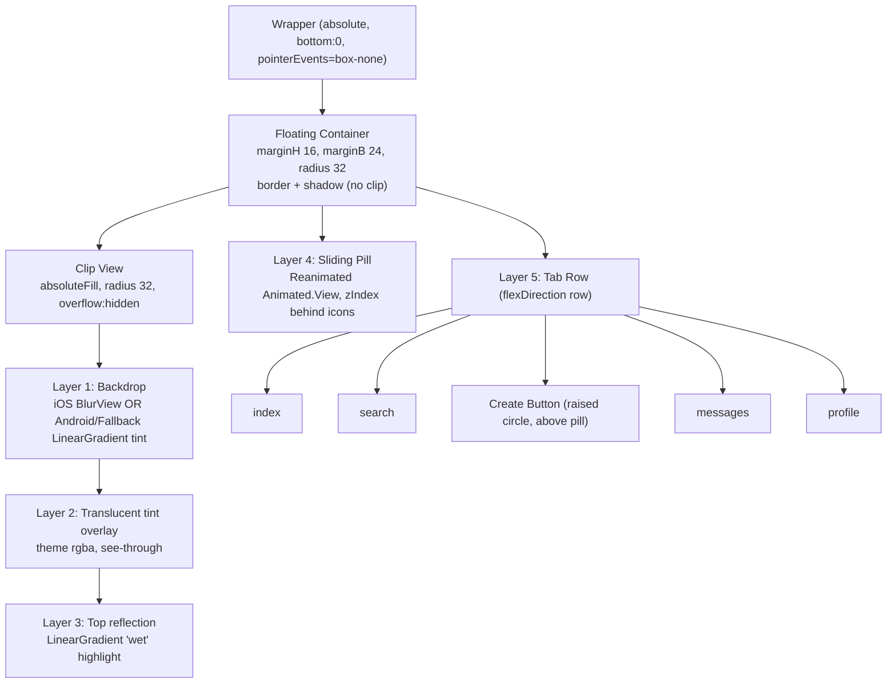
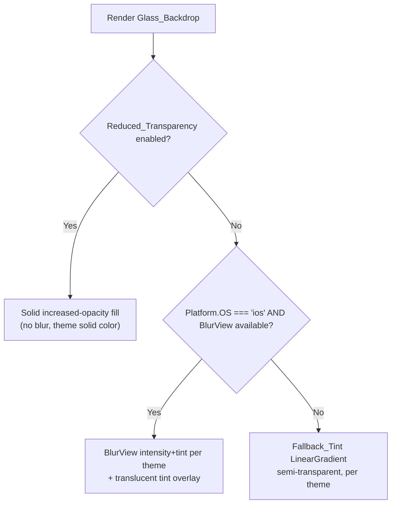
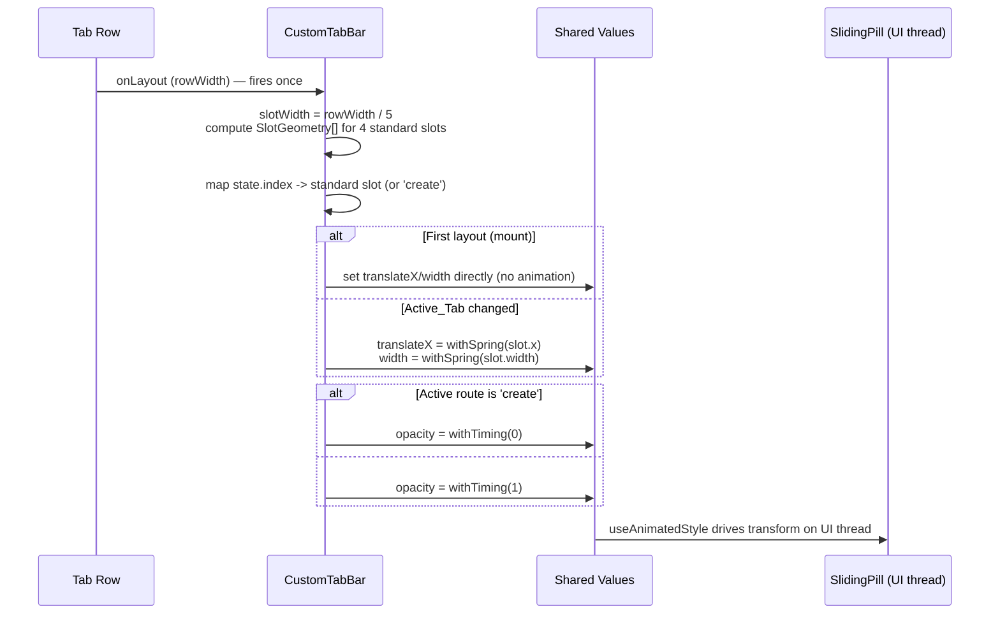

# Design Document

## Overview

This design re-styles the existing `src/components/navigation/CustomTabBar.tsx` into a floating "Liquid Glass" navigation bar. It is a deliberate pseudo-glass imitation assembled only from packages already in the project: `expo-blur` (~15.0.8), `expo-linear-gradient` (~15.0.8), `react-native-reanimated` (~4.1.1), `react-native-svg` (15.12.1, avoided here for performance), and `@expo/vector-icons` (Feather). No new native dependency is introduced and the iOS 26 system glass API is not used.

The change is scoped to this single component. The expo-router `Tabs` navigator and `app/(tabs)/_layout.tsx` wiring remain untouched. The component continues to receive `BottomTabBarProps` (`state`, `navigation`, `descriptors`) and renders the same five routes in the same order: `index`, `search`, `create`, `messages`, `profile`.

The redesign adds three things on top of the current layout:

1. A layered translucent **Glass_Backdrop** (real backdrop blur on iOS via `BlurView`, gradient/tint fallback on Android or when blur is unavailable).
2. A Reanimated spring-driven **Sliding_Pill** that highlights the active Standard_Tab and slides between the four standard slots, skipping the center create slot.
3. Theme- and accessibility-aware tint/border/reflection derivation, including a reduced-transparency fallback.

The existing memoized `TabBarButton`, haptics (`triggerHaptic('light')`), and navigation event emission are preserved.

## Architecture

### Layer stack (bottom to top)

The floating container keeps the current geometry (`marginHorizontal: 16`, `marginBottom: 24`, `borderRadius: 32`, hairline border, drop shadow). Inside it, layers stack from back to front. The blur/tint and reflection layers are clipped to the rounded corners by an inner `overflow: 'hidden'` clip view that carries the same `borderRadius`, while the outer container keeps the shadow (a view cannot both clip children and cast a shadow on iOS, so shadow and clip are split across two views).



Z-order summary (lowest first): backdrop -> tint overlay -> reflection -> sliding pill -> tab row (icons + create button). The pill sits behind the icons so the active icon renders on top of the highlight; the create button renders in the row and is therefore always above the pill, satisfying the "never covered" requirement.

### Platform split



- **iOS**: `BlurView` with `tint` = `'light' | 'dark'` derived from `theme.isDark` and an `intensity` tuned per theme. A lighter translucent tint overlay sits on top so the fill is see-through rather than a heavy frosted panel.
- **Android**: `BlurView` backdrop blur is unreliable/expensive, so a `LinearGradient` Fallback_Tint (semi-transparent, theme-derived) is rendered instead.
- **Blur unavailable / reduced transparency**: render the Fallback_Tint or an increased-opacity solid fill so the bar stays fully visible and legible.

A small helper module encapsulates the decision so the JSX stays readable.

## Components and Interfaces

### Module layout

All changes live in `CustomTabBar.tsx`. Internal helpers/sub-components:

- `useReduceTransparency()` — hook wrapping `AccessibilityInfo.isReduceTransparencyEnabled()` + change listener.
- `useGlassTheme(theme, reduceTransparency)` — derives all backdrop colors/intensities from theme tokens.
- `GlassBackdrop` — renders the platform backdrop + tint overlay + reflection (Layers 1-3).
- `SlidingPill` — the Reanimated `Animated.View` (Layer 4).
- `TabBarButton` — existing memoized button (Layer 5), unchanged behavior.
- `CustomTabBar` — orchestrates measurement, active-index tracking, and composition.

### Key TypeScript interfaces

```typescript
import type { BottomTabBarProps } from '@react-navigation/bottom-tabs';
import type { Theme } from '../../theme';

/** Geometry of one standard-tab slot, measured once from the row layout. */
interface SlotGeometry {
  /** Route name for this slot (excludes 'create'). */
  routeName: string;
  /** Left x offset of the slot within the tab row, in px. */
  x: number;
  /** Slot width in px. */
  width: number;
}

/** Resolved visual values for the Glass_Backdrop for the current theme + a11y state. */
interface GlassStyle {
  /** iOS BlurView tint. */
  blurTint: 'light' | 'dark';
  /** iOS BlurView intensity (0-100). */
  blurIntensity: number;
  /** Translucent tint overlay color (rgba) layered over the backdrop. */
  tintOverlay: string;
  /** Solid fill used when reduced transparency is enabled (rgba, high opacity). */
  solidFill: string;
  /** Hairline border color. */
  borderColor: string;
  /** Top reflection gradient stops (top -> transparent). */
  reflectionColors: [string, string];
  /** Android fallback tint gradient stops. */
  fallbackColors: [string, string];
  /** Sliding pill fill color (derived from accent.primary at low opacity). */
  pillColor: string;
}

interface GlassBackdropProps {
  glass: GlassStyle;
  reduceTransparency: boolean;
}

interface SlidingPillProps {
  /** Animated horizontal offset (shared value, px). */
  translateX: SharedValue<number>;
  /** Animated width (shared value, px). */
  width: SharedValue<number>;
  /** Animated opacity (0 when active route is 'create'). */
  opacity: SharedValue<number>;
  pillColor: string;
}
```

### Theme derivation (`useGlassTheme`)

Values are derived from `theme.isDark` and tokens (`accent.primary`, `accent.secondary`, `text.tertiary`, `background.primary`). Indicative mapping:

| Value | Dark theme | Light theme |
| --- | --- | --- |
| `blurTint` | `'dark'` | `'light'` |
| `blurIntensity` | ~40 | ~50 |
| `tintOverlay` | `rgba(30,30,32,0.35)` | `rgba(255,255,255,0.35)` |
| `solidFill` (reduced transparency) | `rgba(22,22,24,0.96)` | `rgba(252,252,252,0.96)` |
| `borderColor` | `rgba(255,255,255,0.12)` | `rgba(0,0,0,0.06)` |
| `reflectionColors` | `['rgba(255,255,255,0.14)', 'rgba(255,255,255,0)']` | `['rgba(255,255,255,0.55)', 'rgba(255,255,255,0)']` |
| `fallbackColors` (Android) | `['rgba(40,40,44,0.85)', 'rgba(24,24,26,0.92)']` | `['rgba(255,255,255,0.85)', 'rgba(245,245,247,0.92)']` |
| `pillColor` | `accent.primary` @ ~18% opacity | `accent.primary` @ ~14% opacity |

Active icon color stays `accent.primary`; inactive icons stay `text.tertiary`; the create circle stays `accent.secondary` with a white plus — unchanged from current behavior.

## Data Models

### Measurement and pill data flow

The tab row is a flex container with 5 equal slots. The create button occupies the center slot (index 2). The pill must align to the four standard slots only. Rather than assume equal widths, the design measures the row width once and computes slot geometry, which is robust to padding changes.



Slot geometry computation (5 equal slots, create at index 2):

```typescript
// rowWidth measured from the tab row's onLayout
const slotWidth = rowWidth / state.routes.length; // 5 slots
const PILL_INSET = 8;        // horizontal inset inside a slot
const pillWidth = slotWidth - PILL_INSET * 2;

function slotXForRouteIndex(routeIndex: number): number {
  return routeIndex * slotWidth + PILL_INSET;
}
```

Mapping the navigation `state.index` to pill target:

```typescript
const activeRoute = state.routes[state.index].name;
const isCreateActive = activeRoute === 'create';
// When not create, the pill targets the active route's own slot index.
const targetX = slotXForRouteIndex(state.index);
const targetW = pillWidth;
```

Because the pill animates `translateX` directly to the active slot's x, moving from `search` (index 1) to `messages` (index 3) slides the pill smoothly across the create slot (index 2) without stopping on it — satisfying the "skip the create slot" requirement. The pill is hidden (`opacity 0`) whenever `create` is active, so it never sits on the create slot.

### Animation parameters

Use a single Reanimated spring driven on the UI thread. Reuse the project's `springConfigs.snappy` token for consistency:

```typescript
import { withSpring, withTiming } from 'react-native-reanimated';

const PILL_SPRING = { damping: 15, stiffness: 300, mass: 0.8 }; // = theme.animations.spring.snappy
const OPACITY_TIMING = { duration: 150 };                       // = theme.animations.timing.fast

// On Active_Tab change (not first layout):
translateX.value = withSpring(targetX, PILL_SPRING);
width.value = withSpring(targetW, PILL_SPRING);

// First layout (mount): set without animation
translateX.value = targetX;
width.value = targetW;

// Visibility:
opacity.value = withTiming(isCreateActive ? 0 : 1, OPACITY_TIMING);
```

A `mountedRef`/`hasMeasuredRef` flag distinguishes the first layout (assign directly, no animation) from subsequent active-index changes (spring). This satisfies "no translation animation on first mount."

## Error Handling

- **BlurView unavailable**: wrap blur rendering behind a capability check (Platform + try/guard). If `BlurView` is not usable, fall through to the Fallback_Tint so the bar is still opaque enough to be visible and functional. No crash, no blank bar.
- **Layout not yet measured**: until the first `onLayout` provides `rowWidth`, render the pill with `opacity 0` (or skip it) to avoid a flash at x=0. Once measured, set values directly.
- **Reduced transparency toggled at runtime**: the `AccessibilityInfo` change listener updates state, swapping the backdrop to the solid increased-opacity fill without remounting the bar.
- **Theme change**: derived `GlassStyle` recomputes via `useMemo` keyed on `theme.isDark` + accent tokens; colors update immediately on the next render. Pill `translateX`/`width` are unaffected by theme changes (geometry only).
- **Unknown route name**: icon lookup already falls back to `'circle'`; the pill mapping only ever targets valid slot indices from `state`.

## Performance

- **Zero idle animation**: the backdrop is a single static composition (blur/gradient + overlay + reflection). No looping or per-frame work occurs when the user is not switching tabs (Req 5.1, 5.3).
- **UI-thread animation**: pill transform/width/opacity are Reanimated shared values consumed by `useAnimatedStyle`, so the spring runs on the UI thread at 60fps without JS round-trips (Req 5.2).
- **Memoized buttons**: `TabBarButton` stays `React.memo`; only focus-state-changed buttons re-render on tab change (Req 5.4). The pill is a sibling `Animated.View`, so animating it does not re-render the button row.
- **Measure once**: slot geometry is computed from a single `onLayout`; subsequent renders reuse it.
- **Avoid SVG**: the radial highlight is approximated with `LinearGradient` only; `react-native-svg` is not used, avoiding an extra render surface.

## Accessibility

- Each tab control keeps `accessibilityRole="button"`, an `accessibilityLabel` derived from the route/tab title, and `accessibilityState={{ selected: isFocused }}` on the active tab (Req 6.1, 6.2).
- `useReduceTransparency()` reads `AccessibilityInfo.isReduceTransparencyEnabled()` and subscribes to `'reduceTransparencyChanged'`. When enabled, the backdrop renders `solidFill` (high opacity, no blur) so tab content stays legible (Req 6.3).
- Color choices keep `accent.primary` (active) vs `text.tertiary` (inactive) contrast in both themes; the pill uses a low-opacity accent fill so it does not wash out the active icon (Req 6.4).

## Correctness Properties

*A property is a characteristic or behavior that should hold true across all valid executions of a system — essentially, a formal statement about what the system should do. Properties serve as the bridge between human-readable specifications and machine-verifiable correctness guarantees.*

### Property 1: Pill aligns to the active standard slot and never lands on the create slot

*For any* measured row width and *any* Active_Tab that is one of the four Standard_Tabs, the computed Sliding_Pill target x and width SHALL place the pill fully within that tab's own slot bounds, and the pill's horizontal center SHALL never fall within the center create slot (index 2) bounds.

**Validates: Requirements 2.1, 2.3, 3.3**

### Property 2: Pill visibility tracks the create route

*For any* Active_Tab, the Sliding_Pill opacity target SHALL be 0 when the active route is `create` and 1 otherwise.

**Validates: Requirements 2.4**

### Property 3: Icon and pill color correctness across themes

*For any* Active_Tab and either theme (`isDark` true or false), the focused Standard_Tab icon color and the Sliding_Pill fill SHALL derive from `accent.primary`, every non-focused Standard_Tab icon color SHALL equal `text.tertiary`, and these two color values SHALL differ so the active tab stays distinguishable.

**Validates: Requirements 4.3, 4.4, 6.4**

### Property 4: Tab change re-renders only affected buttons

*For any* transition from one Active_Tab index to another, only the two buttons whose focused state changed (the previously focused and the newly focused) SHALL re-render; all other Standard_Tab buttons SHALL NOT re-render.

**Validates: Requirements 5.4**

### Property 5: Accessibility role and label for every tab

*For any* set of routes supplied to the Tab_Bar, every rendered tab control SHALL expose a button accessibility role and a non-empty accessibility label derived from its tab title.

**Validates: Requirements 6.1**

### Property 6: Selected accessibility state matches the active tab

*For any* Active_Tab index, the `selected` accessibility state SHALL be true for exactly the active route's control and false for all other tab controls.

**Validates: Requirements 6.2**

### Property 7: Press navigation logic

*For any* pressed tab index, current Active_Tab index, and `defaultPrevented` flag, the Tab_Bar SHALL emit a `tabPress` event and SHALL call `navigate` for the pressed route if and only if the pressed index is not the Active_Tab and the event was not prevented.

**Validates: Requirements 3.4, 7.1, 7.2**

### Property 8: All routes render in order

*For any* routes array supplied by the navigator, the Tab_Bar SHALL render exactly one control per route in the same order and count as provided.

**Validates: Requirements 7.4**

## Testing Strategy

A dual approach is used. Property-based tests (minimum 100 iterations each, tagged `Feature: liquid-glass-tab-bar, Property {n}: {text}`) cover the pure, input-varying logic: the slot-geometry function (Property 1), visibility mapping (Property 2), color derivation (Property 3), accessibility mapping (Properties 5, 6), press/navigation decision (Property 7), and route ordering (Property 8). The geometry, visibility, color, press-decision, and ordering logic are extracted into pure helper functions so they can be exercised without a full native render.

Example-based and edge-case unit tests cover platform-conditional rendering (iOS BlurView vs Android Fallback_Tint, Requirements 1.1, 1.2, 1.6), static style assertions (1.3, 1.4, 1.5, 3.1, 3.2, 5.3), first-mount no-animation behavior (2.5), reduced-transparency fallback (6.3), haptics (7.1), and long-press emission (7.3). UI-thread/60fps behavior (5.2) and the unchanged navigator wiring (7.5) are verified by manual/visual smoke checks on device, since they are not reliably assertable in unit tests.
