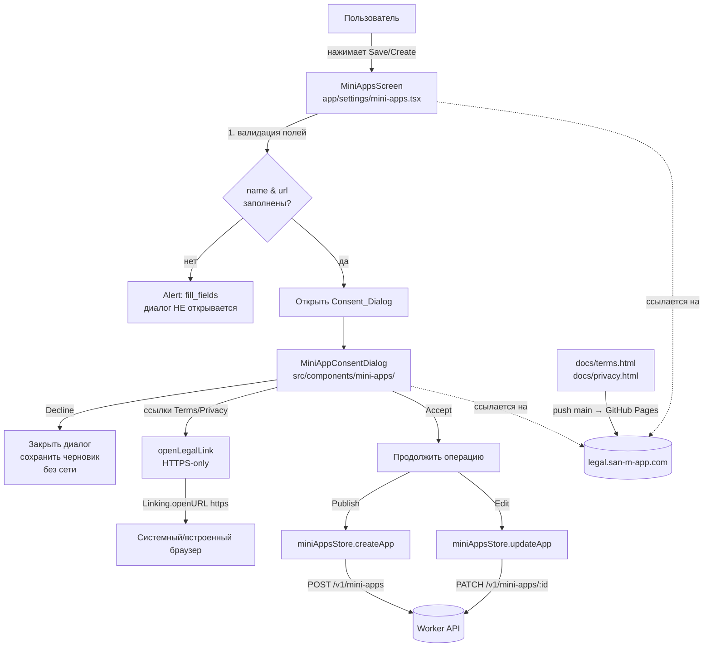
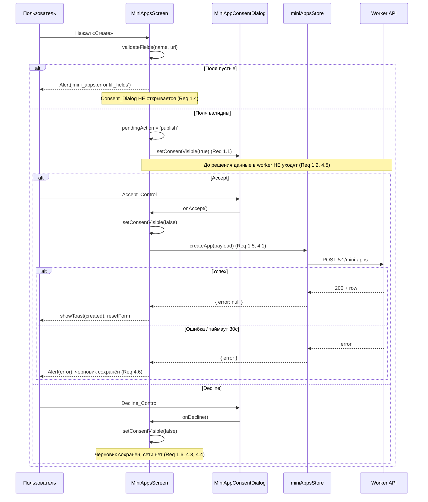
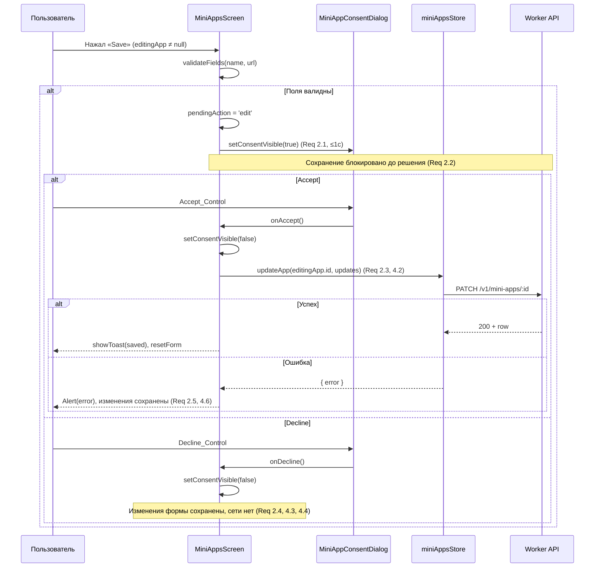
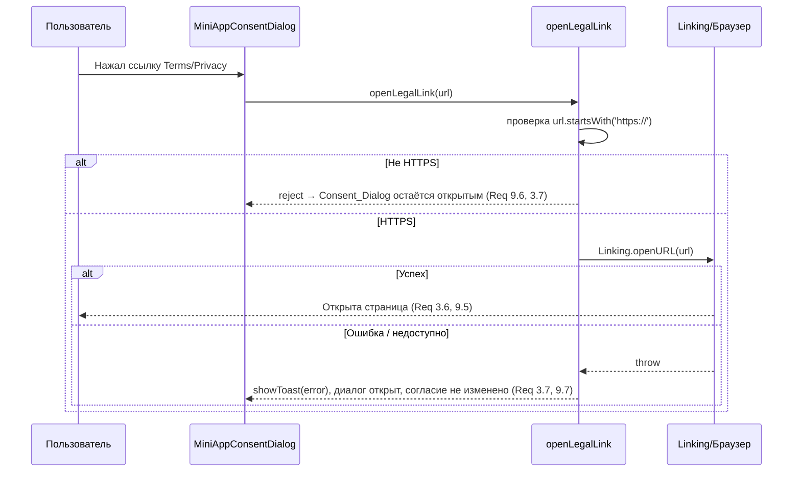

# Design Document

## Overview

Эта функция вводит обязательное окно согласия (Consent_Dialog) с правилами публикации контента, которое перехватывает **и публикацию (Publish_Action), и редактирование (Edit_Action)** мини-приложений на экране `app/settings/mini-apps.tsx` **до** любого обращения к worker. Без явного согласия пользователя (Accept_Control) данные Mini_App никогда не уходят в сеть; при отклонении (Decline_Control) черновик формы полностью сохраняется.

Дополнительно функция расширяет статические юридические страницы (`docs/terms.html`, `docs/privacy.html`), добавляя раздел о запрещённом контенте мини-приложений (Terms) и раздел о пользовательском контенте мини-приложений (Privacy), обновляет дату «Last updated / Последнее обновление» и обеспечивает перекрёстную навигацию между страницами по HTTPS.

Поставка двухканальная:
- **UI-часть** (новый компонент `MiniAppConsentDialog`, правки `mini-apps.tsx`, новые i18n-ключи) — через OTA (`eas update`), без нового нативного билда, без новых нативных разрешений.
- **Юридические страницы** (`docs/`) — через GitHub Pages при push в `main` на `https://legal.san-m-app.com/`.

Функция усиливает соответствие App Review Guideline 1.2 (модерация пользовательского контента) для мини-приложений и согласуется с правилом ATS (HTTPS-only): все ссылки на юридические документы открываются строго по схеме HTTPS.

### Контекст реализации (существующий код)

- **`app/settings/mini-apps.tsx`** — единственный экран создания/редактирования. `handleCreate()` сейчас немедленно вызывает store: для нового приложения — `createApp(...)`, для редактирования — `deleteApp(old) + createApp(new)`. Именно здесь нужно вставить «ворота» согласия.
- **`src/store/miniAppsStore.ts`** — обёртка над worker: `createApp` → `POST /v1/mini-apps`, `updateApp` → `PATCH /v1/mini-apps/:id`, `deleteApp` → `DELETE /v1/mini-apps/:id`.
- **`workers/api/src/routes/miniApps.ts`** — серверные эндпоинты. **Не изменяются** этой функцией: ворота согласия — чисто клиентские, перед сетевым вызовом.
- **`app/(auth)/welcome.tsx`** — эталон открытия юридических ссылок через `Linking.openURL('https://legal.san-m-app.com/...')` с `.catch(() => {})`.
- **`src/i18n/store.ts`** — `t()` / `useT()`; функция интерполяции и поведение фолбэка ключей.

### Замечание о рефакторинге пути редактирования

Текущий путь редактирования делает `deleteApp + createApp` (удаляет старую строку и создаёт новую с новым `id`). Это деструктивно: при сбое `createApp` после успешного `deleteApp` приложение теряется. Требование 2.5 («при неудаче сохранения сохранить введённые данные без потери») и 4.6 указывают на необходимость более безопасного пути. Дизайн предписывает перевести Edit_Action на уже существующий, но неиспользуемый `updateApp(id, updates)` (`PATCH`), который не удаляет строку. Это локальное, неразрушающее изменение клиента (см. Components and Interfaces).

## Architecture



Ключевой архитектурный принцип — **single gate**: и Publish, и Edit проходят через одну точку (`requestConsentThen(action)`), которая открывает Consent_Dialog и выполняет переданное действие только по Accept. Это гарантирует инвариант «нет отправки без согласия» в одном месте, а не дублируется в двух ветках.

### Слои

| Слой | Артефакт | Ответственность |
|------|----------|------------------|
| UI-диалог | `MiniAppConsentDialog.tsx` | Презентация текста правил, ссылок, Accept/Decline; доступность |
| Экран-оркестратор | `mini-apps.tsx` | Валидация полей, открытие ворот, маршрутизация Accept→submit / Decline→cancel, обработка ошибок |
| Утилита ссылок | `openLegalLink()` | Принудительный HTTPS, открытие, обработка ошибки |
| Данные/сеть | `miniAppsStore` | `createApp` / `updateApp` (без изменений в сигнатурах) |
| Локализация | `i18n/locales/{en,ru}.ts` | Ключи `mini_apps.consent.*` |
| Юридические страницы | `docs/terms.html`, `docs/privacy.html` | Разделы о мини-приложениях, дата, навигация |

## Data Flow

### Поток 1: Публикация с согласием (Publish-with-consent)



### Поток 2: Редактирование с согласием (Edit-with-consent)



### Поток 3: Открытие юридической ссылки (HTTPS-only)



## Components and Interfaces

### MiniAppConsentDialog (`src/components/mini-apps/MiniAppConsentDialog.tsx`)

Презентационный модальный компонент. Построен на `react-native` `Modal` в стиле существующих оверлеев (`SlideUpSheet` / `PostContextMenu`): прозрачный backdrop, карточка по центру/снизу, `ModalStatusBar` для iOS. Не содержит бизнес-логики отправки — только UI и колбэки.

```typescript
export interface MiniAppConsentDialogProps {
  /** Управляет видимостью модального окна. */
  visible: boolean;
  /** Контекст вызова — влияет только на заголовок/подпись кнопки (publish vs edit). */
  mode: 'publish' | 'edit';
  /** Пользователь подтвердил согласие (Accept_Control). */
  onAccept: () => void;
  /** Пользователь отклонил согласие (Decline_Control) или закрыл окно. */
  onDecline: () => void;
}
```

Внутреннее поведение:
- Текст правил рендерится из i18n-ключей `mini_apps.consent.*` (никакого хардкода — Req 5.1).
- Две ссылки (Terms, Privacy) — нажимаемые `Text`/`Pressable` с `accessibilityRole="link"`, вызывают `openLegalLink(TERMS_URL | PRIVACY_URL)`.
- Accept и Decline — два визуально различимых `Pressable` (Accept — акцентная заливка, Decline — вторичная) с непустыми `accessibilityLabel` (Req 3.3, 6.1, 6.2).
- При открытии: программный перевод фокуса Screen_Reader на заголовок через `AccessibilityInfo.setAccessibilityFocus` на `ref` заголовка + `accessibilityViewIsModal` на контейнере для удержания фокуса внутри диалога (Req 6.3, 6.5).
- Резервные метки: если i18n-ключ метки пуст, компонент подставляет встроенную дефолтную строку (Req 6.6).
- Кнопка закрытия по фону/`onRequestClose` трактуется как Decline (безопасный исход — без отправки).

Константы URL (модуль-уровень, HTTPS-литералы):
```typescript
const TERMS_URL = 'https://legal.san-m-app.com/terms.html';
const PRIVACY_URL = 'https://legal.san-m-app.com/privacy.html';
```

### openLegalLink (утилита HTTPS-only)

Размещается рядом с диалогом (например `src/components/mini-apps/openLegalLink.ts`) либо в `src/utils`. Чистая обёртка над `Linking.openURL` с проверкой схемы.

```typescript
/**
 * Открывает юридическую ссылку строго по HTTPS.
 * @returns true если открытие инициировано; false если URL отклонён (не HTTPS) или открытие не удалось.
 */
export async function openLegalLink(
  url: string,
  onError?: () => void,
): Promise<boolean> {
  if (!/^https:\/\//i.test(url)) {
    onError?.();           // Req 9.6: не-HTTPS отклоняется, экран не меняется
    return false;
  }
  try {
    await Linking.openURL(url);
    return true;
  } catch {
    onError?.();           // Req 3.7 / 9.7: ошибка открытия → сообщение, состояние сохранено
    return false;
  }
}
```

Примечание ATS: проект работает в режиме HTTPS-only (см. apple-compliance). Явная проверка `https://` — защита на уровне приложения, дублирующая ATS; гарантирует, что даже подменённый/повреждённый URL не уйдёт по HTTP.

### Точка интеграции в `mini-apps.tsx`

Добавляется состояние ворот и единый оркестратор. Существующая `handleCreate` разбивается на «валидация + открытие ворот» и «фактическая отправка».

```typescript
// Новое состояние
const [consentVisible, setConsentVisible] = useState(false);
const [pendingMode, setPendingMode] = useState<'publish' | 'edit'>('publish');

// Шаг 1 — нажатие Save/Create: валидация и открытие ворот
const handleSavePress = () => {
  if (!name.trim() || !url.trim() || !user?.id) {
    Alert.alert(t('common.error'), t('mini_apps.error.fill_fields')); // Req 1.4
    return;                                                            // диалог НЕ открывается
  }
  setPendingMode(editingApp ? 'edit' : 'publish');
  setConsentVisible(true);                                            // Req 1.1 / 2.1
};

// Шаг 2 — Accept: закрыть диалог и выполнить операцию
const handleConsentAccept = async () => {
  setConsentVisible(false);
  setCreating(true);
  const normalizedUrl = url.trim().startsWith('http') ? url.trim() : `https://${url.trim()}`;
  if (editingApp) {
    // Неразрушающий PATCH вместо delete+create (см. Architecture)
    const { error } = await updateApp(editingApp.id, {
      name: name.trim(), description: description.trim(), emoji: emoji || '🎮', url: normalizedUrl,
    });
    setCreating(false);
    if (error) { Alert.alert(t('common.error'), error); return; }     // Req 2.5 / 4.6 — черновик цел
    showToast(t('toast.saved'), 'check');
  } else {
    const { error } = await createApp({ creator_id: user!.id, name: name.trim(), description: description.trim(), emoji: emoji || '🎮', url: normalizedUrl });
    setCreating(false);
    if (error) { Alert.alert(t('common.error'), error); return; }     // Req 4.6 — черновик цел
    showToast(t('mini_apps.toast.created'), 'check');
  }
  resetForm();
};

// Шаг 3 — Decline: закрыть диалог, ничего не отправлять, черновик не трогать
const handleConsentDecline = () => {
  setConsentVisible(false);                                           // Req 1.6 / 2.4 / 4.3 / 4.4
};
```

Кнопка формы переключается с `onPress={handleCreate}` на `onPress={handleSavePress}`. Внизу формы добавляются две HTTPS-ссылки на Terms/Privacy через тот же `openLegalLink` (Req 9.1, 9.2). Компонент `<MiniAppConsentDialog visible={consentVisible} mode={pendingMode} onAccept={handleConsentAccept} onDecline={handleConsentDecline} />` монтируется на экране.

### Список i18n-ключей (`src/i18n/locales/en.ts` и `ru.ts`)

Все ключи в пространстве `mini_apps.consent.*`. Набор должен быть **идентичным** в обоих файлах (Req 5.4).

| Ключ | EN | RU |
|------|----|----|
| `mini_apps.consent.title` | Content policy | Правила публикации |
| `mini_apps.consent.intro` | Before publishing, confirm your mini app follows our content rules. | Перед публикацией подтвердите, что ваше мини-приложение соответствует правилам. |
| `mini_apps.consent.prohibited_heading` | Prohibited content | Запрещённый контент |
| `mini_apps.consent.prohibited_body` | You may not publish mini apps with prohibited content. | Запрещено публиковать мини-приложения с запрещённым контентом. |
| `mini_apps.consent.stores` | Prohibited content includes anything not allowed by Apple App Store and Google Play policies. | Запрещённый контент включает всё, что не допускают политики Apple App Store и Google Play. |
| `mini_apps.consent.san_policies` | It also includes content that violates San's Terms of Use and Privacy Policy. | А также контент, нарушающий Условия использования и Политику конфиденциальности San. |
| `mini_apps.consent.terms_link` | Terms of Use | Условия использования |
| `mini_apps.consent.privacy_link` | Privacy Policy | Политика конфиденциальности |
| `mini_apps.consent.accept` | I agree & publish | Согласен и публикую |
| `mini_apps.consent.decline` | Cancel | Отмена |
| `mini_apps.consent.accept_a11y` | Agree to the content policy and continue | Принять правила и продолжить |
| `mini_apps.consent.decline_a11y` | Decline and cancel publishing | Отклонить и отменить публикацию |
| `mini_apps.consent.terms_link_a11y` | Open Terms of Use | Открыть Условия использования |
| `mini_apps.consent.privacy_link_a11y` | Open Privacy Policy | Открыть Политику конфиденциальности |
| `mini_apps.consent.link_error` | Couldn't open the legal page. Check your connection and try again. | Не удалось открыть документ. Проверьте соединение и попробуйте снова. |

Метка Accept может зависеть от `mode` (publish/edit), при необходимости добавляется `mini_apps.consent.accept_edit` («I agree & save» / «Согласен и сохраняю») — также в обоих файлах.

> Замечание о фолбэке (Req 5.6): текущая `t()` в `src/i18n/store.ts` при отсутствии ключа в активной локали возвращает значение из **русской** локали, а затем сам ключ — не из английской, как формулирует требование. Дизайн делает ставку на **паритет ключей** (Req 5.4): оба файла содержат полный набор `mini_apps.consent.*`, поэтому путь фолбэка не должен активироваться в нормальной работе. Несовпадение фактического фолбэк-языка с формулировкой 5.6 фиксируется как известное расхождение; при необходимости его можно устранить отдельной правкой `store.ts` (вне основной поставки этой функции).

## Data Models

Новых персистентных моделей нет. Структура `MiniApp` (`src/store/miniAppsStore.ts`) не меняется. Вводится только эфемерное UI-состояние ворот согласия:

```typescript
// Эфемерное состояние экрана (не персистится)
type PendingMode = 'publish' | 'edit';
interface ConsentGateState {
  consentVisible: boolean;   // открыт ли Consent_Dialog
  pendingMode: PendingMode;  // какой текст/подпись показывать и какую ветку выполнять по Accept
}
```

Полезная нагрузка, отправляемая по Accept, идентична текущей (`name`, `description`, `emoji`, `url`), плюс `creator_id` для publish.

## Correctness Properties

*Свойство (property) — это характеристика или поведение, которое должно выполняться во всех допустимых исполнениях системы; по сути, формальное утверждение о том, что система должна делать. Свойства служат мостом между человекочитаемой спецификацией и машинно-проверяемыми гарантиями корректности.*

Эта функция в основном UI-ориентированная (модальное окно, статический HTML, i18n-строки), поэтому большинство критериев приёмки покрываются примерами (рендер-тесты), интеграционными проверками (платформенный a11y, открытие ссылок) и статическими проверками HTML. Тем не менее есть ядро чистой логики, для которого property-based тестирование даёт реальную ценность: gating-инвариант ворот согласия, нормализация/маршрутизация отправки, сохранение черновика при Decline/ошибке, HTTPS-only открытие ссылок и паритет ключей локализации. Ниже приведён консолидированный (после рефлексии) минимальный набор свойств.

Логика ворот тестируется через тонкий, чистый «редьюсер» состояния экрана (например `consentGateReducer` / хелперы `handleSavePress`, `handleConsentAccept`, `handleConsentDecline`), извлечённый из компонента с инъекцией мока store (`createApp`/`updateApp`). Это позволяет прогонять 100+ итераций без сети и без рендера нативного дерева.

### Property 1: Gating — нет отправки в worker без явного Accept

*Для любого* валидного состояния формы Mini_App и любого режима (`publish` или `edit`), пока пользователь не выбрал Accept_Control, экран НЕ выполняет ни одного сетевого вызова (`createApp` и `updateApp` мока вызваны 0 раз), а Consent_Dialog при инициации Save переходит в открытое состояние.

**Validates: Requirements 1.1, 1.2, 2.1, 2.2, 4.3, 4.5**

### Property 2: Accept приводит ровно к одному корректному вызову отправки

*Для любого* валидного состояния формы: после открытия ворот и выбора Accept_Control экран выполняет ровно один сетевой вызов, соответствующий режиму — `createApp` с `{name, description, emoji, url}` (нормализованным: URL получает префикс `https://`, если схема отсутствует) для `publish`, либо `updateApp(editingApp.id, updates)` для `edit` — и закрывает Consent_Dialog.

**Validates: Requirements 1.5, 2.3, 4.1, 4.2**

### Property 3: Decline сохраняет черновик и не обращается к сети

*Для любого* валидного состояния формы и любого режима: выбор Decline_Control закрывает Consent_Dialog, не вызывает ни `createApp`, ни `updateApp` (0 вызовов), и оставляет все поля формы (`name`, `description`, `emoji`, `url`, `editingApp`) в точности равными значениям до открытия диалога.

**Validates: Requirements 1.6, 2.4, 4.4**

### Property 4: Невалидные поля не открывают диалог и не вызывают сеть

*Для любой* формы, в которой `name` или `url` пусты или состоят только из пробельных символов, нажатие Save приводит к показу сообщения об ошибке заполнения полей, оставляет Consent_Dialog закрытым и не выполняет ни одного сетевого вызова.

**Validates: Requirements 1.4**

### Property 5: Ошибка отправки после Accept сохраняет введённые данные

*Для любого* валидного состояния формы и любого режима, если мок store после Accept возвращает `{ error }` (или операция не завершается успешно), экран показывает сообщение об ошибке и оставляет все поля формы без изменений и без сброса (`resetForm` не вызывается).

**Validates: Requirements 2.5, 4.6**

### Property 6: Открытие юридических ссылок строго по HTTPS

*Для любой* строки URL, `openLegalLink` инициирует открытие (вызывает `Linking.openURL`) тогда и только тогда, когда схема URL — `https`; для любой не-HTTPS схемы (`http`, `ftp`, `file`, `javascript`, относительные/пустые) функция возвращает `false`, не вызывает `Linking.openURL` и вызывает обработчик ошибки, сохраняя текущий экран без перехода.

**Validates: Requirements 9.5, 9.6**

### Property 7: Паритет ключей локализации Consent_Dialog

*Для любого* ключа в пространстве `mini_apps.consent.*`: множество таких ключей в словаре `en` в точности равно множеству таких ключей в словаре `ru` (нет ключей, присутствующих только в одном файле), и значение каждого ключа в обоих словарях — непустая строка.

**Validates: Requirements 5.2, 5.3, 5.4**

## Error Handling

| Сценарий | Обработка | Требование |
|----------|-----------|------------|
| Пустые `name`/`url` (вкл. whitespace) | `Alert(common.error, mini_apps.error.fill_fields)`; диалог не открывается | 1.4 |
| Decline | Закрыть диалог, нет сети, черновик цел | 1.6, 2.4, 4.3, 4.4 |
| Ошибка `createApp` после Accept (publish) | `setCreating(false)`, `Alert(common.error, error)`, форма не сброшена | 4.6 |
| Ошибка `updateApp` после Accept (edit) | `setCreating(false)`, `Alert(common.error, error)`, изменения сохранены | 2.5, 4.6 |
| Таймаут отправки (без ответа ~30с) | Полагаемся на таймаут `apiClient`; результат — `{error}` → как ошибка отправки выше | 4.6 |
| Ссылка не-HTTPS | `openLegalLink` отклоняет, `onError` → `showToast(link_error)`, диалог открыт, согласие не изменено | 9.6, 3.7 |
| `Linking.openURL` бросает / страница недоступна | `catch` → `onError` → `showToast(link_error)`, экран/диалог без перехода | 3.7, 9.7 |
| Отсутствует i18n-ключ | Паритет ключей предотвращает; `t()` не возвращает сырой идентификатор (фолбэк-строка) | 5.6 |
| Пустая a11y-метка контрола | Компонент подставляет встроенную резервную метку, элемент остаётся активируемым | 6.6 |
| Отсутствует языковой блок на HTML-странице | Скрипт `setLang` по умолчанию использует `'en'` | 7.6, 8.6 |

Принцип: все исходы ошибок **неразрушающие** — пользователь никогда не теряет введённые данные, а отсутствие согласия всегда означает отсутствие сетевой мутации.

## Testing Strategy

### Двойной подход

- **Unit / рендер-тесты (примеры и граничные случаи)** — конкретное поведение компонента и статического контента.
- **Property-тесты (универсальные свойства)** — ядро логики ворот, HTTPS-проверка, паритет i18n. Применимы там, где поведение осмысленно варьируется по входам (см. раздел Correctness Properties).

PBT применяется выборочно: оно НЕ используется для статического HTML (`docs/`), для платформенного поведения VoiceOver/TalkBack и для открытия внешнего браузера — там уместны статические проверки, интеграционные тесты с моками и рендер-примеры.

### Библиотека и конфигурация PBT

- Используется **`fast-check`** поверх Jest (проект уже использует Jest; см. существующие `*.property.test.tsx`). Реализация свойств с нуля не делается.
- Минимум **100 итераций** на каждое property-тест (`{ numRuns: 100 }`).
- Каждый property-тест помечается комментарием-тегом в формате:
  `// Feature: mini-app-content-policy-consent, Property {N}: {текст свойства}`
- Каждое свойство реализуется **одним** property-тестом.

Генераторы:
- `validMiniAppForm` — `name` (непустой trimmed), `url` (произвольный, нормализуемый), `description`, `emoji`.
- `invalidField` — пустые/whitespace строки для Property 4.
- `arbitraryUrl` — URL с варьируемой схемой (`https`, `http`, `ftp`, `file`, `javascript`, относительные, пустые) для Property 6.

### Соответствие свойств тестам

| Property | Что мокируется | Что проверяется |
|----------|----------------|------------------|
| P1 Gating | `createApp`, `updateApp` | 0 вызовов до Accept; `consentVisible=true` после Save |
| P2 Accept→submit | store-методы | ровно 1 вызов нужного метода с нормализованным payload |
| P3 Decline | store-методы | 0 вызовов; снимок формы неизменен |
| P4 Валидация | `Alert`, store | Alert вызван; диалог закрыт; 0 вызовов сети |
| P5 Ошибка | store → `{error}` | Alert; форма не сброшена |
| P6 HTTPS | `Linking.openURL` | вызов только для `https`; `onError` иначе |
| P7 i18n parity | — (чтение словарей) | равенство множеств ключей `mini_apps.consent.*`, непустые значения |

### Unit / рендер-тесты (примеры)

- Диалог рендерит Accept, Decline и текст правил (1.3); тексты о магазинах и о Terms/Privacy San (3.1–3.3).
- Ссылки Terms/Privacy имеют `accessibilityRole="link"` и непустые метки; нажатие вызывает `openLegalLink` с правильным URL (3.4, 3.5, 6.4).
- Accept/Decline имеют непустые `accessibilityLabel` (6.1, 6.2).
- Рендер при `locale='ru'` и `locale='en'` даёт разные строки, без сырых ключей (5.1, 5.5).
- Mini_Apps_Screen отображает HTTPS-ссылки на Terms/Privacy (9.1, 9.2).

### Интеграционные проверки (1–3 примера)

- Открытие диалога вызывает `AccessibilityInfo.setAccessibilityFocus` на заголовке; контейнер имеет `accessibilityViewIsModal` (6.3, 6.5).
- `Linking.openURL` вызывается с корректным HTTPS-URL при нажатии ссылки (3.6).

### Статические проверки `docs/` (примеры)

- `terms.html`: раздел о Mini_App с перечнем категорий Prohibited_Content и упоминанием Apple/Google в обоих блоках `data-lang` (7.1–7.4); дата в формате `YYYY-MM-DD` (7.5).
- `privacy.html`: раздел о пользовательском контенте Mini_App (категории, ответственность, жалобы/блокировка, срок 24 часа) в обоих блоках (8.1–8.4); дата `YYYY-MM-DD` (8.5).
- Навигационные перекрёстные HTTPS-ссылки Terms↔Privacy (9.3, 9.4).
- Скрипт `setLang` по умолчанию использует `'en'` (7.6, 8.6).

## Docs HTML — план правок

Обе страницы используют общий паттерн: парные блоки `<div data-lang="en">` и `<div data-lang="ru">`, поле `.updated`, нижний `.nav`. Правки симметричны и не трогают `<style>`/`<script>`.

### `docs/terms.html`

1. **Дата**: обновить `Last updated: ...` и `Последнее обновление: ...` на дату публикации в формате **ISO 8601 `YYYY-MM-DD`** (Req 7.5). Текущие строки («June 11, 2026» / «11 июня 2026») заменяются на формат `YYYY-MM-DD` в обоих блоках.
2. **Новый раздел о мини-приложениях** — добавить в EN-блок (после §2 «Acceptable use» или перед §3) новый заголовок, например `<h2>3. Mini apps</h2>` (с перенумерацией последующих) или `<h2>Mini apps and prohibited content</h2>`. Содержимое:
   - Явный запрет публиковать мини-приложения с Prohibited_Content (Req 7.1).
   - Список категорий: illegal content, child sexual exploitation, hate speech, harassment, violence, malicious code, intellectual-property infringement (Req 7.1).
   - Требование соответствия политикам Apple App Store и Google Play (Req 7.2).
3. **Зеркальный RU-блок** — добавить раздел `<h2>... Мини-приложения ...</h2>` с тем же набором категорий и упоминанием политик магазинов (Req 7.3, 7.4 — смысловой паритет).
4. **Nav**: блок `.nav` уже содержит ссылки на `privacy.html` и `terms.html` — подтвердить, что ссылка на Privacy присутствует и относительная (`./privacy.html`), что на GitHub Pages резолвится в HTTPS `https://legal.san-m-app.com/privacy.html` (Req 9.3).

### `docs/privacy.html`

1. **Дата**: обновить оба поля `.updated` на формат `YYYY-MM-DD` (Req 8.5).
2. **Новый раздел о пользовательском контенте мини-приложений** — добавить в EN-блок (например, перед «Children's data») `<h2>Mini apps and user content</h2>` со следующими темами (Req 8.1):
   - Категории контента, которые могут публиковаться/запрещены.
   - Ответственность пользователя за публикуемый контент.
   - Механизмы жалоб и блокировки (reporting & blocking).
   - Срок реагирования на жалобы — **24 часа**.
3. **Зеркальный RU-блок** — добавить раздел `<h2>Мини-приложения и пользовательский контент</h2>` с тем же набором тем (Req 8.3, 8.4 — паритет тем).
4. **Nav**: подтвердить наличие ссылки на `terms.html` (Req 9.4).

### Согласованность и деплой

- Перечень категорий Prohibited_Content в `terms.html` должен быть согласован с текстом Consent_Dialog (i18n `mini_apps.consent.*`) и с существующим §2 «Acceptable use», чтобы правила не противоречили друг другу.
- Даты на обеих страницах ставятся одной датой публикации правок.
- Деплой `docs/` — через GitHub Pages при push в `main`; UI-часть — отдельным каналом OTA (`eas update`). Эти две поставки независимы, поэтому формулировки ссылок в приложении (литералы HTTPS-URL) не зависят от момента публикации страниц.

## Compliance Notes

- **ATS (HTTPS-only)**: все юридические ссылки — литералы `https://`; `openLegalLink` дополнительно отклоняет не-HTTPS. Никаких `NSAllowsArbitraryLoads` или HTTP-исключений не вводится.
- **Без новых нативных разрешений**: функция не добавляет ни одной `NS*UsageDescription`, поэтому безопасно поставляется через OTA (`eas update`), без нового нативного билда.
- **App Review Guideline 1.2**: раздел Terms о запрещённом контенте мини-приложений и раздел Privacy о пользовательском контенте (со сроком реагирования 24 часа и упоминанием механизмов жалоб/блокировки) усиливают существующие механизмы модерации UGC.
- **Worker не меняется**: серверная валидация (`POST`/`PATCH` в `miniApps.ts`) остаётся источником истины; ворота согласия — дополнительный клиентский барьер, а не замена серверным проверкам.
