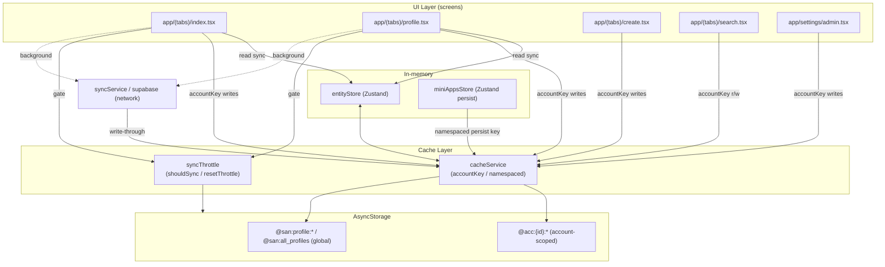
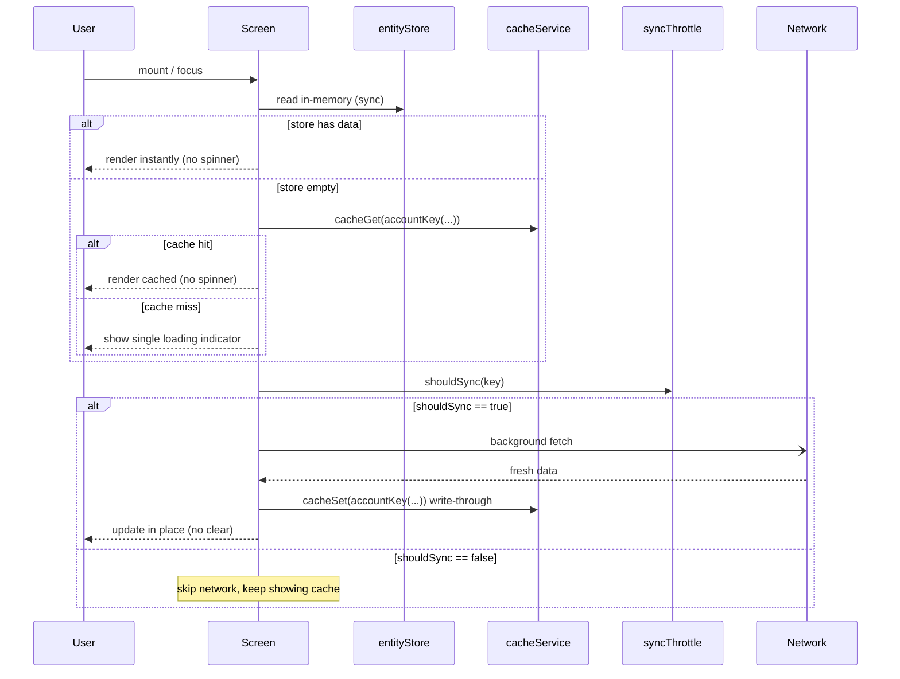

# Design Document

## Overview

Эта фича закрывает последний разрыв в системе пер-аккаунтного кэширования San-Mes. Большая часть инфраструктуры уже есть и работает корректно:

- `src/services/cacheService.ts` — namespacing через `@acc:${activeAccountId}:${key}`, с исключением для `GLOBAL_KEY_PREFIXES`.
- `src/services/syncThrottle.ts` — пер-аккаунтный throttle с ключом `@san:sync_timestamps:${activeAccountId}` и интервалом по умолчанию 5 минут.
- `src/services/entityStore.ts` — Zustand-стор, который гидратируется из `cacheService` при старте.
- `app/_layout.tsx` — при запуске вызывает `setCacheAccount` / `setThrottleAccount` до `hydrate()`.
- `src/components/ui/AccountSwitcher.tsx` — недеструктивное переключение аккаунтов с `setCacheAccount` + `setThrottleAccount` + `resetAllThrottles()` и последующим `Updates.reloadAsync()`.

Реальная проблема в том, что несколько экранов **обходят** `cacheService` и пишут/читают «сырые» глобальные ключи AsyncStorage (`@san:feed_posts`, `@san:my_posts`, `@san:search_history`, persist-ключ `mini-apps-cache`). Эти ключи не несут на себе пер-аккаунтного префикса, поэтому данные одного аккаунта **протекают** в другой при переключении.

Дизайн преследует две цели, заданные требованиями:

1. **Полная изоляция кэша по аккаунтам** — все account-scoped данные хранятся под `@acc:${id}:` через `accountKey()` или хелперы `cacheService`. Никакой деструктивной очистки при переключении — каждый аккаунт держит свой namespace, возврат к аккаунту мгновенный.
2. **Мгновенный cache-first рендеринг без видимой перезагрузки** — экраны показывают кэш сразу, спиннер виден только когда кэша нет, фоновое обновление гейтится через `shouldSync()`.

Дизайн **намеренно компактный**: мы не переписываем инфраструктуру, а устраняем «сырые» ключи и приводим паттерн рендеринга к единому виду на всех экранах.

### Scope

В рамках фичи:

- Заменить «сырые» ключи AsyncStorage на пер-аккаунтные ключи на `app/(tabs)/index.tsx`, `app/(tabs)/profile.tsx`, `app/(tabs)/create.tsx`, `app/settings/admin.tsx`, `app/(tabs)/search.tsx`.
- Сделать persist-ключ `mini-apps-cache` пер-аккаунтным в `src/store/miniAppsStore.ts`.
- Закрепить единый паттерн cache-first рендеринга + throttle-gated фонового обновления.

Вне рамок фичи (уже реализовано и не требует изменений):

- Сам механизм namespacing в `cacheService` (`accountKey`, `namespaced`, `GLOBAL_KEY_PREFIXES`).
- Пер-аккаунтный `syncThrottle`.
- Стартовая привязка аккаунта в `_layout.tsx` и привязка при переключении в `AccountSwitcher.tsx`.

## Architecture

### Слои и поток данных

Система состоит из четырёх логических слоёв. Экраны читают синхронно из памяти (Entity_Store) и из кэша, а сеть работает строго в фоне.



### Ключевой архитектурный принцип

Единственная точка, которая знает про активный аккаунт — это модульная переменная `activeAccountId` внутри `cacheService` и `syncThrottle`. Любой код, который пишет в AsyncStorage account-scoped данные, **обязан** проходить через одну из двух дверей:

1. Хелперы `cacheService` (`cacheGet` / `cacheSet` / `cacheRemove` и сущностные хелперы) — они сами применяют `namespaced()`.
2. `accountKey(baseKey)` — когда экран по историческим причинам напрямую дергает `AsyncStorage`, он оборачивает базовый ключ в `accountKey()` перед вызовом.

«Сырой» вызов `AsyncStorage.getItem('@san:feed_posts')` нарушает этот принцип и является ровно тем дефектом, который мы устраняем.

### Cache-first жизненный цикл экрана



## Components and Interfaces

Ниже — изменения по файлам. Везде, где экран сейчас использует «сырой» ключ, базовый ключ оборачивается в `accountKey(baseKey)` из `cacheService`. Базовый ключ остаётся прежним (`'@san:feed_posts'`, `'@san:my_posts'`, `'@san:search_history'`) — меняется только то, что он проходит через `accountKey()`.

### `src/services/cacheService.ts` (без изменений логики)

Используется как есть. Экраны импортируют `accountKey`:

```typescript
import { accountKey } from '../../src/services/cacheService';
// было:  AsyncStorage.getItem('@san:feed_posts')
// стало: AsyncStorage.getItem(accountKey('@san:feed_posts'))
```

`accountKey('@san:feed_posts')` вернёт `@acc:${activeAccountId}:@san:feed_posts`. Это даёт пер-аккаунтную изоляцию без изменения формата самого базового ключа.

> Примечание: базовые ключи `'@san:feed_posts'` и `'@san:my_posts'` **не** совпадают с `GLOBAL_KEY_PREFIXES` (`'@san:profile:'`, `'@san:all_profiles'`), поэтому корректно трактуются как account-scoped.

### `app/(tabs)/index.tsx` (Feed_Screen)

Сейчас ~4 «сырых» обращения к `FEED_CACHE_KEY = '@san:feed_posts'`:

- `useFocusEffect` — чтение кэша при фокусе вкладки.
- mount `useEffect` — чтение кэша, если стор пуст.
- `loadFeed` — запись кэша после сетевой загрузки.
- `handleRefresh` — запись кэша после pull-to-refresh.

Изменения:

- Все 4 обращения оборачиваются в `accountKey(FEED_CACHE_KEY)`.
- `handleRefresh` уже вызывает `resetThrottle('feed')` — сохраняем.
- Перед фоновой загрузкой в `loadFeed` добавить гейт `shouldSync('feed')`: если `false` — пропустить сеть и оставить кэш.
- Спиннер (`isLoading`) показывается только при отсутствии кэша; при наличии кэша `setIsLoading(false)` происходит до сетевого запроса (паттерн уже частично присутствует).

Интерфейс (концептуально, без изменения сигнатур экрана):

```typescript
const FEED_CACHE_KEY = '@san:feed_posts'; // базовый ключ, всегда через accountKey()

// read
const cached = await AsyncStorage.getItem(accountKey(FEED_CACHE_KEY));
// write
await AsyncStorage.setItem(accountKey(FEED_CACHE_KEY), JSON.stringify(mapped));
// background gate
if (await shouldSync('feed')) { /* fetch */ }
```

### `app/(tabs)/profile.tsx` (Profile_Screen)

Сейчас «сырые» обращения к `MY_POSTS_CACHE_KEY = '@san:my_posts'` (mount read + write после `loadMyPosts`).

Изменения:

- Обе операции оборачиваются в `accountKey(MY_POSTS_CACHE_KEY)`.
- Фоновая `loadMyPosts` гейтится через `shouldSync('my_posts')`; pull-to-refresh (`onRefresh`) вызывает `resetThrottle('my_posts')` перед загрузкой.
- Рендер my-posts остаётся cache-first: если `userPosts.length > 0` в сторе — рисуем сразу.

### `app/(tabs)/create.tsx` (Create_Screen)

Сейчас ~3 места с «сырыми» ключами `'@san:feed_posts'` и `'@san:my_posts'`:

- Ветка редактирования поста: чтение+запись фид-кэша и my-posts-кэша.
- Ветка создания поста: запись нового поста в фид-кэш и my-posts-кэш (`slice(0, 20)`).

Изменения:

- Все чтения/записи оборачиваются в `accountKey('@san:feed_posts')` / `accountKey('@san:my_posts')`.
- Так как `create.tsx` мутирует кэш активного аккаунта, корректный namespace гарантирует, что новый/отредактированный пост попадает только в кэш текущего аккаунта (Requirement 11.3).

### `app/settings/admin.tsx` (Admin_Screen)

Сейчас 2 места: удаление поста из фид-кэша и из my-posts-кэша «сырыми» ключами.

Изменения:

- Обе операции оборачиваются в `accountKey('@san:feed_posts')` / `accountKey('@san:my_posts')`.

### `app/(tabs)/search.tsx` (Search_Screen)

Сейчас `SEARCH_HISTORY_KEY = '@san:search_history'` используется «сырым» в трёх местах: `loadHistory` (read), сохранение истории (write), `clearHistory` (remove).

Изменения:

- Все три операции оборачиваются в `accountKey(SEARCH_HISTORY_KEY)`.
- Это делает историю поиска account-scoped (Requirement 3.3): аккаунт A не видит историю аккаунта B.

### `src/store/miniAppsStore.ts` (Mini_Apps_Store)

Сейчас Zustand `persist` использует фиксированное `name: 'mini-apps-cache'`, то есть один глобальный ключ на устройство.

Изменения: сделать ключ хранения пер-аккаунтным через кастомный `StateStorage`, который оборачивает имя в `accountKey()`:

```typescript
import { accountKey } from '../services/cacheService';

const storage: StateStorage = {
  setItem: async (name, value) => {
    await AsyncStorage.setItem(accountKey(name), value);
  },
  getItem: async (name) => {
    return await AsyncStorage.getItem(accountKey(name));
  },
  removeItem: async (name) => {
    await AsyncStorage.removeItem(accountKey(name));
  },
};
```

Так как `AccountSwitcher` вызывает `Updates.reloadAsync()` после `setCacheAccount(profile.id)`, persist-стор регидратируется уже под пер-аккаунтным ключом активного аккаунта на старте. Имя `'mini-apps-cache'` остаётся базовым ключом, а `accountKey()` добавляет префикс `@acc:${id}:`.

> Замечание о порядке инициализации: `accountKey()` читает `activeAccountId`, который выставляется в `_layout.tsx` через `setCacheAccount(currentUser?.id)` на старте. Поскольку Zustand `persist` регидратируется асинхронно после первого доступа к стору, а экран mini-apps открывается уже после монтирования дерева (когда `setCacheAccount` отработал в `_layout.tsx`), активный аккаунт к моменту чтения корректен. Это согласуется с уже существующим поведением `entityStore.hydrate()`, который тоже стартует после `setCacheAccount`.

### Затрагиваемые модули — сводная таблица

| Файл | Сейчас (raw) | Станет |
|------|--------------|--------|
| `app/(tabs)/index.tsx` | `'@san:feed_posts'` ×4 | `accountKey('@san:feed_posts')` + `shouldSync('feed')` |
| `app/(tabs)/profile.tsx` | `'@san:my_posts'` ×2 | `accountKey('@san:my_posts')` + `shouldSync('my_posts')` |
| `app/(tabs)/create.tsx` | `'@san:feed_posts'`, `'@san:my_posts'` ×3 | `accountKey(...)` |
| `app/settings/admin.tsx` | `'@san:feed_posts'`, `'@san:my_posts'` ×2 | `accountKey(...)` |
| `app/(tabs)/search.tsx` | `'@san:search_history'` ×3 | `accountKey('@san:search_history')` |
| `src/store/miniAppsStore.ts` | persist `name: 'mini-apps-cache'` | storage оборачивает имя в `accountKey()` |

## Data Models

### Классификация ключей

Все кэш-ключи делятся на две категории.

#### Account_Scoped_Data — формат `@acc:${activeAccountId}:${baseKey}`

| Базовый ключ | Содержимое | Доступ |
|--------------|-----------|--------|
| `@san:feed` | лента (через `cacheService.cacheFeed`) | `cacheService` |
| `@san:feed_posts` | лента (экран `index.tsx`, raw → `accountKey`) | `accountKey` |
| `@san:my_posts` | посты пользователя (`profile`/`create`/`admin`) | `accountKey` |
| `@san:conversations` | список диалогов | `cacheService` |
| `@san:messages:${convId}` | сообщения диалога | `cacheService` |
| `@san:likes:${userId}` | лайкнутые посты | `cacheService` |
| `@san:follows:${userId}` | подписки | `cacheService` |
| `@san:search_history` | история поиска | `accountKey` |
| `mini-apps-cache` | список mini-apps (persist) | `accountKey` |
| `@san:sync_timestamps` | таймстемпы throttle (через `syncThrottle`) | `syncThrottle` |

Для anon-состояния `activeAccountId === 'anon'`, поэтому ключи приобретают вид `@acc:anon:${baseKey}`.

#### Global_Shared_Data — без namespace

| Ключ / префикс | Содержимое |
|----------------|-----------|
| `@san:profile:${id}` | публичный профиль (общий для всех аккаунтов) |
| `@san:all_profiles` | батч публичных профилей |

Эти ключи перечислены в `GLOBAL_KEY_PREFIXES` и `namespaced()` оставляет их без изменений — публичные профили кэшируются один раз на устройство, без дублирования по аккаунтам (Requirement 4).

### Схема ключа

```
Account-scoped:  @acc:<activeAccountId>:<baseKey>
                 └──┬──┘ └──────┬──────┘ └───┬───┘
                  prefix     account id    base key

Global-shared:   <baseKey starting with @san:profile: or @san:all_profiles>
                 (без префикса @acc:)

Anon fallback:   @acc:anon:<baseKey>   (когда activeAccountId == 'anon')
```

### Инвариант изоляции

Для любого account-scoped baseKey и двух разных аккаунтов A и B итоговые ключи хранения различны:

```
accountKey_A(baseKey) = @acc:A:baseKey
accountKey_B(baseKey) = @acc:B:baseKey
A != B  ⇒  accountKey_A(baseKey) != accountKey_B(baseKey)
```

Это — формальная основа гарантии «аккаунт A никогда не читает данные аккаунта B».

## Correctness Properties

*Свойство (property) — это характеристика или поведение, которое должно оставаться истинным для всех валидных исполнений системы; по сути, формальное утверждение о том, что система обязана делать. Свойства служат мостом между человекочитаемой спецификацией и машинно-проверяемыми гарантиями корректности.*

Ниже — свойства, выведенные из prework-анализа критериев приёмки. Тестируемая логика здесь — это чистые функции построения ключей (`accountKey`, `namespaced`) и логика `shouldSync` по времени; именно они допускают property-based проверку. Критерии, относящиеся к UI-рендерингу и к конфигурации, тестируются примерами/интеграционно (см. Testing Strategy) и здесь не дублируются.

### Property 1: Account-scoped ключи изолированы между аккаунтами

*Для любых* двух различных id аккаунтов и любого account-scoped базового ключа результаты `accountKey(baseKey)` для этих аккаунтов различны; и наоборот, для одного и того же аккаунта `accountKey(baseKey)` детерминирован и стабилен.

**Validates: Requirements 1.1, 1.2, 1.4, 1.5, 2.5, 3.4, 9.4**

### Property 2: Global_Shared_Data не неймспейсится

*Для любого* ключа, начинающегося с префикса из `GLOBAL_KEY_PREFIXES` (`@san:profile:`, `@san:all_profiles`), `namespaced(key)` возвращает ключ без изменений (без префикса `@acc:`), независимо от активного аккаунта.

**Validates: Requirements 1.3, 4.1, 4.2, 4.3, 4.4**

### Property 3: Запись и чтение account-scoped значения — round-trip в рамках одного аккаунта

*Для любого* активного аккаунта, любого account-scoped базового ключа и любого сериализуемого значения, `cacheSet(key, value)` с последующим `cacheGet(key, fallback)` возвращает значение, эквивалентное исходному.

**Validates: Requirements 1.2, 1.5, 11.2**

### Property 4: Чтение под чужим аккаунтом не видит данные другого аккаунта

*Для любого* account-scoped базового ключа и значения, записанного при активном аккаунте A, чтение того же базового ключа при активном аккаунте B (B ≠ A) возвращает fallback, а не значение аккаунта A.

**Validates: Requirements 1.5, 2.5, 3.4, 9.4, 14.4**

### Property 5: Anon fallback при пустом id

*Для любого* null, undefined или пустого значения id аккаунта, переданного в `setCacheAccount` (и `setThrottleAccount`), последующий `accountKey(baseKey)` использует `anon` как id аккаунта (то есть `@acc:anon:${baseKey}`).

**Validates: Requirements 14.1, 14.2, 14.3**

### Property 6: shouldSync подавляет повторную синхронизацию внутри окна

*Для любого* ключа и интервала, после успешного `shouldSync(key, interval)` (вернувшего `true`) любой последующий `shouldSync(key, interval)`, выполненный в пределах окна `interval`, возвращает `false`; по истечении окна снова возвращает `true`.

**Validates: Requirements 6.1, 6.2, 6.3, 6.5, 12.4**

### Property 7: resetThrottle снимает подавление

*Для любого* ключа, для которого `shouldSync` недавно вернул `true` (то есть он подавлён), вызов `resetThrottle(key)` приводит к тому, что следующий `shouldSync(key)` снова возвращает `true`.

**Validates: Requirements 6.4, 11.1**

### Property 8: Лента ограничена MAX_FEED_POSTS

*Для любого* массива постов, переданного в `cacheFeed`, размер сохранённого массива не превышает `MAX_FEED_POSTS` (200), и сохранённые посты — это самые новые по `created_at`.

**Validates: Requirements 12.3**

### Property 9: Cache-helpers устойчивы к сбоям AsyncStorage

*Для любого* ключа, при сбое чтения AsyncStorage `cacheGet` возвращает переданный fallback (не выбрасывает исключение); при невалидном JSON `cacheGet` также возвращает fallback; при сбое записи `cacheSet` не выбрасывает исключение.

**Validates: Requirements 13.1, 13.2, 13.3, 13.4**

## Error Handling

### Сбои AsyncStorage в cacheService

`cacheService` уже инкапсулирует обработку ошибок (используется как есть):

- `cacheGet`: `try/catch` вокруг `getItem` + `JSON.parse`; при любой ошибке логирует warning и возвращает `fallback`. Также возвращает `fallback`, если значение `null`/`undefined` после парсинга.
- `cacheSet` / `cacheRemove`: `try/catch`, логируют warning и не пробрасывают исключение, чтобы вызывающий поток продолжал работу.

Экраны, переходящие на `accountKey()`, сохраняют свои существующие `.catch(() => {})` на прямых вызовах `AsyncStorage`, чтобы сбой записи кэша не ломал UI-поток.

### Сбои syncThrottle

`syncThrottle` ловит ошибки чтения/записи в `loadThrottles`/`saveThrottles` (`try/catch` с пустыми блоками) и продолжает работу на in-memory `cache`. При сбое хранилища throttle деградирует gracefully: в худшем случае подавление работает только в пределах сессии, но никогда не выбрасывает исключение (Requirement 13.4).

### Сетевые сбои (offline)

- Если фоновая загрузка падает (offline или ошибка сети), экран **сохраняет** уже отображённый кэш и просто скрывает индикатор обновления — никакой очистки экрана (Requirements 10.1, 10.2).
- Если кэша нет и сеть недоступна — экран показывает пустое/offline состояние, а не бесконечный спиннер (Requirement 10.3). Реализуется через safety-timeout (уже есть в `index.tsx`: `setTimeout(() => setIsLoading(false), 1500)`).
- При восстановлении связи и разрешении throttle — фоновое обновление и обновление контента «на месте» (Requirement 10.4).

### Невалидные данные в кэше

`entityStore` уже валидирует записи через `isValidPost` / `isValidProfile` при гидратации и при upsert. Битые записи отбрасываются, а не приводят к падению.

## Testing Strategy

### Двойной подход

- **Property-based тесты** — для чистой логики ключей и тайминга throttle (свойства 1–9 выше).
- **Unit/example тесты** — для конкретных сценариев и edge-cases.
- **Интеграционные/ручные проверки** — для UI-рендеринга без видимой перезагрузки и переключения аккаунтов (то, что нельзя выразить как универсальное свойство).

### Property-based тесты

Библиотека: **`fast-check`** (стандарт для TypeScript/JS; не реализуем PBT с нуля). AsyncStorage мокается через `@react-native-async-storage/async-storage/jest/async-storage-mock` (in-memory), что делает 100+ итераций дешёвыми.

Требования к property-тестам:

- Минимум **100 итераций** на свойство.
- Каждый тест помечается комментарием-тегом в формате:
  `// Feature: per-account-cache, Property {N}: {краткий текст свойства}`
- Один property-тест на одно свойство из раздела Correctness Properties.

Примерное соответствие свойств и целей тестирования:

| Свойство | Что генерируется | Что проверяется |
|----------|------------------|-----------------|
| 1 | пары id аккаунтов + базовые ключи | различие/детерминизм `accountKey` |
| 2 | ключи с global-префиксами + произвольные id | `namespaced` не меняет ключ |
| 3 | id + ключ + значение | round-trip `cacheSet`→`cacheGet` |
| 4 | значение под A, чтение под B | возвращается fallback |
| 5 | null/undefined/'' как id | используется `anon` |
| 6 | ключ + интервал + смещения времени | подавление в окне (мок `Date.now`) |
| 7 | ключ | `resetThrottle` снимает подавление |
| 8 | массивы постов произвольной длины | размер ≤ 200, новейшие по дате |
| 9 | принудительные сбои мока + битый JSON | возврат fallback, отсутствие throw |

### Unit / example тесты

- `create.tsx`: после создания/редактирования поста кэш под `accountKey('@san:feed_posts')` и `accountKey('@san:my_posts')` содержит изменения (на моках AsyncStorage).
- `admin.tsx`: удаление поста убирает его из обоих namespaced-кэшей.
- `search.tsx`: добавление в историю и `clearHistory` затрагивают только `accountKey('@san:search_history')` активного аккаунта.

### Интеграционные / ручные сценарии (не PBT)

Эти критерии относятся к UI-поведению и проверяются вручную/E2E, а не свойствами:

- **Cache-first рендер без спиннера** (Requirements 5.1–5.6): повторный вход на экран/профиль/вкладку при наличии кэша не показывает Visible_Reload; при отсутствии кэша — один индикатор загрузки; фоновое обновление обновляет контент «на месте».
- **Изоляция при переключении** (Requirements 9.1–9.4, 8.1–8.4): переключение A→B показывает данные B, не A; возврат B→A мгновенный из кэша A.
- **Старт под нужным аккаунтом** (Requirements 7.1–7.4): после рестарта показывается кэш активного аккаунта до сетевого синка.
- **Weak-device smoothness** (Requirements 12.1, 12.2): чтения/записи кэша не блокируют рендер (визуальная проверка на низкопроизводительном устройстве).

### Почему часть критериев не покрыта свойствами

- Критерии UI-рендеринга (видимость спиннера, обновление «на месте», плавность) не выражаются как «для всех входов P(x)» — это перцептивное поведение интерфейса; покрываются интеграционно/вручную.
- Стартовая привязка аккаунта и `Updates.reloadAsync()` в `_layout.tsx`/`AccountSwitcher.tsx` — это конфигурация порядка инициализации (smoke-проверка), а не варьируемая по входу логика.
