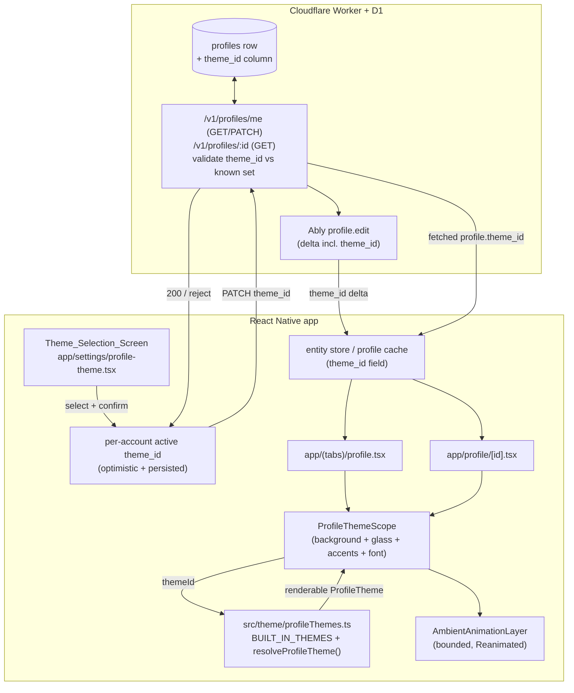
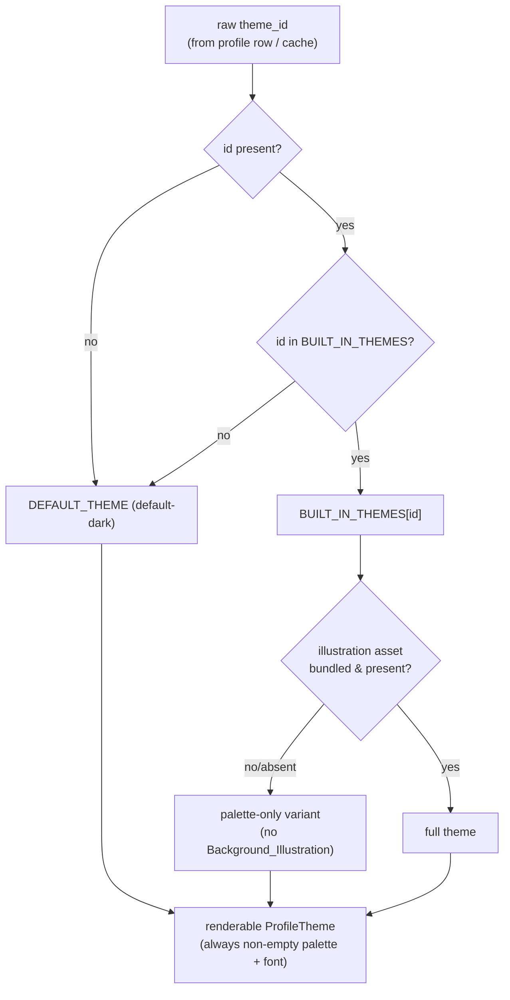
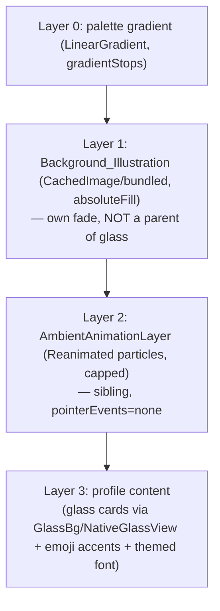

# Design Document

## Overview

Seasonal Profile Themes adds public, owner-selected visual "skins" to the profile screen. A theme bundles a color palette, an optional full-screen background illustration, an optional bounded ambient animation (snow/leaves), an optional set of system-emoji accents, and an optional font override. The selected theme is stored on the backend profile row alongside `banner_url`, so every viewer of a profile resolves the same theme as part of that person's public identity.

This design is grounded in the app's existing systems and reuses them rather than inventing parallel infrastructure (Req 9):

- **Theme infrastructure** — `src/theme` (`ThemeProvider`/`useTheme`) and `src/store/themeStore`. A new `src/theme/profileThemes.ts` registry + resolver plugs into this module so profile-theme resolution lives alongside the existing theme system (Req 9.1).
- **Full-screen background layering** — `src/components/ui/ChatBackgroundLayer.tsx` is the proven `StyleSheet.absoluteFill` pattern for rendering a background behind content. The new `ProfileThemeBackground` follows the same shape (Req 9.2).
- **Liquid glass** — `src/components/ui/LiquidGlass.tsx`: `GlassBg`, `NativeGlassView`, and `useLiquidGlassActive()`. The profile screens already gate their chrome through these; themed cards keep that gating with a non-glass fallback (Req 9.3). We respect the hard-won rule that **opacity must never be animated on a parent of a glass view** — all theme animation (illustration cross-fade, ambient particles) lives in **sibling layers beneath** the glass content, never wrapping it.
- **Appearance settings pattern** — `app/settings/appearance.tsx`: a deferred (`InteractionManager`) + virtualized (`FlatList` with `getItemLayout`, tight `windowSize`) carousel. The `Theme_Selection_Screen` mirrors this exactly (Req 2.7, 9.4).
- **Per-account scoping + cache** — `accountsStore`, `settingsStore`, and the `accountKey()`/`kvStore` (MMKV) helpers. Theme_Id is stored server-side per account (so it is inherently per-account), and the local optimistic value is namespaced per account (Req 9.5).
- **Backend profile API** — `workers/api/src/routes/profiles.ts` (`GET`/`PATCH /v1/profiles/me`, `GET /v1/profiles/:id`) and `workers/schema.sql`. A `theme_id` column is added and threaded through exactly like `banner_url` (Req 3).
- **Performance services** — `src/services/perfMonitor` (120 ms long-task detector, JS/UI FPS streams), `InteractionManager`-deferred mounting, and the staggered/scroll-pause patterns from chat. The ambient engine is Reanimated-driven (UI thread) and bounded, pausing on scroll/background/off-screen and disabling entirely on weak devices or reduced motion (Req 6, Req 7).

### Asset dependency (design risk — read first)

The six themes call for real background illustrations and at least one custom font (`purple-pixel`). **These assets do not yet exist in the repo and MUST be sourced/owned or licensed before the feature can ship** (Req 8, Apple §3.3.4). This is a genuine release blocker. To keep development unblocked, the design specifies a **placeholder strategy**: themes whose illustration asset is absent resolve to a *palette-only* theme (gradient background, no illustration) through the exact same fallback path used for a failed image load. Development, testing, and the build-time license gate all work with zero illustration files present; shipping requires the license manifest to be populated and the assets dropped in. System emoji accents are exempt from licensing (Req 8.3).

## Architecture

### Component / data-flow overview



### Theme resolution flow (total function)



The resolver is **total**: every code path returns a renderable `ProfileTheme` with a non-empty palette and a font (Req 5.5, 5.6, 9.7). Unknown or missing ids collapse to `default-dark` while the raw stored value is preserved upstream in the cache (Req 5.1, 5.2, 9.7).

### Rendering layer stack (profile screen)

Bottom-to-top, all beneath the existing scrollable profile content. Critically, the glass content cards are **siblings on top of** these layers, never children of an animating layer:



### Reuse decisions and rationale

| Concern | Existing system reused | Why |
| --- | --- | --- |
| Theme state | `src/theme` + `src/store/themeStore` | Req 9.1 forbids a parallel store; profile themes are a registry + resolver added to the same module. |
| Background image | `ChatBackgroundLayer` absoluteFill pattern | Proven full-screen layering that already coexists with glass (Req 9.2). |
| Glass vs fallback | `useLiquidGlassActive()` + `GlassBg` | Single capability gate already used on both profile screens (Req 9.3, 7.4). |
| Selection UI perf | `appearance.tsx` deferred + virtualized list | Avoids the long-task the perf monitor flags on heavy carousels (Req 2.7, 9.4). |
| Per-account isolation | server-side row + `accountKey()` namespacing | Theme_Id lives on the per-account profile row; local optimistic copy is per-account keyed (Req 9.5). |
| Cache propagation | Ably `profile.edit` + entity store | `PATCH /v1/profiles/me` already fans a delta; we add `theme_id` to it (Req 3.4). |

## Components and Interfaces

### 1. Theme registry + resolver — `src/theme/profileThemes.ts` (new)

The single source of truth for the Built_In_Theme_Set and the resolver. Exported from `src/theme/index.ts`.

```ts
export type ProfileThemeId =
  | 'default-dark' | 'spring' | 'summer-beach' | 'autumn' | 'winter' | 'purple-pixel';

export type AmbientAnimationType = 'snow' | 'leaves';

export interface ThemePalette {
  /** 2–5 gradient stops, top→bottom. */
  gradient: string[];
  text: string;          // primary text
  secondaryText: string; // secondary text
  accent: string;        // accent color
}

export interface EmojiAccentSet {
  like: string;   // single system-emoji glyph
  menu: string;   // post-overflow "…" area
  follow: string; // follow ("Подписаться") button
}

export interface ThemeFont {
  key: string;                 // e.g. 'pixel'
  family: string;              // RN fontFamily once loaded
  asset?: number | null;       // require()'d bundled font, null until sourced
}

export interface ProfileTheme {
  id: ProfileThemeId;
  label: string;
  palette: ThemePalette;
  /** require()'d bundled image, or null when palette-only / asset pending. */
  backgroundIllustration: number | null;
  ambientAnimation: AmbientAnimationType | null;
  emojiAccents: EmojiAccentSet | null;
  themeFont: ThemeFont | null;
}

export const DEFAULT_THEME_ID: ProfileThemeId = 'default-dark';
export const BUILT_IN_THEMES: Record<ProfileThemeId, ProfileTheme>;
export const BUILT_IN_THEME_LIST: ProfileTheme[]; // stable order for the picker

export function isKnownThemeId(id: unknown): id is ProfileThemeId;

/** Total function: ALWAYS returns a renderable ProfileTheme. */
export function resolveProfileTheme(id: string | null | undefined): ProfileTheme;

/** Resolution result that also reports whether a fallback occurred (Req 9.7). */
export function resolveProfileThemeResult(id: string | null | undefined): {
  theme: ProfileTheme;        // renderable
  requestedId: string | null; // raw stored value, preserved
  isFallback: boolean;        // true when requestedId !== theme.id
};
```

`resolveProfileTheme` never throws and never returns `undefined`. The default theme is a const with a complete palette + the app default font, so it is always available (Req 5.6).

### 2. Render scope — `src/components/profile/ProfileThemeScope.tsx` (new)

Wraps a profile screen's content and renders the layer stack. Pure composition over existing primitives.

```tsx
interface ProfileThemeScopeProps {
  themeId: string | null | undefined; // raw value from the profile row
  scrollActive: boolean;              // true while Profile_Scroll in progress
  screenFocused: boolean;             // useIsFocused() of the profile screen
  children: React.ReactNode;          // existing profile content (cards, header)
}
```

Responsibilities:
- Resolve the theme via `resolveProfileTheme` (Req 4.1–4.3).
- Render Layer 0 palette gradient (`expo-linear-gradient`) and Layer 1 `ProfileThemeBackground` (Req 4.4).
- Mount `AmbientAnimationLayer` only when allowed by the gating hook (Req 6, 7).
- Provide the resolved theme + emoji accents + font via a lightweight React context (`ProfileThemeContext`) so descendant elements (like icon, "…" menu, follow button, text) read accents/font **scoped to this subtree only** (Req 4.10). The context defaults to `DEFAULT_THEME` with `emojiAccents: null` and app default font when no provider is present, guaranteeing no leakage to other screens.

### 3. Background layer — `src/components/profile/ProfileThemeBackground.tsx` (new)

Mirrors `ChatBackgroundLayer`'s absoluteFill approach but for bundled `require()` image sources.

```tsx
interface ProfileThemeBackgroundProps {
  illustration: number | null; // bundled require(); null → palette-only
  onError?: () => void;
  onTimeout?: () => void;       // fired if not loaded within 5s
}
```

- When `illustration` is null → renders nothing (palette shows through) (Req 4.5/5.3 placeholder path).
- Uses `expo-image` (`CachedImage`) for bundled assets with `onLoad`/`onError`. A 5 s timer triggers the palette-only fallback if neither fires (Req 4.5, 5.3, 7.7).
- Bundled assets are offline-available by construction (Req 1.3); no network fetch.
- The image element owns its own fade-in; it is a **sibling under** glass, so animating its opacity is safe (it never parents a glass view).

### 4. Ambient animation engine — `src/components/profile/AmbientAnimationLayer.tsx` (new)

Bounded, UI-thread particle system using `react-native-reanimated` (so a JS long task cannot stutter it). `pointerEvents="none"`, `StyleSheet.absoluteFill`.

```tsx
interface AmbientAnimationLayerProps {
  type: AmbientAnimationType; // 'snow' | 'leaves'
  active: boolean;            // master gate (see useAmbientAnimationGate)
  paused: boolean;            // transient pause (scroll/background/off-screen)
}

export const PARTICLE_CAP = 14;          // hard upper bound, all platforms
export const PARTICLE_CAP_WEAK = 0;      // weak devices render none
```

Design:
- A **fixed pool** of exactly `min(PARTICLE_CAP, configuredCount)` particle views is allocated once at mount. The pool size is computed once and never grows, so the on-screen particle count provably never exceeds `PARTICLE_CAP` (Req 6.1). Each particle loops its own `withRepeat(withTiming(...))` translate/opacity on the UI thread.
- `paused` toggles a shared value that freezes the animations (Reanimated `cancelAnimation` / pausing the driver). Pause reacts within 100 ms because the flag is set on `onScrollBeginDrag` synchronously (Req 6.2); resume restarts on `onMomentumScrollEnd`/`onScrollEndDrag` within 200 ms (Req 6.3).
- While paused, the pool stays mounted but frozen; the gradient + illustration remain visible (Req 6.4).
- Renders only inside a `ProfileThemeScope` (Req 6.5, 4.10).
- Targets ≥55 FPS by keeping the pool tiny, using transforms only (no layout/opacity thrash on parents), and running entirely on the UI thread (Req 6.6, 7.6).

### 5. Animation gating hook — `src/hooks/useAmbientAnimationGate.ts` (new)

Centralizes all the conditions that suppress ambient motion, returning the effective state.

```ts
interface AmbientGateResult {
  enabled: boolean;        // false → render static background, no particle pool
  particleCap: number;     // PARTICLE_CAP or PARTICLE_CAP_WEAK (0)
}
function useAmbientAnimationGate(theme: ProfileTheme): AmbientGateResult;
```

Inputs (all existing/lightweight):
- `theme.ambientAnimation == null` → disabled.
- `useReducedMotion()` (wraps `AccessibilityInfo.isReduceMotionEnabled()` + `reduceMotionChanged` listener) → disabled within 500 ms without remount (Req 7.2, 7.3).
- `useWeakDevice()` (see component 9) → `particleCap = 0`, disabled (Req 7.1, 7.5).
- App backgrounded (`AppState`) or screen unfocused → forces `paused` (Req 6.7) — surfaced via the `paused` prop, not `enabled`, so resuming is instant.

Note: palette, illustration, and emoji accents are applied **independently** of the animation gate, so weak/reduced-motion devices still get the full static look (Req 7.5).

### 6. Theme selection screen — `app/settings/profile-theme.tsx` (new)

Follows `appearance.tsx` structure precisely (Req 2, 9.4):
- Header with back + "Сохранить" (Save).
- `cardsReady` gate via `InteractionManager.runAfterInteractions` to defer the carousel past the navigation transition.
- A horizontal `FlatList` over `BUILT_IN_THEME_LIST` with `getItemLayout`, `initialNumToRender={2}`, `maxToRenderPerBatch={1}`, `windowSize={3}`, `removeClippedSubviews` — mounting only the visible viewport + ~one viewport of overscan (Req 9.4, 2.7).
- Each preview is a memoized `ProfileThemePreviewCard` rendering a miniature of the palette + illustration thumbnail + emoji accents (static; no ambient animation in previews to keep the list cheap).
- The currently persisted Theme_Id is marked selected; if none persisted, the `default-dark` preview is marked (Req 2.2, 2.3).
- On confirm: optimistic update of the per-account active theme id, then `PATCH /v1/profiles/me { theme_id }` with a **5 s timeout**. On success the optimistic value is committed; on failure/timeout/`reject` it reverts to the previously persisted id and shows an error toast via `showToast` (Req 2.4–2.6, 3.7, 3.8).

### 7. Owner theme state — `src/store/profileThemeStore.ts` (new, thin) + selectors

Theme_Id is authoritative on the backend profile row, so this store holds only the **per-account optimistic/persisted mirror** used by the selection screen and the owner's own profile before a server round-trip settles. It uses the same `accountKey()` namespacing as other per-account caches (Req 9.5).

```ts
interface ProfileThemeState {
  // keyed by account id → last-known theme_id (persisted mirror)
  byAccount: Record<string, string>;
  getThemeId(accountId: string): string | undefined;
  setThemeId(accountId: string, themeId: string): void;     // optimistic/commit
  revertThemeId(accountId: string, prev: string | undefined): void;
}
```

`useActiveProfileThemeId(accountId)` returns the per-account stored id (or `undefined`). Resolution to a renderable theme is always via `resolveProfileTheme`. Changing one account's id leaves others untouched (Req 9.5).

### 8. Profile screen integration — `app/(tabs)/profile.tsx`, `app/profile/[id].tsx`

- Wrap the existing scroll content in `<ProfileThemeScope themeId={...} scrollActive={...} screenFocused={...}>`.
  - Own profile: `themeId` = `useActiveProfileThemeId(currentUser.id)` ?? `currentUser.theme_id` (Req 4.2).
  - Visitor: `themeId` = `profile.theme_id` from the entity store/fetch (Req 4.1).
- `scrollActive` is derived from the existing `Animated.FlatList`/`ScrollView` handlers (`onScrollBeginDrag` → true, `onMomentumScrollEnd`/`onScrollEndDrag` → false), feeding the ambient pause (Req 6.2, 6.3).
- The like icon, post-overflow "…" menu trigger, and follow button read `useProfileThemeAccents()` from context; when an `EmojiAccentSet` exists they render the emoji accent, otherwise the current Feather icons unchanged (Req 4.6, 4.7).
- Themed font: when `themeFont` is present and loaded, profile `Text` uses it; the override is provided via context and applied only within the scope (Req 4.8, 4.10). If the font is absent/unloaded after 5 s, fall back to the app default font while keeping the palette (Req 5.4).
- Glass content cards keep the existing `useLiquidGlassActive()` gate: glass when active, the current non-glass fallback otherwise — now drawing fallback colors from the resolved palette (Req 4.4, 7.4, 9.3).

### 9. Weak-device detection — `src/utils/deviceCapability.ts` (new) + `useWeakDevice()`

A lightweight, **privacy-safe** capability heuristic (no fingerprinting, no new permissions — Apple §3.3.3):
- iOS with liquid glass capable (`isNativeGlassCapable()`) → not weak.
- Android, or non-glass devices, classified weak when `expo-device`'s reported total memory / `Device.deviceYearClass` is low, or OS version is old (Android API ≤ 30). The thresholds are coarse and derived only from already-available, non-identifying device class info — never combined into a stable identifier.
- Result is computed once per session and memoized.

### 10. Backend — `workers/api/src/routes/profiles.ts`, `workers/schema.sql`, `workers/api/src/db.ts`

- **Schema**: add `theme_id TEXT` to `profiles` (nullable; null ⇒ default theme). Migration mirrors `banner_url`.
- **`PROFILE_FULL_COLUMNS`**: append `theme_id` so every `GET` (`/me`, `/:id`, `/by-username`, `/by-device-key`, list) returns it (Req 3.3, 3.5).
- **`PATCH /v1/profiles/me`**: accept `theme_id`. Validate against the known set; if unknown → **reject the whole update with `invalid_theme_id` (400)** so the previous value is retained (Req 3.7). Valid value is bound + `recordChange('theme_id', next)`, so it joins the realtime delta (Req 3.4).

```ts
// inside PATCH handler, alongside banner_url:
const KNOWN_THEME_IDS = new Set([
  'default-dark','spring','summer-beach','autumn','winter','purple-pixel',
]);
if (typeof v.theme_id === 'string') {
  if (!KNOWN_THEME_IDS.has(v.theme_id)) return fail(req, 'invalid_theme_id', 400);
  sets.push('theme_id = ?'); binds.push(v.theme_id);
  recordChange('theme_id', v.theme_id);
}
```

> The Worker keeps its own copy of the known-id set (it cannot import the RN registry). A single shared JSON list (`workers/api/src/themeIds.ts` mirrored from the registry) plus a unit test asserting the two lists are identical keeps them in lock-step.

- **Realtime**: `profile.edit` already fans the computed `delta`; with `theme_id` recorded it propagates to other devices. `RealtimeAccountBridge.tsx` maps `theme_id` into the entity store / authStore so renders update without restart (Req 3.4).

### 11. Client profile plumbing (mirror `banner_url`)

Add `theme_id` to: `ProfileRow`/`updateProfile` types in `src/lib/supabase.ts`; the `Profile` cache shape in `src/services/cacheService.ts`; `syncService.ts` upserts; `authStore` user mapping (`themeId`); `AccountSwitcher` mappings; and the `RealtimeAccountBridge` profile.edit handler. Each is the same one-line addition already present for `banner_url` (Req 3.1, 3.3, 9.5).

### 12. Asset license manifest + build gate — `assets/profile-themes/licenses.json` + `scripts/verify-theme-assets.js` (new)

- `licenses.json`: one record per shipped illustration/font asset: `{ assetPath, type: 'illustration'|'font', licenseType, source, owner }` (Req 8.1, 8.2).
- `verify-theme-assets.js`: a build/CI step (wired into the EAS/GitHub `build-*.yml` prebuild and runnable via `npm run verify:theme-assets`) that:
  1. Enumerates every `backgroundIllustration` and `themeFont.asset` referenced by `BUILT_IN_THEMES` that resolves to an actual bundled file.
  2. Asserts each has a matching, complete license record.
  3. **Exits non-zero (build fails)** listing any asset lacking a record; such an asset is excluded from the shipped set (Req 8.5, 8.6, 8.4).
- Emoji accents are skipped — system glyphs need no record (Req 8.3).
- While illustration/font files are still pending (placeholder phase), `backgroundIllustration`/`themeFont.asset` are `null`, so the gate passes with zero records and the themes render palette-only. Adding any real asset without a record fails the build (Req 8.6).

## Data Models

### ProfileTheme (client registry)

See the `ProfileTheme` interface above. The six built-ins (palette stops illustrative; final colors tuned to mockups):

| Theme_Id | Palette (gradient → accent) | Illustration | Ambient | Emoji {like, menu, follow} | Font |
| --- | --- | --- | --- | --- | --- |
| `default-dark` | charcoal[800]→charcoal[900], text cream[50], accent sage | none | none | none | app default |
| `spring` | greens, accent fresh green | meadow* | none | 🌷, 🌿, 🌱 | app default |
| `summer-beach` | peach/aqua, accent coral | beach* | none | 🌴, 🐚, ☀️ | app default |
| `autumn` | brown/orange, accent amber | forest* | leaves | 🍂, 🌰, 🎃 | app default |
| `winter` | blue/white, accent sky | snowy hills* | snow | ❄️, 🧣, 🎄 | app default |
| `purple-pixel` | purple/lavender, accent violet | dreamy purple* | none | 👾, 🕹️, ⭐ | pixel font* |

`*` = asset pending sourcing/licensing; until present, resolves palette-only (illustration) / app-default (font).

Invariants enforced by the registry (and asserted in tests):
- Exactly six themes; ids exactly the set above (Req 1.1).
- Each `palette.gradient.length` ∈ [2,5]; exactly one `text`, one `secondaryText`, one `accent` (Req 1.2).
- `default-dark` has `backgroundIllustration: null`, `ambientAnimation: null`, `emojiAccents: null`, `themeFont: null` and a complete neutral dark palette (Req 1.6, 5.6).
- Where `emojiAccents` is set, all three slots (`like`,`menu`,`follow`) are present (Req 1.4).

### Profile row (backend, D1)

```sql
ALTER TABLE profiles ADD COLUMN theme_id TEXT; -- nullable; NULL ⇒ default-dark
```

Returned in all profile projections via `PROFILE_FULL_COLUMNS`. `normalizeProfile` passes it through unchanged (string|null).

### Profile (client cache shape)

`cacheService.Profile`, entity-store profile, and `authStore.user` gain `theme_id?: string | null` (camel `themeId` on the `user` object, matching `bannerUrl`). Persisted in the existing per-account MMKV caches.

### Theme resolution result

`{ theme: ProfileTheme, requestedId: string | null, isFallback: boolean }` — lets the owner's profile preserve the raw stored id for round-tripping while rendering the default (Req 9.7).

## Correctness Properties

*A property is a characteristic or behavior that should hold true across all valid executions of a system — essentially, a formal statement about what the system should do. Properties serve as the bridge between human-readable specifications and machine-verifiable correctness guarantees.*

These properties were derived from the acceptance-criteria prework and consolidated to remove redundancy (e.g. the many "missing/unknown id → default" criteria collapse into one resolver property; the load-fallback criteria collapse per asset type). Properties focus on the parts of this feature that are genuinely input-varying logic: the **resolver** (a pure total function), the **bounded particle math**, **server-side validation**, **per-account isolation**, **scope containment**, and the **build-time license verifier**. UI layering, glass gating, FPS, and backend wiring are covered by example/integration/smoke tests in the Testing Strategy instead.

### Property 1: Resolver is total and pure with a complete output

*For any* input value (an arbitrary string, the empty string, `null`, or `undefined`), `resolveProfileTheme(input)` returns a `ProfileTheme` whose `palette.gradient` has at least 2 stops and whose font reference is defined, and calling it repeatedly with the same input always returns the same theme id (no throw, no `undefined`).

**Validates: Requirements 3.5, 5.5, 5.6**

### Property 2: Missing or unknown ids resolve to the Default_Theme

*For any* input that is `null`, `undefined`, the empty string, or any string not equal to one of the six known Theme_Ids, `resolveProfileTheme(input).id === 'default-dark'`; and *for any* known Theme_Id, the resolved theme's id equals that input.

**Validates: Requirements 1.7, 3.6, 5.1, 5.2, 9.6**

### Property 3: Fallback resolution preserves the requested id and flags the fallback

*For any* input id, `resolveProfileThemeResult(input)` returns a renderable `theme`, a `requestedId` exactly equal to the input, and `isFallback === (input is not a known Theme_Id)`. When `isFallback` is true the `theme.id` is `default-dark`.

**Validates: Requirements 9.7**

### Property 4: Emoji accents are rendered exactly when the theme defines them

*For any* theme in the Built_In_Theme_Set, the like icon, post-overflow "…" menu area, and follow button render the theme's emoji glyphs if and only if that theme's `emojiAccents` is non-null; when present, each of the three slots renders the corresponding single glyph; when absent, all three render the default (non-emoji) controls.

**Validates: Requirements 4.6, 4.7**

### Property 5: Profile font is the theme font when present and loaded, otherwise the app default

*For any* theme, profile typography uses the theme's `themeFont` family if and only if the theme defines a `themeFont` and it has loaded; if the theme defines no font, or the font errors or has not loaded within 5 seconds, profile typography uses the app default font while the theme's palette is still applied.

**Validates: Requirements 4.8, 4.9, 5.4**

### Property 6: Illustration load failure degrades to palette-only

*For any* theme, when its Background_Illustration is absent, errors, or has not loaded within 5 seconds, the effective render configuration disables the illustration while retaining the theme's Theme_Palette (and any Emoji_Accent_Set and profile content).

**Validates: Requirements 4.5, 5.3, 7.7**

### Property 7: Particle count never exceeds the Particle_Cap

*For any* requested ambient particle count and *any* device classification, the allocated particle-pool size is at most `PARTICLE_CAP`, is never negative, and is exactly `0` when the device is classified as a Weak_Device.

**Validates: Requirements 6.1, 7.1**

### Property 8: Static theme attributes are independent of the animation gate

*For any* theme, the Theme_Palette, Background_Illustration, and Emoji_Accent_Set that are applied to the profile screen are identical whether or not the Ambient_Animation is enabled (i.e. disabling animation via weak-device or reduced-motion never removes the palette, illustration, or emoji accents).

**Validates: Requirements 7.5**

### Property 9: Ambient animation is disabled under any suppressing condition

*For any* theme and gate inputs, the ambient animation gate reports `enabled === false` whenever the theme defines no Ambient_Animation, OR the device is a Weak_Device, OR the Reduced_Motion_Setting is enabled; and `enabled === true` only when the theme defines an animation AND the device is not weak AND reduced motion is off.

**Validates: Requirements 7.1, 7.2**

### Property 10: Theme attributes are confined to the profile screen scope

*For any* active theme, reading the profile-theme context outside a `ProfileThemeScope` yields the default values (no emoji accents, app default font, no themed palette), so theme attributes (palette, illustration, ambient animation, emoji accents, font) are never applied to any element that is not a descendant of the scope.

**Validates: Requirements 4.10, 6.5**

### Property 11: Theme_Id is isolated per account

*For any* mapping of account ids to Theme_Ids and *any* single update `setThemeId(accountId, newId)`, after the update the entry for `accountId` equals `newId` and every other account's stored Theme_Id is exactly equal to its value before the update.

**Validates: Requirements 9.5**

### Property 12: Server accepts known Theme_Ids and rejects unknown ones without mutating state

*For any* string submitted as `theme_id` to `PATCH /v1/profiles/me`: if it is one of the six known ids the update is accepted and the stored value becomes that id; if it is any other string the request is rejected (HTTP 400, `invalid_theme_id`) and the previously stored `theme_id` is unchanged.

**Validates: Requirements 3.7**

### Property 13: Selection commits optimistically and reverts on persistence failure

*For any* previously persisted Theme_Id and *any* newly selected known Theme_Id, confirming the selection sets the per-account active id to the selected id; then if persistence rejects or does not complete within 5 seconds, both the displayed selection and the active id return to the previously persisted id (and an error indication is shown), whereas on success the selected id is retained.

**Validates: Requirements 2.4, 2.6, 3.8**

### Property 14: Asset-license verifier passes iff every shipped asset has a valid record

*For any* set of referenced Background_Illustration and Theme_Font assets and *any* license manifest, the verifier succeeds if and only if every shipped asset has a complete record whose license type permits distribution; otherwise it fails (non-zero) and its error names every asset lacking a valid record. Emoji-accent glyphs are never required to have a record.

**Validates: Requirements 8.1, 8.2, 8.4, 8.5, 8.6**

### Property 15: Every built-in palette is structurally valid

*For any* theme in the Built_In_Theme_Set, its `palette.gradient` has between 2 and 5 stops inclusive, and it has exactly one non-empty `text`, one non-empty `secondaryText`, and one non-empty `accent` color; any defined `emojiAccents` has all three slots populated and any defined `themeFont` has a non-empty family.

**Validates: Requirements 1.2, 1.3, 1.4, 1.5**

## Error Handling

- **Unknown/missing Theme_Id (client render)** — `resolveProfileTheme` is total and silently returns `default-dark` (Property 1, 2). The raw id is preserved in the cache and surfaced via `resolveProfileThemeResult` so the owner's stored value round-trips even if the app version doesn't recognize it (Req 9.7). No error UI on a render path — a profile must never appear blank (Req 5).
- **Unknown Theme_Id (server PATCH)** — rejected with `400 invalid_theme_id`; the stored value is retained (Req 3.7). The selection screen treats this exactly like a network failure: revert + error toast (Property 13).
- **Persistence failure / timeout** — the confirm flow races the `PATCH` against a 5 s timer (`Promise.race`). On reject or timeout it reverts the optimistic per-account id and shows an error toast via the existing `showToast` (Req 2.5, 2.6, 3.8). The previously persisted id remains authoritative.
- **Background_Illustration load error or >5 s** — `ProfileThemeBackground` `onError`/timeout flips to palette-only; the gradient and all other attributes remain (Property 6, Req 4.5, 5.3, 7.7). Bundled assets won't hit the network, so this primarily guards a corrupt/missing bundled file.
- **Theme_Font load error or >5 s** — falls back to the app default font while keeping the palette (Property 5, Req 5.4). Font loading uses the existing `expo-font` loading state; no crash if a family is missing.
- **Reduced motion / weak device** — not errors but degradation paths: the gate disables animation and the static background renders (Property 8, 9; Req 7.1–7.3).
- **App backgrounded / screen off-screen** — ambient animation pauses (not unmounts) so resume is instant and no work runs off-screen (Req 6.7).
- **Realtime delta miss** — if the `profile.edit` event is missed, the next profile fetch carries the authoritative `theme_id`; resolution is deterministic so the view self-heals (Req 3.4, 3.5).
- **Missing license record (build)** — the verifier fails the build with a message naming each offending asset; the asset is excluded from the shipped set (Property 14, Req 8.6).
- **`expo-glass-effect` absent / non-iOS** — `useLiquidGlassActive()` already returns false and content uses the non-glass fallback drawing colors from the palette (Req 7.4, 9.3).

## Testing Strategy

PBT **is appropriate** here for the logic-bearing parts (resolver, particle math, validation, isolation, containment, verifier) and is paired with example/integration/smoke tests for UI, backend wiring, and performance. The project uses **fast-check** with the existing Jest setup (see `src/services/__tests__/*.property.test.ts`, e.g. `cacheService.offline.property.test.ts`) — reuse it; do not hand-roll generators.

### Property-based tests

- Library: **fast-check** + Jest (existing in the repo).
- Minimum **100 iterations** per property (`fc.assert(fc.property(...), { numRuns: 100 })`).
- Each test is tagged with a comment of the form
  `// Feature: seasonal-profile-themes, Property {n}: {property text}`.
- Implement each of Properties 1–15 with a **single** property-based test:
  - **P1, P2, P3** — resolver: generators producing arbitrary strings, the empty string, `null`, `undefined`, and the known ids (e.g. `fc.oneof(fc.constantFrom(...KNOWN_IDS), fc.string(), fc.constant(null), fc.constant(undefined))`).
  - **P4, P5, P15** — over `fc.constantFrom(...BUILT_IN_THEME_LIST)`; for P4/P5 drive a render helper or a pure "effective accents/font" selector with present/absent/loaded/errored font states.
  - **P6** — over themes × `fc.constantFrom('ok','error','timeout')` against the effective-render-config function.
  - **P7** — over `fc.integer()` requested counts × `fc.boolean()` weak flag against the pool-sizing function.
  - **P8, P9** — over themes × boolean gate inputs (weak, reducedMotion) against `useAmbientAnimationGate`'s pure core.
  - **P10** — assert the context default equals DEFAULT for any active theme (pure read outside a provider).
  - **P11** — `fc.dictionary(accountId, themeId)` × an arbitrary update; assert only the target key changes.
  - **P12** — over `fc.oneof(known ids, arbitrary strings)` against the server validator (pure `validateThemeId` extracted from the route, tested directly).
  - **P13** — over (prev known id, selected known id) with a mocked client forced to succeed / reject / never-resolve (fake timers for the 5 s race).
  - **P14** — over generated `{assets, records}` with arbitrary license types against `verifyThemeAssets(manifest, refs)`.

### Unit / example tests

- Registry shape: exactly six ids equal to the expected set (Req 1.1); `default-dark` is neutral, attribute-free, complete (Req 1.6).
- Selection screen: renders 6 previews (Req 2.1); marks the persisted id, or `default-dark` when none (Req 2.2, 2.3); uses the deferred-mount + virtualized `FlatList` config mirroring `appearance.tsx` (Req 9.4).
- Render integration (React Native Testing Library): own + visitor profile apply the resolved theme (Req 4.1–4.3); glass content cards sit above the background layers and gate on `useLiquidGlassActive()` with the non-glass fallback (Req 4.4, 7.4, 9.3); background uses an absoluteFill layer like `ChatBackgroundLayer` (Req 9.2).
- Ambient wiring: `onScrollBeginDrag` pauses, `onScrollEndDrag`/`onMomentumScrollEnd` resumes; `AppState` background and screen blur pause (Req 6.2, 6.3, 6.7); paused keeps the static background (Req 6.4); reduced-motion toggled at runtime suppresses within 500 ms without remount (Req 7.3).
- Emoji accents are plain system-glyph strings and the verifier requires no emoji asset records (Req 8.3).

### Integration tests (backend, 1–3 examples)

- `PATCH /v1/profiles/me` then `GET` round-trips `theme_id` (Req 3.1); `GET /v1/profiles/:id` includes `theme_id` (Req 3.3).
- A `profile.edit` realtime event carrying `theme_id` updates the entity store so a mounted profile re-renders without restart (Req 3.4).
- The Worker's known-id list equals the RN registry list (lock-step guard test).

### Smoke / performance (manual, FPS perf snapshots on the primary Weak_Device)

- Opening the Theme_Selection_Screen produces no long-task marker in `perfMonitor` (Req 2.7).
- A winter/autumn profile (ambient active) holds ≥55 FPS while animating (Req 6.6) and during scroll on the weak Android 10, within 5 FPS of the themeless baseline (Req 7.6).
- Architectural/structural check: profile-theme state is exported from `src/theme` with no parallel `ThemeProvider` (Req 9.1).

### Asset / licensing (Req 8)

- `npm run verify:theme-assets` runs in CI/prebuild; Property 14 covers its logic. Until real illustration/font files are sourced and recorded in `licenses.json`, themes resolve palette-only/app-default and the gate passes with zero records — adding any real asset without a record fails the build.

> **Release dependency (call-out):** the six themes are not shippable to the App Store until the background illustrations and the `purple-pixel` font are sourced/owned or licensed and recorded in `licenses.json` (Apple §3.3.4). This is tracked as a hard blocker; the placeholder palette-only strategy keeps all development and testing unblocked in the meantime.
